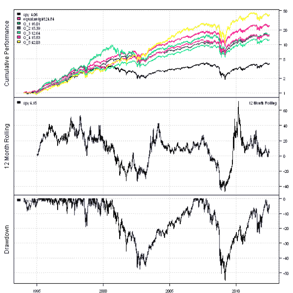

<!--yml
category: 未分类
date: 2024-05-18 14:39:43
-->

# Example of Factor Attribution | Systematic Investor

> 来源：[https://systematicinvestor.wordpress.com/2012/07/04/example-of-factor-attribution/#0001-01-01](https://systematicinvestor.wordpress.com/2012/07/04/example-of-factor-attribution/#0001-01-01)

In the prior post, [Factor Attribution 2](https://systematicinvestor.wordpress.com/2012/06/27/factor-attribution-2/), I have shown how Factor Attribution can be applied to decompose fund’s returns in to Market, Capitalization, and Value factors, the [“three-factor model”](http://en.wikipedia.org/wiki/Fama%E2%80%93French_three-factor_model) of Fama and French. Today, I want to show you a different application of Factor Attribution. First, let’s run Factor Attribution on each the stocks in the S&P 500 to determine it’s Value exposure. Next let’s group stocks into Quantiles based on Value exposure and create back-test for each Quantile. I will rely on the code in the [Volatility Quantiles](https://systematicinvestor.wordpress.com/2012/06/05/volatility-quantiles/) post to create Quantiles.

Let’s start by loading historical prices for all current components of the S&P 500 index.

```

###############################################################################
# Load Systematic Investor Toolbox (SIT)
# https://systematicinvestor.wordpress.com/systematic-investor-toolbox/
###############################################################################
setInternet2(TRUE)
con = gzcon(url('http://www.systematicportfolio.com/sit.gz', 'rb'))
    source(con)
close(con)

	#*****************************************************************
	# Load historical data
	#****************************************************************** 
	load.packages('quantmod')	
	tickers = sp500.components()$tickers

	data <- new.env()
	getSymbols(tickers, src = 'yahoo', from = '1970-01-01', env = data, auto.assign = T)
		# remove companies with less than 5 years of data
		rm.index = which( sapply(ls(data), function(x) nrow(data[[x]])) < 1000 )	
		rm(list=names(rm.index), envir=data)

		for(i in ls(data)) data[[i]] = adjustOHLC(data[[i]], use.Adjusted=T)		
	bt.prep(data, align='keep.all', dates='1994::')
		tickers = data$symbolnames

	data.spy <- new.env()
	getSymbols('SPY', src = 'yahoo', from = '1970-01-01', env = data.spy, auto.assign = T)
	bt.prep(data.spy, align='keep.all', dates='1994::')

	#*****************************************************************
	# Code Strategies
	#****************************************************************** 
	prices = data$prices
		nperiods = nrow(prices)
		n = ncol(prices)

	models = list()

	# SPY
	data.spy$weight[] = NA
		data.spy$weight[] = 1
	models$spy = bt.run(data.spy)

	# Equal Weight
	data$weight[] = NA
		data$weight[] = ntop(prices, n)
	models$equal.weight = bt.run(data)

```

Next let’s run Factor Attribution on each the stocks in the S&P 500 to determine it’s Value exposure.

```

	#*****************************************************************
	# Compute Factor Attribution for each ticker
	#****************************************************************** 
	periodicity = 'weeks'

	# load Fama/French factors
	factors = get.fama.french.data('F-F_Research_Data_Factors', periodicity = periodicity,download = T, clean = F)

	period.ends = endpoints(data$prices, periodicity)
		period.ends = period.ends[period.ends > 0]

	# add factors and align
	data.fa <- new.env()
		for(i in tickers) data.fa[[i]] = data[[i]][period.ends,]
	data.fa$factors = factors$data / 100
	bt.prep(data.fa, align='remove.na')

	index = match( index(data.fa$prices), index(data$prices) )
	measure = data$prices[ index, ]	
	for(i in tickers) {
		cat(i, '\n')

		# Facto Loadings Regression
		obj = factor.rolling.regression(data.fa, i, 36, silent=T)

		measure[,i] = coredata(obj$fl$estimate$HML)
	}

```

Finally, let’s group stocks into Quantiles based on Value exposure and create back-test for each Quantile.

```

	#*****************************************************************
	# Create Value Quantiles
	#****************************************************************** 
	n.quantiles=5
	start.t = 1+36
	quantiles = weights = coredata(measure) * NA			

	for( t in start.t:nrow(weights) ) {
		factor = as.vector(coredata(measure[t,]))
		ranking = ceiling(n.quantiles * rank(factor, na.last = 'keep','first') / count(factor))

		quantiles[t,] = ranking
		weights[t,] = 1/tapply(rep(1,n), ranking, sum)[ranking]			
	}

	quantiles = ifna(quantiles,0)

	#*****************************************************************
	# Create backtest for each Quintile
	#****************************************************************** 
	for( i in 1:n.quantiles) {
		temp = weights * NA
			temp[] = 0
		temp[quantiles == i] = weights[quantiles == i]

		data$weight[] = NA
			data$weight[index,] = temp
		models[[ paste('Q',i,sep='_') ]] = bt.run(data, silent = T)
	}

	#*****************************************************************
	# Create Report
	#****************************************************************** 					
	plotbt.custom.report.part1(models)		

	plotbt.strategy.sidebyside(models)

```

[](https://systematicinvestor.wordpress.com/wp-content/uploads/2012/07/plot1-small.png)

[](https://systematicinvestor.wordpress.com/wp-content/uploads/2012/07/plot2-small.png)

There is no linear relationship between Value Quantiles and historical performance. I’m also suspecting that that implied Value exposure might be quite different than the real Price/Book ratio for each stock. Let me know what do you think about this approach.

In the next post I will show another example of Factor Attribution.

To view the complete source code for this example, please have a look at the [bt.fa.value.quantiles.test() function in bt.test.r at github](https://github.com/systematicinvestor/SIT/blob/master/R/bt.test.r).