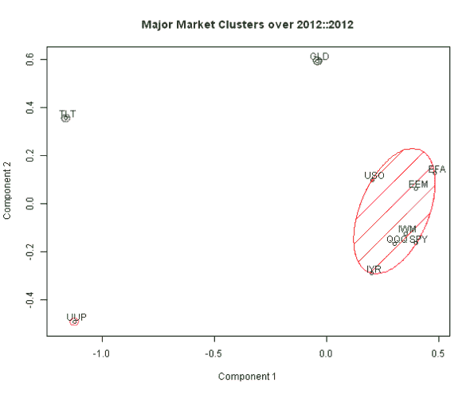

<!--yml
category: 未分类
date: 2024-05-18 14:34:49
-->

# Examples of Current Major Market Clusters | Systematic Investor

> 来源：[https://systematicinvestor.wordpress.com/2013/01/12/examples-of-current-major-market-clusters/#0001-01-01](https://systematicinvestor.wordpress.com/2013/01/12/examples-of-current-major-market-clusters/#0001-01-01)

I want to follow up and provide a bit more details to the excellent [“A Visual of Current Major Market Clusters”](http://cssanalytics.wordpress.com/2013/01/10/a-visual-of-current-major-market-clusters/) post by David Varadi.

Let’s first load historical for the 10 major asset classes:

*   Gold ( [GLD](http://finance.yahoo.com/q?s=GLD) )
*   US Dollar ( [UUP](http://finance.yahoo.com/q?s=UUP) )
*   S&P500 ( [SPY](http://finance.yahoo.com/q?s=SPY) )
*   Nasdaq100 ( [QQQ](http://finance.yahoo.com/q?s=QQQ) )
*   Small Cap ( [IWM](http://finance.yahoo.com/q?s=IWM) )
*   Emerging Markets ( [EEM](http://finance.yahoo.com/q?s=EEM) )
*   International Equity ( [EFA](http://finance.yahoo.com/q?s=EFA) )
*   Real Estate ( [IYR](http://finance.yahoo.com/q?s=IYR) )
*   Oil ( [USO](http://finance.yahoo.com/q?s=USO) )
*   Treasurys ( [TLT](http://finance.yahoo.com/q?s=TLT) )

```

###############################################################################
# Load Systematic Investor Toolbox (SIT)
# https://systematicinvestor.wordpress.com/systematic-investor-toolbox/
###############################################################################
setInternet2(TRUE)
con = gzcon(url('http://www.systematicportfolio.com/sit.gz', 'rb'))
    source(con)
close(con)

	#*****************************************************************
	# Load historical data for ETFs
	#****************************************************************** 
	load.packages('quantmod')

	tickers = spl('GLD,UUP,SPY,QQQ,IWM,EEM,EFA,IYR,USO,TLT')

	data <- new.env()
	getSymbols(tickers, src = 'yahoo', from = '1900-01-01', env = data, auto.assign = T)
		for(i in ls(data)) data[[i]] = adjustOHLC(data[[i]], use.Adjusted=T)

	bt.prep(data, align='remove.na')

```

Next let’s use the historical returns over the past year to compute correlations between all asset classes and group assets into 4 clusters:

```

	#*****************************************************************
	# Create Clusters
	#****************************************************************** 
	# compute returns
	ret = data$prices / mlag(data$prices) - 1
		ret = na.omit(ret)		

	# setup period and method to compute correlations
	dates = '2012::2012'
	method = 'pearson'	# kendall, spearman

	correlation = cor(ret[dates], method = method)    
        dissimilarity = 1 - (correlation)
        distance = as.dist(dissimilarity)

	# find 4 clusters      
	xy = cmdscale(distance)
	fit = kmeans(xy, 4, iter.max=100, nstart=100)

	#*****************************************************************
	# Create Plot
	#****************************************************************** 	
	load.packages('cluster')
	clusplot(xy, fit$cluster, color=TRUE, shade=TRUE, labels=3, lines=0, plotchar=F, 
		main = paste('Major Market Clusters over', dates), sub='')	

```

[](https://systematicinvestor.wordpress.com/wp-content/uploads/2013/01/plot1.png)

There are 4 clusters: TLT, GLD, UUP, and Equities / Oil / Real Estate. You can see assigned clusters by executing

```

	fit$cluster

```

This works quite well, but we have a number of things to explore:

*   how to select number of clusters
*   what correlation measure to use i.e. pearson, kendall, spearman
*   what look back to use i.e. 1 month / 6 months / 1 year
*   what frequency of data to use i.e daily / weekly / monthly

In the next post I will provide some ideas how to select number of clusters.

To view the complete source code for this example, please have a look at the [bt.cluster.visual.test() function in bt.test.r at github](https://github.com/systematicinvestor/SIT/blob/master/R/bt.test.r).