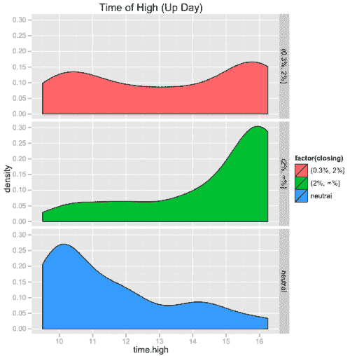
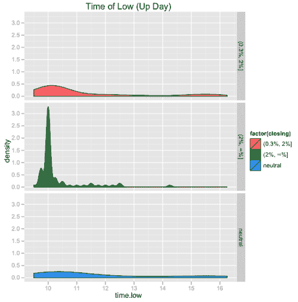
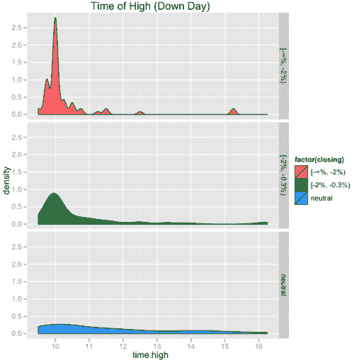
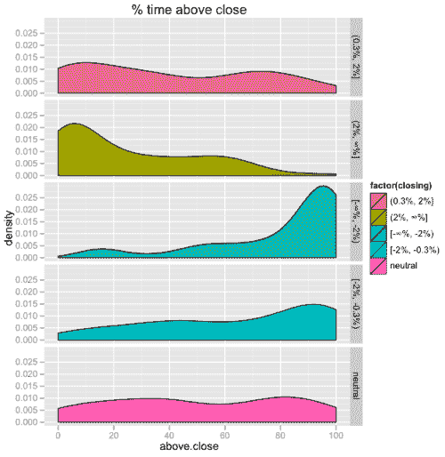

<!--yml
category: 未分类
date: 2024-05-18 15:31:50
-->

# Execution Profile | Tr8dr

> 来源：[https://tr8dr.wordpress.com/2010/09/11/execution-profile/#0001-01-01](https://tr8dr.wordpress.com/2010/09/11/execution-profile/#0001-01-01)

I have a number of models that forecast a next period return for a portfolio of assets.   It is important to have a view on how the asset trades on average over the period.  On average:

1.  where are the lows & highs made
2.  how much time is spent above or below the close (useful to know if close is your target)
3.  what is the average volume profile for the asset

There is a large business on wall street built around executing large size for clients to a target measure (VWAP is an example of this).  Execution algos focus on  how to execute size with the least amount of market impact and at the lowest cost (best price & transaction cost).

I don’t have experience in the execution algo side, having focused mostly on signal generation (so if there any readers with suggestions please let me know).    That said, here are some simple analyses I did on 1 year of tick data across 2700 US equities;  Definitely gives me a better picture.

**Up Day
Supposing our model predicts that an asset will close higher by a certain % on the next day and we enter at a price close to the prior close.   We now want to know when is the best point(s) to sell the position.   If the position has size, we may have to sell at multiple points during the day.**

**The following graph looks at the time of day on average where the high is reached, for different close-to-close % return scenarios (neutral indicates a close close to 0%, between +/- 0.3%):**

**** 

For very sharp close-to-close appreciation (> 2% return), the high is usually achieved in the last hour.  In the neutral case we see the high achieved in the first 1/2 of the day, with the most weight around 10:30\.   The medium returns (≤ 2%) seem to be more split between the opening and closing sessions (but otherwise pretty uniform).

Interestingly, we would not want to be selling near the open (9:30 – 10:30) for a high return target.   The other return profiles show elevated probability of low in the morning session, but otherwise close to a uniform distribution.

**Down Day
Supposing our model predicts that an asset will close lower by a certain % on the next day and we short at a price close to the previous close.   We are now looking for the right time to close out the short.**

****

**The profile looks very similar to our Time Of Low (Up Day)** graph above.  As expected the short side mirrors the long side.

**% Of Time Above (Below) Close
If the closing price is our target then it is useful to know how much time and perhaps # of opportunities at or exceeding target.**

****

The extreme returns (> 2% in olive) and (< -2% in green) show 30-40% probability that the asset only spends 20% of the trading day on or above (below) the close, peaking in probability at 7-8% or maybe 1/2 hour of the day.   This is coincident with the time-of-high (low) behavior that we see above as well.

We can also look at the number of “touches” on or above the closing price we realize.   This distribution seems to be more uniform.

**Conclusion & Further Work
I suspect that there are differences in price movement profiles for different groups of assets.   For instance the lower liquidity stocks with less frequent trading may have a very different profile.   I know that execution algo desks measure volume and other indicators on a per-asset basis, maybe with some grouping overlays.**

Another analysis that would be useful would be to see volume-weighted price profiles.   For example, what is the average volume weighted price path for differing closing return targets**.**