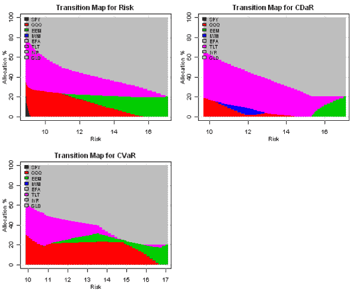

<!--yml
category: 未分类
date: 2024-05-18 14:48:05
-->

# Expected shortfall (CVaR) and Conditional Drawdown at Risk (CDaR) risk measures | Systematic Investor

> 来源：[https://systematicinvestor.wordpress.com/2011/10/25/expected-shortfall-cvar-and-conditional-drawdown-at-risk-cdar-risk-measures/#0001-01-01](https://systematicinvestor.wordpress.com/2011/10/25/expected-shortfall-cvar-and-conditional-drawdown-at-risk-cdar-risk-measures/#0001-01-01)

In the [Maximum Loss and Mean-Absolute Deviation risk measures](https://systematicinvestor.wordpress.com/2011/10/14/maximum-loss-and-mean-absolute-deviation-risk-measures/) post I started the discussion about alternative risk measures we can use to construct [efficient frontier](http://en.wikipedia.org/wiki/Efficient_Frontier). Another alternative risk measures I want to discuss are [Expected shortfall (CVaR)](http://en.wikipedia.org/wiki/Expected_shortfall) and Conditional Drawdown at Risk (CDaR). I will use methods presented in [Comparative Analysis of Linear Portfolio Rebalancing Strategies: An Application to Hedge Funds by Krokhmal, P., S. Uryasev, and G. Zrazhevsky (2001)](http://papers.ssrn.com/sol3/papers.cfm?abstract_id=297639) and [Portfolio Optimization Using Conditional Value-At-Risk and Conditional Drawdown-At-Risk by Enn Kuutan](http://www.mie.utoronto.ca/undergrad/thesis-catalog/files/351.pdf)papers to construct optimal portfolios.

Let x.i, i= 1,…,n be weights of instruments in the portfolio. We suppose that j= 1,…,T scenarios of returns with equal probabilities are available. I will use historical assets returns as scenarios. Let us denote by r.ij the return of i-th asset in the scenario j. The portfolio’s Conditional Value at Risk (CVaR) (page 30-32) can be written as


It can be formulated as a linear programming problem


This linear programming problem can be easily implemented

```

min.cvar.portfolio <- function
(
	ia,		# input assumptions
	constraints	# constraints
)
{
	n = ia$n
	nt = nrow(ia$hist.returns)

	alpha = ia$parameters.alpha

	# objective : Conditional Value at Risk (CVaR)
	#  E + 1/(1-a) * 1/T * [ SUM  w.j ]
	f.obj = c( rep(0, n), (1/(1-alpha))* (1/nt) * rep(1, nt), 1 )

	# adjust constraints, add w.j, E
	constraints = add.variables(nt + 1, constraints, lb = c(rep(0,nt),-Inf))

	#  -E - [ SUM <over i> r.ij * x.i ] < w.j, for each j = 1,...,T 
	a = rbind( matrix(0, n, nt), diag(nt), 1)
		a[1 : n, ] = t(ia$hist.returns)
	constraints = add.constraints(a, rep(0, nt), '>=', constraints)			

	# setup linear programming	
	f.con = constraints$A
	f.dir = c(rep('=', constraints$meq), rep('>=', len(constraints$b) - constraints$meq))
	f.rhs = constraints$b

	# find optimal solution
	x = NA
	sol = try(solve.LP.bounds('min', f.obj, t(f.con), f.dir, f.rhs, 
					lb = constraints$lb, ub = constraints$ub), TRUE)

	if(!inherits(sol, 'try-error')) {
		x = sol$solution[1:n]

	}

	return( x )
}

```

The portfolio’s Conditional Drawdown at Risk (CDaR) (page 32-33) concept is very similar to CVaR. Instead of using portfolio returns to determine shortfall, we use portfolio drawdowns. The Conditional Drawdown at Risk (CDaR) can be written as

![E + \frac{1}{(1 - \alpha) J}\sum_{j=1}^{T}max\left \{ 0,   \max_{1\leq k\leq j} \left ( \sum_{i=1}^{n} \left [ \sum_{s=1}^{k}r_{is} \right ] x_{i} \right ) - \sum_{i=1}^{n} \left [ \sum_{s=1}^{j}r_{is} \right ]x_{i}-E\right \}](img/a71404c3da98d48d87678911aa179d00.png)

It can be formulated as a linear programming problem

![min_{}{} E + \frac{1}{(1 - \alpha) J}\sum_{j=1}^{T}w_{j}  \newline\newline  u_{j}-\sum_{i=1}^{n} \left [ \sum_{s=1}^{j}r_{is} \right ]x_{i}-E\leq w_{j}, j=1,...,T  \newline\newline  \sum_{i=1}^{n} \left [ \sum_{s=1}^{j}r_{is} \right ]x_{i}\leq u_{j}, j=1,...,T  \newline\newline  u_{j-1}\leqslant u_{j} , j=1,...,T  \newline\newline  w_{j}\geqslant 0, j=1,...,T](img/c67fe74ef995e9827ad9f5db0c4d16de.png)

```

min.cdar.portfolio <- function
(
	ia,		# input assumptions
	constraints	# constraints
)
{
	n = ia$n
	nt = nrow(ia$hist.returns)

	alpha = ia$parameters.alpha

	# objective : Conditional Drawdown at Risk (CDaR)
	#  E + 1/(1-a) * 1/T * [ SUM  w.j ]
	f.obj = c( rep(0, n), (1/(1-alpha))* (1/nt) * rep(1, nt), 1, rep(0, nt) )

	# adjust constraints, add w.j, E, u.j
	constraints = add.variables(2*nt + 1, constraints, lb = c(rep(0,nt), rep(-Inf,nt+1)))

	#  u.j - [ SUM <over i> [ SUM <over j> r.ij ] * x.i ] - E < w.j, for each j = 1,...,T 
	a = rbind( matrix(0, n, nt), diag(nt), 1, -diag(nt))
		a[1 : n, ] = t(apply( t(ia$hist.returns), 1, cumsum))	
	constraints = add.constraints(a, rep(0, nt), '>=', constraints)					

	#  [ SUM <over i> [ SUM <over j> r.ij ] * x.i ] < u.j, for each j = 1,...,T 
	a = rbind( matrix(0, n, nt), 0*diag(nt), 0, diag(nt))
		a[1 : n, ] = -t(apply( t(ia$hist.returns), 1, cumsum))
	constraints = add.constraints(a, rep(0, nt), '>=', constraints)

	#  u.j-1 < u.j, for each j = 1,...,T - portfolio high water mark is increasing		
	temp = diag(nt);
		temp[-nt,-1]=-diag((nt-1))
		diag(temp) = 1			

	a = rbind( matrix(0, n, nt), 0*diag(nt), 0, temp)
		a = a[,-1]		
	constraints = add.constraints(a, rep(0, (nt-1)), '>=', constraints)

	# setup linear programming	
	f.con = constraints$A
	f.dir = c(rep('=', constraints$meq), rep('>=', len(constraints$b) - constraints$meq))
	f.rhs = constraints$b

	# find optimal solution
	x = NA
	sol = try(solve.LP.bounds('min', f.obj, t(f.con), f.dir, f.rhs, 
					lb = constraints$lb, ub = constraints$ub), TRUE)

	if(!inherits(sol, 'try-error')) {
		x = sol$solution[1:n]

	}

	return( x )
}

```

Let’s examine efficient frontiers computed under different risk measures using historical input assumptions presented in the [Introduction to Asset Allocation](https://systematicinvestor.wordpress.com/2011/10/13/introduction-to-asset-allocation/) post:

```

# load Systematic Investor Toolbox
setInternet2(TRUE)
source(gzcon(url('https://github.com/systematicinvestor/SIT/raw/master/sit.gz', 'rb')))

#--------------------------------------------------------------------------
# Create Efficient Frontier
#--------------------------------------------------------------------------
	ia = aa.test.create.ia()
	n = ia$n		

	# 0 <= x.i <= 0.8 
	constraints = new.constraints(n, lb = 0, ub = 0.8)

	# SUM x.i = 1
	constraints = add.constraints(rep(1, n), 1, type = '=', constraints)		

	# Alpha for used for CVaR and CDaR
	# http://www.investopedia.com/articles/04/092904.asp
	ia$parameters.alpha = 0.95

	# create efficient frontier(s)
	ef.risk = 		portopt(ia, constraints, 50, 'Risk')
	ef.cvar = 		portopt(ia, constraints, 50, 'CVaR', 	min.cvar.portfolio)
	ef.cdar = 		portopt(ia, constraints, 50, 'CDaR', 	min.cdar.portfolio)

	# Plot multiple Efficient Frontiers
	layout( matrix(1:4, nrow = 2) )
	plot.ef(ia, list(ef.risk, ef.cvar, ef.cdar), portfolio.risk, F)	
	plot.ef(ia, list(ef.risk, ef.cvar, ef.cdar), portfolio.cvar, F)	
	plot.ef(ia, list(ef.risk, ef.cvar, ef.cdar), portfolio.cdar, F)	

	# Plot multiple Transition Maps
	layout( matrix(1:4, nrow = 2) )
	plot.transition.map(ef.risk)
	plot.transition.map(ef.cvar)
	plot.transition.map(ef.cdar)

```

[](https://systematicinvestor.wordpress.com/wp-content/uploads/2011/10/plot1-small6.png)

[](https://systematicinvestor.wordpress.com/wp-content/uploads/2011/10/plot2-small6.png)

The efficient frontiers constructed under Expected shortfall (CVaR) and Standard Deviation risk measures look similar. The efficient frontier constructed under Conditional Drawdown at Risk (CDaR) is superior to the other risk measures in controlling drawdowns.

In the next post, I will discuss how to combine multiple risk measures during construction of efficient frontier.

To view the complete source code for this example, please have a look at the [aa.cvar.test() function in aa.test.r at github](https://github.com/systematicinvestor/SIT/blob/master/R/aa.test.r).