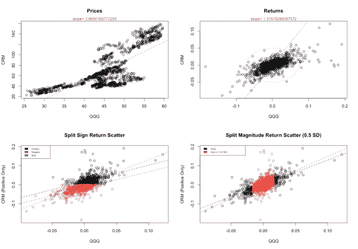
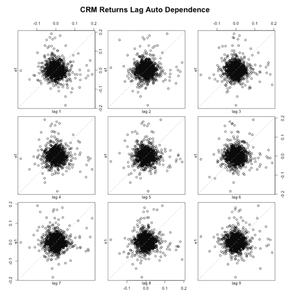
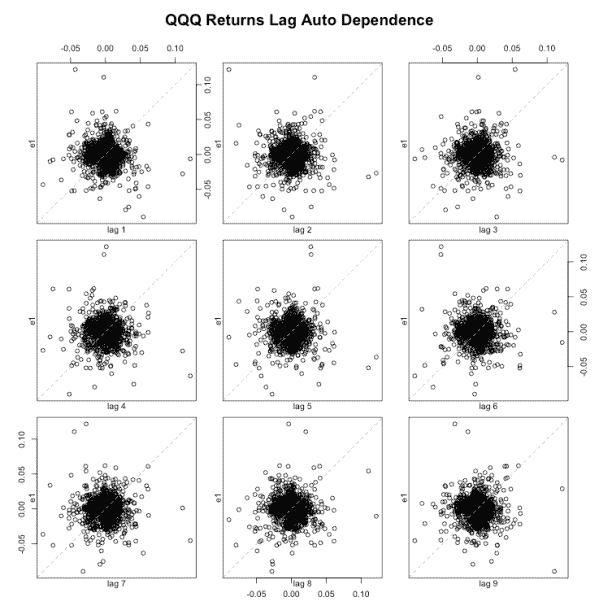
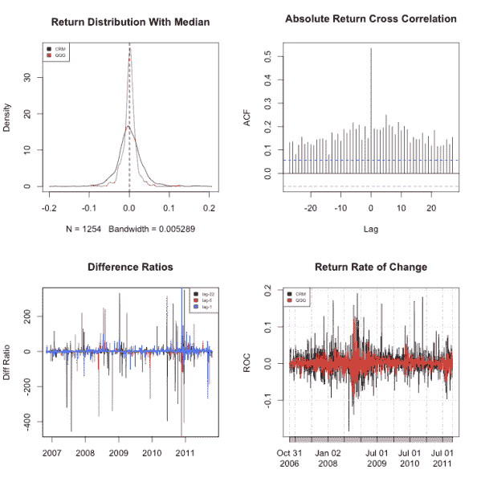
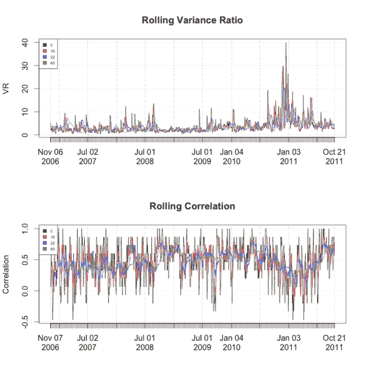
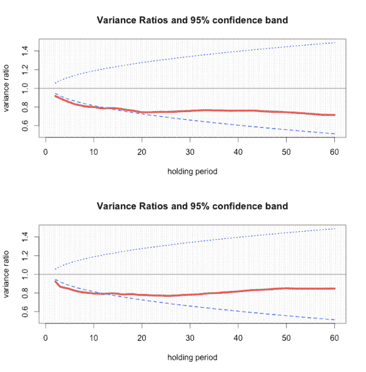

<!--yml
category: 未分类
date: 2024-05-18 13:47:42
-->

# Exploratory Hedge Analysis | Quantivity

> 来源：[https://quantivity.wordpress.com/2011/10/22/exploratory-proxy-cross-hedge-analysis/#0001-01-01](https://quantivity.wordpress.com/2011/10/22/exploratory-proxy-cross-hedge-analysis/#0001-01-01)

Previous posts on empirical [quantiles](https://quantivity.wordpress.com/2011/10/03/empirical-quantiles-proxy-cross-hedging-selection) and [copulas](https://quantivity.wordpress.com/2011/10/10/empirical-copulas-and-proxy-cross-hedge-basis-risk/) for [proxy / cross hedge](https://quantivity.wordpress.com/2011/10/02/proxy-cross-hedging) illustrate the potential insight from graphical visualization. This post continues the theme, illustrating *exploratory data analysis for proxy hedging* using classical statistical techniques.

In a world awash with symbolic models, there is ample room for graphical exploratory analysis in finance—as the fine texture of the real world differs from both mathematical formalisms and standard mental models. Indeed, alpha hides in the *divergence* between model and reality.

Statistician [John Tukey](http://en.wikipedia.org/wiki/John_Tukey) is one of the most well-known advocates of [exploratory data analysis](http://en.wikipedia.org/wiki/Exploratory_Data_Analysis), captured in his 1977 [book](http://books.google.com/books?id=UT9dAAAAIAAJ&q) of the same title. Tukey nicely captures the essence of exploratory analysis in the opening chapter of his book (p. 1):

> Exploratory data analysis is detective work–numerical detective work–or counting detective work–or graphical detective work.

This post illustrates graphical exploratory analysis, using R, specifically for the proxy hedging of previous posts: well-known tech company and QQQ. Although focused on a particular stock, these analysis techniques are *applicable to other equities and higher frequencies*.

Begin with scatters for daily prices and returns sampled over the previous 5 years, overlaid with fitted OLS and dispersion ellipsoids:

[](https://quantivity.wordpress.com/wp-content/uploads/2011/10/explore-proxy-scatters1.png)

Top left plot illustrates several distinct price regimes. Top right plot illustrates ample returns well outside the dispersion ellipsoids, consistent with previous posts. Bottom left plot illustrates returns split by sign, demonstrating divergence in fit between positive and non-negative returns. Bottom right plot illustrates divergence between returns under and over 0.5 standard deviations, whose fit is quite similar.

Next, lag scatters for CRM:

[](https://quantivity.wordpress.com/wp-content/uploads/2011/10/explore-crm-return-lags.png)

Illustrating moderately non-spherical returns in the tails at all lags, consistent with the quantiles discussed in previous post. QQQ exhibits similar non-spherical lag returns, although the shape is not consistent with CRM:

[](https://quantivity.wordpress.com/wp-content/uploads/2011/10/explore-qqq-return-lags.png)

To understand return dynamics in more depth, the following plots consider empirical density, absolute cross-correlation, difference ratios, and discrete rate of change:

[](https://quantivity.wordpress.com/wp-content/uploads/2011/10/explore-proxy-returns1.png)

Top left plot is textbook-style illustration of comparative *excess kurtosis*, with CRM return tails going out to +/- 10%. Cross correlation in top right plot exemplifies both forward and backward linear dependence for absolute returns, consistent with previous post on autocopulas. Difference ratios in bottom left plot illustrate empirical beta ranges from 1 to *several hundred*, irrespective whether returns are measured daily, weekly, or monthly—*this corroborates difficulty of proxy hedging with linear instruments*. These ratios provide the first evidence that late-2010 was perhaps even more anomalous for this pair than 2008, which is quite remarkable. Finally, bottom right plot illustrating return ROC further juxtaposes the comparison, as the ROC of both CRM and QQQ was dramatically higher in 2008 than 2010.

Finally, visualize the *rolling* proxy variance ratio (not to be confused with the standard statistical variance ratio, explored below) and correlation over the sample period with different durations:

[](https://quantivity.wordpress.com/wp-content/uploads/2011/10/explore-proxy-rolling.png)

Perhaps most interesting is the top plot which exemplifies that variance ratios (VR) for all roll durations are maximized over the 12 months beginning in August 2010\. Contrast those ratios with the *nearly flat VR, at all durations, during the financial crisis*. The bottom plot provides one dimension of insight into this comparative behavior, illustrating that proxy correlation behaved inversely during these two periods: correlation was maximized during the finance crisis and minimized during 2010/2011.

Another interesting effect illustrated by both plots is *temporal scaling behavior*: correlation exhibits *monotonic smoothing* as lag window increases (conceptually similar to low-pass filtering), as exemplified by correlation progressive decreasing with black (daily), red (bi-weekly), blue (monthly), and green (quarterly). In contrast, the roll variance ratio exhibits no such scaling (monotonic or not). For example, early 2007 exhibits 60-day VR *exceedingly* all period periods. Similarly, the monthly VR frequently exceeds the biweekly VR.

Finally, consider classic unstandardized variance ratios for both CRM (top plot) and QQQ (bottom plot), calculated using the *entire 5-year sample period*, which illustrates mean-reversion versus trending (due to [Lo and Mackinlay (1998)](http://press.princeton.edu/books/lo/chapt2.pdf)):

[](https://quantivity.wordpress.com/wp-content/uploads/2011/10/explore-proxy-vr.png)

Both exhibit similar qualitative behavior: strongly mean reverting for holding periods under 30 days, followed by weaker reverting for longer periods. Variance ratio analysis is worth further consideration, particularly more rich graphical techniques (*e.g.* [Lindemann *et al.* (2004)](http://www.ljmu.ac.uk/AFE/AFE_docs/VR_AND_REGR.PDF)) and multivariate methods.

* * *

R code to generate the preceding exploratory hedge analysis:

```

require("tseries")
require("vrtest")
require("fSeries")

colors <- c('black', 'red', 'blue', 'green', 'orange', 'purple', 'yellow', 'brown', 'pink', 'coral', 'cyan', 'darkgreen', 'darkred' ,'darkblue', 'darkgrey');

exploreProxyHedge <- function(p, doMonthlyScatter=TRUE, freq="daily", doQuantilePlots=TRUE)
{
  # Plot various proxy hedge exploratory analysis.
  #
  # Args:
  #   p: matrix of instrument price data, including valid colnames
  #   doMonthlyScatter: flag indicating whether monthly scatter should
  #           be plotted
  #   freq: text string for frequency, used for graphing
  #   doQuantilePlots: flag indicating whether quantiles should be plotted
  #
  # Returns: None

  oldpar <- par(mfrow=c(2,2))

  # discrete first differences (not logged)
  pROC <- ROC(p, type="discrete", na.pad=FALSE)
  p1ROC <- ROC(p[,1], type="discrete", na.pad=FALSE)
  p2ROC <- ROC(p[,2], type="discrete", na.pad=FALSE)

  # scatter analysis
  plot(coredata(p[,2]), coredata(p[,1]), xlab=colnames(p)[2], ylab=colnames(p)[1], main="Prices")
  plm <- lm(p[,1] ~ p[,2])
  abline(plm, col=colors[2], lty=2)
  mtext(text=paste("slope=",plm$coefficients[2]), side=3, cex=0.75, col=colors[2])

  plot(coredata(p1ROC), coredata(p2ROC), xlab=colnames(p)[2], ylab=colnames(p)[1], main="Returns")
  rlm <- lm(p1ROC ~ p2ROC)
  abline(rlm, col=colors[2], lty=2)
    par(xpd=TRUE)
    d <- dataEllipse(as.vector(coredata(p1ROC)),as.vector(coredata(p2ROC)),draw=FALSE)
    lines(d[[1]], col=colors[2], lty=3)
    lines(d[[2]], col=colors[3], lty=3)
    par(xpd=FALSE)
  mtext(text=paste("slope=",rlm$coefficients[2]), side=3, cex=0.75, col=colors[2])

  # split positive/negative scatter analysis
  plot(coredata(p2ROC[(coredata(p1ROC)>0)]), coredata(p1ROC[(coredata(p1ROC)>0)]), xlab=colnames(p)[2], ylab=paste(colnames(p)[1], "(Positive Only)"), xlim=c(min(p2ROC),max(p2ROC)), ylim=c(min(p1ROC),max(p1ROC)), main="Split Sign Return Scatter")
  prlm <- lm(coredata(p1ROC[(coredata(p1ROC)>0)]) ~ coredata(p2ROC[(coredata(p1ROC)>0)]))
  abline(prlm, col=colors[1], lty=2)
  points(coredata(p2ROC[(coredata(p1ROC)<0)]), coredata(p1ROC[(coredata(p1ROC)<0)]), xlab=colnames(p)[2], ylab=paste(colnames(p)[1], "(Negative Only)"), col='red')
  nrlm <- lm(coredata(p1ROC[(coredata(p1ROC)<0)]) ~ coredata(p2ROC[(coredata(p1ROC)<0)]))
  abline(nrlm, col=colors[2], lty=2)
  abline(rlm, col=colors[3], lty=2)
  legend("topleft",legend=c("Positive", "Negative", "Both"), fill=colors, cex=0.5)

  # split magnitude scatter analysis
  magBound <- sd(p1ROC) / 2
  plot(coredata(p2ROC[(abs(coredata(p2ROC))>=magBound)]), coredata(p1ROC[(abs(coredata(p2ROC))>=magBound)]), xlab=colnames(p)[2], ylab=paste(colnames(p)[1], "(Positive Only)"), xlim=c(min(p2ROC),max(p2ROC)), ylim=c(min(p1ROC),max(p1ROC)), main="Split Magnitude Return Scatter (0.5 SD)")
  orlm <- lm(coredata(p1ROC[(abs(coredata(p2ROC))>=magBound)]) ~ coredata(p2ROC[(abs(coredata(p2ROC))>=magBound)]))
  abline(orlm, lty=2)
  points(coredata(p2ROC[(abs(coredata(p2ROC))<magBound)]), coredata(p1ROC[(abs(coredata(p2ROC))<magBound)]), xlab=colnames(p)[2], ylab=paste(colnames(p)[1], "(Positive Only)"), xlim=c(min(p2ROC),max(p2ROC)), ylim=c(min(p1ROC),max(p1ROC)), main="Split Magnitude Return Scatter", col=colors[2])
  irlm <- lm(coredata(p1ROC[(abs(coredata(p2ROC))<magBound)]) ~ coredata(p2ROC[(abs(coredata(p2ROC))<magBound)]))
  abline(irlm, lty=2, col=colors[2])
  legend("topleft", legend=c("Outer", "Inner (+/- 0.5 SD)"), fill=colors, cex=0.5)

  # monthly scatter analysis
  if (doMonthlyScatter)
  {
    plot(coredata(xts(p)["2011-05"][,2]), coredata(xts(p)["2011-05"][,1]), ylim=c(min(p[,1]),max(p[,1])), xlim=c(min(p[,2]),max(p[,2])), col=colors[1], xlab=colnames(p)[2], ylab=colnames(p)[1], main="Prices by Month")
    points(coredata(xts(p)["2011-06"][,2]), coredata(xts(p)["2011-06"][,1]), col=colors[2])
    points(coredata(xts(p)["2011-07"][,2]), coredata(xts(p)["2011-07"][,1]), col=colors[3])
    points(coredata(xts(p)["2011-08"][,2]), coredata(xts(p)["2011-08"][,1]), col=colors[4])
    points(coredata(xts(p)["2011-09"][,2]), coredata(xts(p)["2011-09"][,1]), col=colors[5])
    points(coredata(xts(p)["2011-10"][,2]), coredata(xts(p)["2011-10"][,1]), col=colors[6])
    legend("topleft", legend=c("05", "06", "07", "08", "09", "10"), fill=colors, cex=0.5)
    abline(lm(coredata(xts(p)["2011-05"][,1]) ~ coredata(xts(p)["2011-05"][,2])), col=colors[1], lty=2)
    abline(lm(coredata(xts(p)["2011-06"][,1]) ~ coredata(xts(p)["2011-06"][,2])), col=colors[2], lty=2)
    abline(lm(coredata(xts(p)["2011-07"][,1]) ~ coredata(xts(p)["2011-07"][,2])), col=colors[3], lty=2)
    abline(lm(coredata(xts(p)["2011-08"][,1]) ~ coredata(xts(p)["2011-08"][,2])), col=colors[4], lty=2)
    abline(lm(coredata(xts(p)["2011-09"][,1]) ~ coredata(xts(p)["2011-09"][,2])), col=colors[5], lty=2)
  }

  # quantile plots
  if (doQuantilePlots)
  {
    qqplot(coredata(p2ROC), coredata(p1ROC), xlab=paste(colnames(p)[2], "Returns Quantiles"), ylab=paste(colnames(p)[1], "Returns Quantiles"), main="Empirical Returns QQ-Plot")
    abline(0,1,lty=2)
    grid(20)
    par(xpd=TRUE)
    d <- dataEllipse(as.vector(coredata(p1ROC)),as.vector(coredata(p2ROC)),draw=FALSE)
    lines(d[[1]], col=colors[2], lty=3)
    lines(d[[2]], col=colors[3], lty=3)
    par(xpd=FALSE)
  }

  # Price lag dependence
  lag.plot(p1ROC, 9, do.lines=FALSE, main=paste(colnames(p)[1], "Returns Lag Auto Dependence"))

  lag.plot(p2ROC, 9, do.lines=FALSE, main=paste(colnames(p)[2], "Returns Lag Auto Dependence"))

  par(mfrow=c(2,2))

  # return distributions
  p1Density <- density(p1ROC)
  p2Density <- density(p2ROC)

  plot(p1Density, ylim=c(0, max(p1Density$y, p2Density$y)), main="Return Distribution With Median")
  lines(p2Density, col=colors[2])
  abline(v=median(p1ROC), lty=2)
  abline(v=median(p2ROC), col=colors[2], lty=2)
  legend("topleft", legend=colnames(p), fill=colors, cex=0.5)

  # cross correlation
  ccf(data.frame(abs(coredata(p1ROC))), data.frame(abs(coredata(p2ROC))), main="Absolute Return Cross Correlation")

  # diff ratio analysis (exclude periods with zero return QQQ)
  p1NoZeros <- diff(p[(p[,2] != 0),])
  p5NoZeros <- diff(p, lag=5)
  p5NoZeros <- p5NoZeros[(p5NoZeros[,2] != 0),]
  p22NoZeros <- diff(p, lag=22)
  p22NoZeros <- p22NoZeros[(p22NoZeros[,2] != 0),]

  diff1Ratio <- p1NoZeros[,1] / p1NoZeros[,2]
  diff5Ratio <- p5NoZeros[,1] / p5NoZeros[,2]
  diff22Ratio <- p22NoZeros[,1] / p22NoZeros[,2]

  plot(diff22Ratio, main="Difference Ratios", ylab="Diff Ratio", xlab="")
  lines(diff5Ratio, col=colors[2])
  lines(diff1Ratio, col=colors[3])            
  legend("topright", legend=c("lag-22", "lag-5", "lag-1"), fill=colors, cex=0.5)

  # ROC analysis
  plot(xts(p1ROC), ylab="ROC", xlab="", main="Return Rate of Change")
  lines(xts(p2ROC), col=colors[2])
  legend("topleft", legend=colnames(p), fill=colors, cex=0.5)

  # variance ratio analysis
  vratio <- sd(p[,1]) / sd(p[,2])
  cat(paste("variance ratio:", round(vratio,2)),"\n")

  vRatio5 <- rollingVarianceRatio(p,5)
  vRatio10 <- rollingVarianceRatio(p,10)

  np <- nrow(p)
  vRatio22 <- c()
  vRatio60 <- c()
  if (np > 22)
  {
    vRatio22 <- rollingVarianceRatio(p,22)
    if (np > 60)
    {
      vRatio60 <- rollingVarianceRatio(p,60)
    }
  }

  par(mfrow=c(2,1))
  plot(vRatio5, type='l', xlab="", ylab="VR", main="Rolling Variance Ratio", ylim=c(min(vRatio5, vRatio10,vRatio22,vRatio60), max(vRatio5, vRatio10,vRatio22,vRatio60)))
  lines(vRatio10, col=colors[2])

  if (np > 22)
  {
    lines(vRatio22, col=colors[3])
    if(np > 60)
    {
      lines(vRatio60, col=colors[4])
    }
  }
  legend("topleft", legend=c("5", "10", "22", "60"), fill=colors, cex=0.5)

  # correlation analysis
  vCorr5 <- rollingCorrelation(pROC, 5)
  vCorr10 <- rollingCorrelation(pROC, 10)

  vCorr22 <- c()
  vCorr60 <- c()
  if (np > 22)
  {
    vCorr22 <- rollingCorrelation(pROC, 22)
    if (np > 60)
    {
      vCorr60 <- rollingCorrelation(pROC, 60)
    }
  }

  plot(vCorr5, type='l', xlab="", ylab="Correlation", main="Rolling Correlation", ylim=c(min(vCorr5, vCorr10,vCorr22,vCorr60), max(vCorr5, vCorr10,vCorr22,vCorr60)))
  lines(vCorr10, col=colors[2])

  if (np > 22)
  {
    lines(vCorr22, col=colors[3])
    if (np > 60)
    {
      lines(vCorr60, col=colors[4])
    }
  }
  legend("topleft", legend=c("5", "10", "22", "60"), fill=colors, cex=0.5)

  # classic variance ratios (unstandardized)
  VR.plot(p1ROC,60)
  VR.plot(p2ROC,60)

  par(oldpar)
}

rollingVarianceRatio <- function(p, winLen)
{
  # Calculate rolling variance ratio with a given window length
  #
  # Args:
  #   p: matrix of instrument price data, including valid colnames
  #   winLen: length of window over which to calculate variance
  #
  # Returns: xts of rolling variance ratio

  return (xts(sapply(c(1:(nrow(p)-winLen)), function(i) { sd(p[i:(i+winLen),1]) / sd(p[i:(i+winLen),2]) }), order.by=index(p[((winLen+1):nrow(p)),])))
}

rollingCorrelation <- function(p, winLen)
{
  # Calculate rolling correlation with a given window length
  #
  # Args:
  #   p: matrix of instrument price data, including valid colnames
  #   winLen: length of window over which to calculate correlation
  #
  # Returns: xts of rolling correlation

  return (xts(sapply(c(1:(nrow(p)-winLen)), function(i) { cor(p[i:(i+winLen)], method="kendall")[2,1] }), order.by=index(p[((winLen+1):nrow(p)),])))
}

```