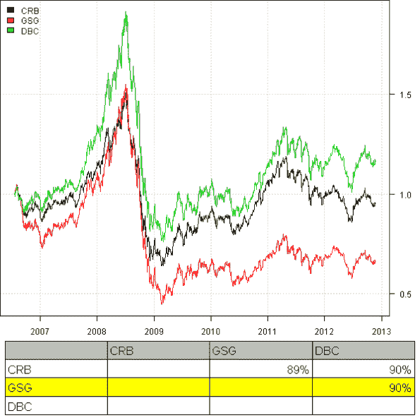
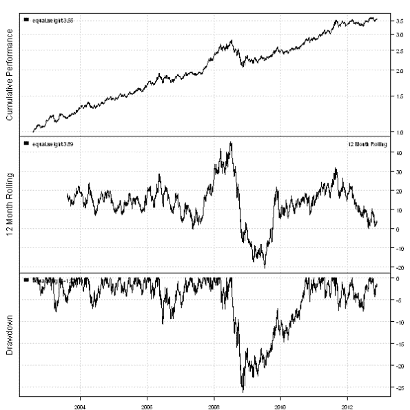
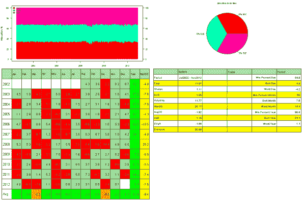

<!--yml
category: 未分类
date: 2024-05-18 14:35:47
-->

# Extending Commodity time series | Systematic Investor

> 来源：[https://systematicinvestor.wordpress.com/2012/11/22/extending-commodity-time-series/#0001-01-01](https://systematicinvestor.wordpress.com/2012/11/22/extending-commodity-time-series/#0001-01-01)

I want to follow up with [Extending Gold time series](https://systematicinvestor.wordpress.com/2012/09/11/extending-gold-time-series/) post by showing how we can extend Commodity time series. Most Commodity ETFs began trading in 2006, please see the [List of Commodity ETFs](http://etf.about.com/od/commodityetfs/a/List-Of-Commodity-Etfs.htm) page. I will use [DBC – PowerShares DB Commodity Fund](http://finance.yahoo.com/q?s=DBC), one on the most liquid Commodity ETFs as my proxy for Commodity time series.

Unfortunately the historical data for the underlying index for the [DBC – PowerShares DB Commodity Fund](http://finance.yahoo.com/q?s=DBC) is not publicly available. Instead I will use [Thomson Reuters/Jefferies CRB Index](http://www.jefferies.com/cositemgr.pl/html/ProductsServices/SalesTrading/Commodities/ReutersJefferiesCRB/IndexData/index.shtml) to extend [DBC – PowerShares DB Commodity Fund](http://finance.yahoo.com/q?s=DBC) time series.

I created a helper function [get.CRB() function in data.r at github](https://github.com/systematicinvestor/SIT/blob/master/R/data.r) to download and extract index information. Please note that I used gdata package to read index data and you might need local Perl available to make it work. There is a great tutorial on setting everything up at [How to read an excel file (dot xls and dot xlsx) into a data frame with r: gdata and perl](http://www.r-bloggers.com/how-to-read-an-excel-file-dot-xls-and-dot-xlsx-into-a-data-frame-with-r/) post.

Now let’s plot the CRB index and a few Commodity ETFs side by side to visual check the similarity:

```

###############################################################################
# Load Systematic Investor Toolbox (SIT)
# https://systematicinvestor.wordpress.com/systematic-investor-toolbox/
###############################################################################
setInternet2(TRUE)
con = gzcon(url('http://www.systematicportfolio.com/sit.gz', 'rb'))
    source(con)
close(con)

	#*****************************************************************
	# Load historical data
	#****************************************************************** 	
	load.packages('quantmod')		
	CRB = get.CRB()

	tickers = spl('GSG,DBC')		
	getSymbols(tickers, src = 'yahoo', from = '1970-01-01')

	#*****************************************************************
	# Compare different indexes
	#****************************************************************** 	
	out = na.omit(merge(Ad(CRB), Ad(GSG), Ad(DBC)))
		colnames(out) = spl('CRB,GSG,DBC')
	temp = out / t(repmat(as.vector(out[1,]),1,nrow(out)))

	# Plot side by side
	layout(1:2, heights=c(4,1))
	plota(temp, ylim=range(temp))
		plota.lines(temp[,1],col=1)
		plota.lines(temp[,2],col=2)
		plota.lines(temp[,3],col=3)
	plota.legend(colnames(temp),1:3)

	# Plot correlation table
	temp = compute.cor(temp / mlag(temp)- 1, 'pearson')
			temp[] = plota.format(100 * temp, 0, '', '%')
	plot.table(temp)	

```

[](https://systematicinvestor.wordpress.com/wp-content/uploads/2012/11/plot1-small2.png)

The CRB index performed similar to Commodity ETFs; its not the exact replica, but will do given the lack of public historical data for Commodity index.

Next let’s extend the DBC’s time series with CRB index and use it for a simple equal weight strategy:

```

	#*****************************************************************
	# Create simple equal weight back-test
	#****************************************************************** 
	tickers = spl('GLD,DBC,TLT')

	data <- new.env()
	getSymbols(tickers, src = 'yahoo', from = '1980-01-01', env = data, auto.assign = T)
		for(i in ls(data)) data[[i]] = adjustOHLC(data[[i]], use.Adjusted=T)

		# extend Gold and Commodity time series
		data$GLD = extend.GLD(data$GLD)	
		data$DBC = extend.data(data$DBC, get.CRB(), scale=T)

	bt.prep(data, align='remove.na')

	#*****************************************************************
	# Code Strategies
	#******************************************************************
	prices = data$prices      
	n = ncol(prices)

	# find period ends
	period.ends = endpoints(prices, 'months')
		period.ends = period.ends[period.ends > 0]

	models = list()

	#*****************************************************************
	# Equal Weight
	#******************************************************************
	data$weight[] = NA
		data$weight[period.ends,] = ntop(prices[period.ends,], n)   
	models$equal.weight = bt.run.share(data, clean.signal=F)

	#*****************************************************************
	# Create Report
	#******************************************************************       
	plotbt.custom.report.part1(models)       
	plotbt.custom.report.part2(models)       

```

[](https://systematicinvestor.wordpress.com/wp-content/uploads/2012/11/plot2-small2.png)

[](https://systematicinvestor.wordpress.com/wp-content/uploads/2012/11/plot3-small1.png)

By extending DBC’s and GLD’s time series, the back-test now goes back to the July 2002, the TLT’s first trading date.

To view the complete source code for this example, please have a look at the [bt.extend.DBC.test() function in bt.test.r at github](https://github.com/systematicinvestor/SIT/blob/master/R/bt.test.r).