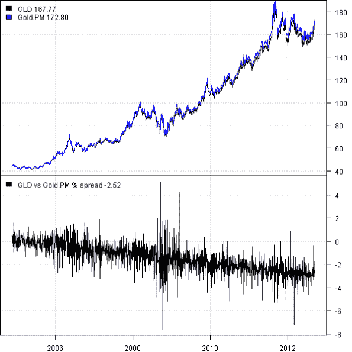

<!--yml
category: 未分类
date: 2024-05-18 14:38:00
-->

# Extending Gold time series | Systematic Investor

> 来源：[https://systematicinvestor.wordpress.com/2012/09/11/extending-gold-time-series/#0001-01-01](https://systematicinvestor.wordpress.com/2012/09/11/extending-gold-time-series/#0001-01-01)

While back-testing trading strategies I want all assets to have long history. Unfortunately, sometimes there is no tradeable stock or ETF with sufficient history. For example, I might use [GLD](http://finance.yahoo.com/q?s=GLD) as a proxy for Gold allocation, but [GLD](http://finance.yahoo.com/q?s=GLD) is only began trading in November of 2004.

We can extend the GLD’s historical returns with its benchmark index – London Gold afternoon fixing prices. Let’s first download and plot side by side the GLD and London Gold afternoon fixing prices from [http://www.kitco.com/gold.londonfix.html](http://www.kitco.com/gold.londonfix.html) the convenient CSV download is provided by [Wikiposit](http://wikiposit.org/w?filter=Finance/Commodities/).

```

###############################################################################
# Load Systematic Investor Toolbox (SIT)
# https://systematicinvestor.wordpress.com/systematic-investor-toolbox/
###############################################################################
setInternet2(TRUE)
con = gzcon(url('http://www.systematicportfolio.com/sit.gz', 'rb'))
    source(con)
close(con)

	#*****************************************************************
	# Load historical data
	#****************************************************************** 
	load.packages('quantmod')	
	GLD = getSymbols('GLD', src = 'yahoo', from = '1970-01-01', auto.assign = F)			
		GLD = adjustOHLC(GLD, use.Adjusted=T)

	# get Gold.PM - London Gold afternoon fixing prices
	temp = read.csv('http://wikiposit.org/w?action=dl&dltypes=comma%20separated&sp=daily&uid=KITCO',skip=4,header=TRUE, stringsAsFactors=F)
	Gold.PM = make.xts(as.double(temp$Gold.PM) / 10, as.Date(temp$Date, '%d-%b-%Y'))
		Gold.PM = Gold.PM[ !is.na(Gold.PM), ]

	# merge GLD and Gold.PM
	data <- new.env()
		data$GLD = GLD
		data$Gold.PM = Gold.PM
	bt.prep(data, align='remove.na')

	#*****************************************************************
	# Plot GLD and Gold.PM
	#****************************************************************** 
	layout(1:2)
	plota(data$GLD, type='l', col='black', plotX=F)	
		plota.lines(data$Gold.PM, col='blue')	
	plota.legend('GLD,Gold.PM', 'black,blue', list(data$GLD, data$Gold.PM))

	# plot GLD and London afternoon gold fix spread
	spread = 100 * (Cl(data$GLD) - data$Gold.PM) / data$Gold.PM
	plota(spread , type='l', col='black')	
		plota.legend('GLD vs Gold.PM % spread', 'black', spread)

```

[](https://systematicinvestor.wordpress.com/wp-content/uploads/2012/09/plot1-small.png)

There is a divergence between GLD and its benchmark index. Please read [“Gold’s ‘Paper’ Price” article by B. Zigler](http://www.hardassetsinvestor.com/interviews/2091-golds-paper-price.html) for a detailed discussion and explanation for this divergence.

Next let’s extend the GLD’s time series with its benchmark ( I created a helper function [extend.GLD() function in data.r at github](https://github.com/systematicinvestor/SIT/blob/master/R/data.r) to simplify the process ) and use it for a simple equal weight strategy

```

	#*****************************************************************
	# Create simple equal weight back-test
	#****************************************************************** 
	tickers = spl('GLD,TLT')

	data <- new.env()
	getSymbols(tickers, src = 'yahoo', from = '1980-01-01', env = data, auto.assign = T)
		for(i in ls(data)) data[[i]] = adjustOHLC(data[[i]], use.Adjusted=T)

		# extend GLD with Gold.PM - London Gold afternoon fixing prices
		data$GLD = extend.GLD(data$GLD)

	bt.prep(data, align='remove.na')

    #*****************************************************************
    # Code Strategies
    #******************************************************************
    prices = data$prices      
    n = ncol(prices)

    # find period ends
    period.ends = endpoints(prices, 'months')
        period.ends = period.ends[period.ends > 0]

    models = list()

    #*****************************************************************
    # Equal Weight
    #******************************************************************
    data$weight[] = NA
        data$weight[period.ends,] = ntop(prices[period.ends,], n)   
    models$equal.weight = bt.run.share(data, clean.signal=F)

    #*****************************************************************
    # Create Report
    #******************************************************************       
    plotbt.custom.report.part1(models)       
    plotbt.custom.report.part2(models)       

```

[](https://systematicinvestor.wordpress.com/wp-content/uploads/2012/09/plot3-small.png)

[](https://systematicinvestor.wordpress.com/wp-content/uploads/2012/09/plot4-small.png)

By extending GLD’s time series, the back-test now goes back to the June 2002, the TLT’s first trading date.

To view the complete source code for this example, please have a look at the [bt.extend.GLD.test() function in bt.test.r at github](https://github.com/systematicinvestor/SIT/blob/master/R/bt.test.r).