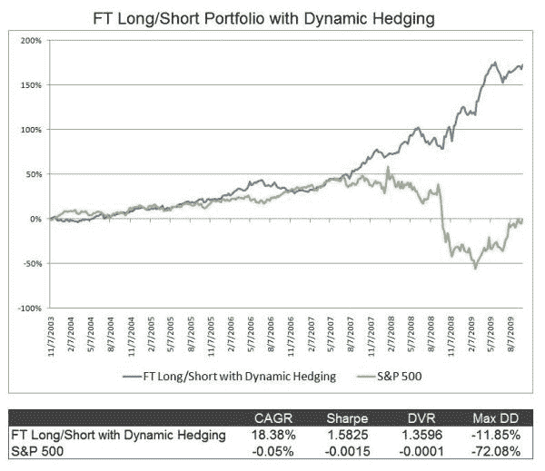

<!--yml
category: 未分类
date: 2024-05-12 18:45:04
-->

# FT Portfolio with Dynamic Hedging | CSSA

> 来源：[https://cssanalytics.wordpress.com/2009/10/15/ft-portfolio-with-dynamic-hedging/#0001-01-01](https://cssanalytics.wordpress.com/2009/10/15/ft-portfolio-with-dynamic-hedging/#0001-01-01)

Ok here is a quickie post to show the risk reduction benefits of dynamic hedging. In this case we are using a long/short portfolio that does not need to be market neutral. If the S&P500 is above the 200ma we will go net long 25%, and if the long portfolio is above its 2 period EMA (2 weeks)  then we will go net long 50%. The remainder of the portfolio is of course fully hedged against the bottom 20 FT. Should the S&P500 drop below its 200 ma and the long portfolio is below its 2 period EMA, we will be fully market neutral.  Essentially we are leveraging our long exposure only when it is least risky to do so—-ie its a bull market, and our portfolio is rising. This isn’t the optimal method and there are many possible combinations, but the results are superb on a risk adjusted basis. Max drawdown for the Dynamic portfolio is only -12%,  and both the Sharpe and DVR are very high. This is more comparable to what a hedge fund would require in risk/return characteristics. However, keep in mind that the portfolio does not factor in transaction costs, and with weekly rebalancing, this will reduce returns.

