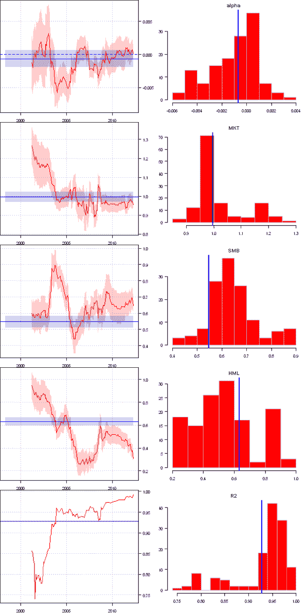

<!--yml
category: 未分类
date: 2024-05-18 14:40:03
-->

# Factor Attribution | Systematic Investor

> 来源：[https://systematicinvestor.wordpress.com/2012/06/20/factor-attribution/#0001-01-01](https://systematicinvestor.wordpress.com/2012/06/20/factor-attribution/#0001-01-01)

I came across a very descriptive visualization of the Factor Attribution that I will replicate today. There is the [Three Factor Rolling Regression Viewer](http://mas.xtreemhost.com/) at the [mas financial tools](http://mas.xtreemhost.com/) web site that performs rolling window Factor Analysis of the [“three-factor model”](http://en.wikipedia.org/wiki/Fama%E2%80%93French_three-factor_model) of Fama and French. The factor returns are available from the [Kenneth R French: Data Library](http://mba.tuck.dartmouth.edu/pages/faculty/ken.french/data_library.html). I recommend reading the [Efficient Frontier: Rolling Your Own: Three-Factor Analysis by W. Bernstein](http://www.efficientfrontier.com/ef/101/roll101.htm) for a step by step instructions.

Let’s start by loading historical returns for the [Vanguard Small Cap Value Index (VISVX)](http://www.google.com/finance?q=VISVX) and aligning them with Fama/French Monthly Factors. Please note I wrote a helper function, [get.fama.french.data()](https://github.com/systematicinvestor/SIT/blob/master/R/data.r), to simplify process of loading and analyzing factor data from the [Kenneth R French: Data Library](http://mba.tuck.dartmouth.edu/pages/faculty/ken.french/data_library.html).

```

###############################################################################
# Load Systematic Investor Toolbox (SIT)
# https://systematicinvestor.wordpress.com/systematic-investor-toolbox/
###############################################################################
setInternet2(TRUE)
con = gzcon(url('http://www.systematicportfolio.com/sit.gz', 'rb'))
    source(con)
close(con)

	#*****************************************************************
	# Load historical data
	#****************************************************************** 
	load.packages('quantmod')	
	tickers = 'VISVX'

	data <- new.env()
	getSymbols(tickers, src = 'yahoo', from = '1980-01-01', env = data, auto.assign = T)
	for(i in ls(data)) {
		temp = adjustOHLC(data[[i]], use.Adjusted=T)							

		period.ends = endpoints(temp, 'months')
			period.ends = period.ends[period.ends > 0]

		# reformat date to match Fama French Data
		monthly.dates = as.Date(paste(format(index(temp)[period.ends], '%Y%m'),'01',sep=''), '%Y%m%d')
		data[[i]] = make.xts(coredata(temp[period.ends,]), monthly.dates)
	}

	# Fama/French factors
	factors = get.fama.french.data('F-F_Research_Data_Factors', periodicity = 'months',download = T, clean = F)

	# add factors and align
	data$factors = factors$data / 100
	bt.prep(data, align='remove.na', dates='1994::')

```

Next, let’s run Factor Attribution over all available data:

```

	#*****************************************************************
	# Facto Loadings Regression over whole period
	#****************************************************************** 
	prices = data$prices
		nperiods = nrow(prices)
		dates = index(data$prices)

	# compute simple returns	
	hist.returns = ROC(prices[,tickers], type = 'discrete')
		hist.returns = hist.returns - data$factors$RF
		colnames(hist.returns) = 'fund'
	hist.returns = cbind(hist.returns, data$factors$Mkt.RF,
					data$factors$SMB, data$factors$HML)

	fit.all = summary(lm(fund~Mkt.RF+SMB+HML, data=hist.returns))
		estimate.all = c(fit.all$coefficients[,'Estimate'], fit.all$r.squared)
		std.error.all = c(fit.all$coefficients[,'Std. Error'], NA)

```

```

Coefficients:
              Estimate Std. Error t value Pr(>|t|)
(Intercept) -0.0006828  0.0012695  -0.538    0.591
Mkt.RF       0.9973980  0.0262881  37.941   <2e-16 ***
SMB          0.5478299  0.0364984  15.010   <2e-16 ***
HML          0.6316528  0.0367979  17.165   <2e-16 ***
---
Signif. codes:  0 '***' 0.001 '**' 0.01 '*' 0.05 '.' 0.1 ' ' 1

Multiple R-squared: 0.9276,     Adjusted R-squared: 0.9262

```

All factor loadings are significant.

Next, let’s run a 36 month rolling window Factor Attribution:

```

	#*****************************************************************
	# Facto Loadings Regression over 36 Month window
	#****************************************************************** 							
	window.len = 36

	colnames = spl('alpha,MKT,SMB,HML,R2')
	estimate = make.xts(matrix(NA, nr = nperiods, len(colnames)), dates)
	colnames(estimate) = colnames
	std.error = estimate

	# main loop
	for( i in window.len:nperiods ) {
		window.index = (i - window.len + 1) : i

		fit = summary(lm(fund~Mkt.RF+SMB+HML, data=hist.returns[window.index,]))
		estimate[i,] = c(fit$coefficients[,'Estimate'], fit$r.squared)
		std.error[i,] = c(fit$coefficients[,'Std. Error'], NA)

		if( i %% 10 == 0) cat(i, '\n')
	}

```

Finally, let’s re-create the timeseries and histogram charts as presented by [Three Factor Rolling Regression Viewer](http://mas.xtreemhost.com/).

```

	#*****************************************************************
	# Reports
	#****************************************************************** 
	layout(matrix(1:10,nc=2,byrow=T))

	for(i in 1:5) {	
		#-------------------------------------------------------------------------
		# Time plot
		#-------------------------------------------------------------------------
		est = estimate[,i]
		est.std.error = ifna(std.error[,i], 0)

		plota(est, 
			ylim = range( c(
				range(est + est.std.error, na.rm=T),
				range(est - est.std.error, na.rm=T)		
				)))

		polygon(c(dates,rev(dates)), 
			c(coredata(est + est.std.error), 
			rev(coredata(est - est.std.error))), 
			border=NA, col=col.add.alpha('red',50))

		est = estimate.all[i]
		est.std.error = std.error.all[i]

		polygon(c(range(dates),rev(range(dates))), 
			c(rep(est + est.std.error,2),
			rep(est - est.std.error,2)),
			border=NA, col=col.add.alpha('blue',50))

		abline(h=0, col='blue', lty='dashed')

		abline(h=est, col='blue')

		plota.lines(estimate[,i], type='l', col='red')

		#-------------------------------------------------------------------------
		# Histogram
		#-------------------------------------------------------------------------
		par(mar = c(4,3,2,1))
		hist(estimate[,i], col='red', border='gray', las=1,
			xlab='', ylab='', main=colnames(estimate)[i])
			abline(v=estimate.all[i], col='blue', lwd=2)
	}

```

[](https://systematicinvestor.wordpress.com/wp-content/uploads/2012/06/plot1.png)

In the next post, I plan to replicate the Style charts and provide more examples.

To view the complete source code for this example, please have a look at the [three.factor.rolling.regression() function in bt.test.r at github](https://github.com/systematicinvestor/SIT/blob/master/R/bt.test.r).