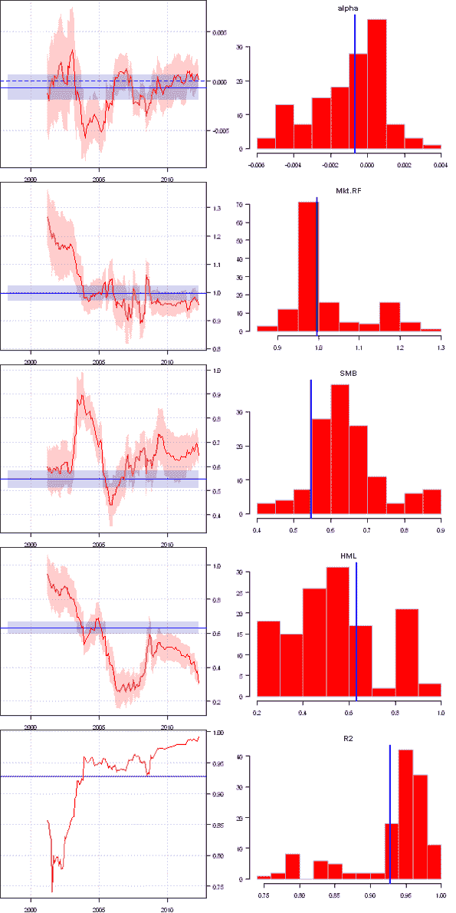
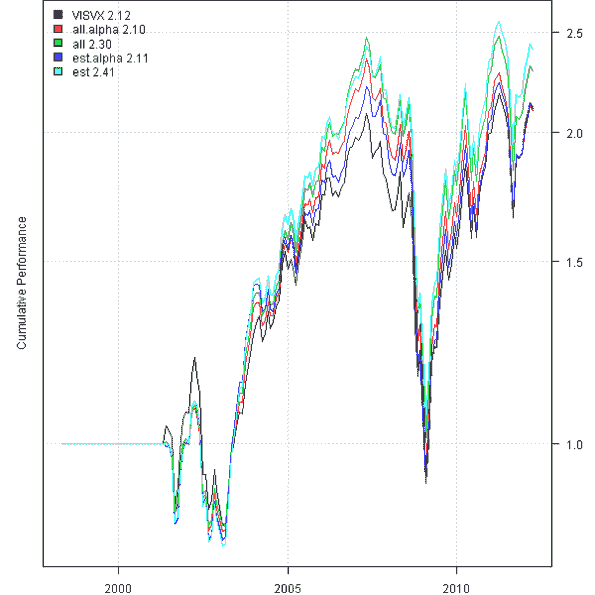
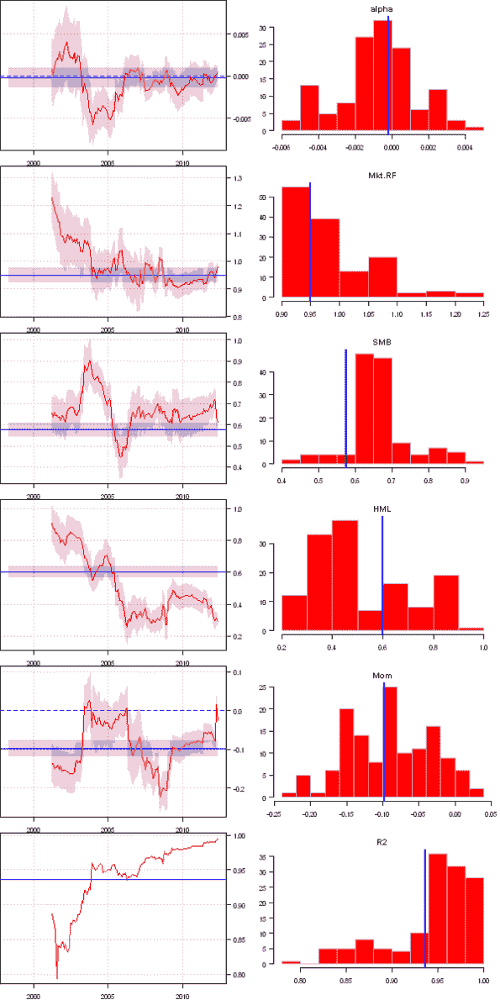
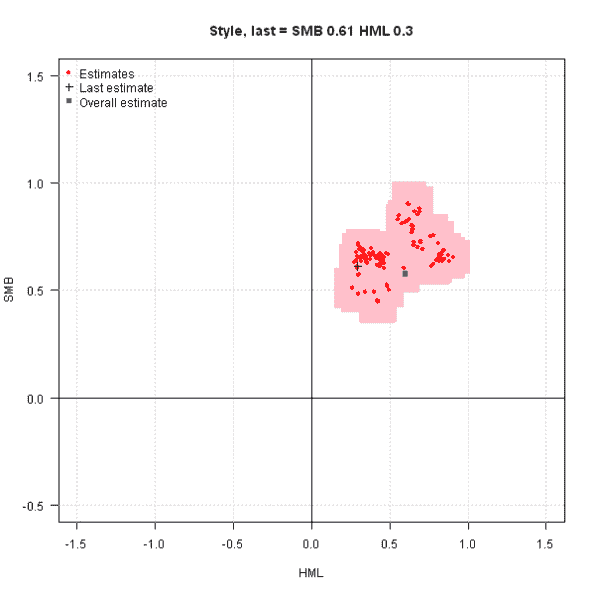
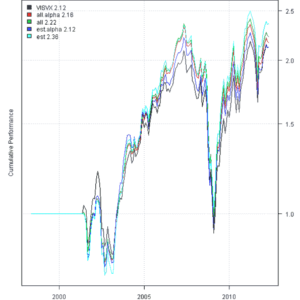
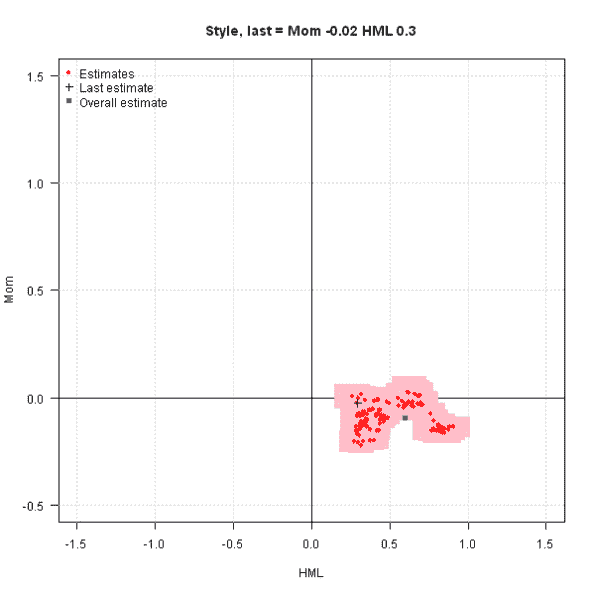

<!--yml
category: 未分类
date: 2024-05-18 14:39:55
-->

# Factor Attribution 2 | Systematic Investor

> 来源：[https://systematicinvestor.wordpress.com/2012/06/27/factor-attribution-2/#0001-01-01](https://systematicinvestor.wordpress.com/2012/06/27/factor-attribution-2/#0001-01-01)

I want to continue with Factor Attribution theme that I presented in the [Factor Attribution](https://systematicinvestor.wordpress.com/2012/06/20/factor-attribution/) post. I have re-organized the code logic into the following 4 functions:

*   factor.rolling.regression – Factor Attribution over given rolling window
*   factor.rolling.regression.detail.plot – detail time-series plot and histogram for each factor
*   factor.rolling.regression.style.plot – historical style plot for selected 2 factors
*   factor.rolling.regression.bt.plot – compare fund’s performance with portfolios implied by Factor Attribution

Let’s first replicate style and performance charts from the [Three Factor Rolling Regression Viewer](http://mas.xtreemhost.com/) at the [mas financial tools](http://mas.xtreemhost.com/) web site.

```

###############################################################################
# Load Systematic Investor Toolbox (SIT)
# https://systematicinvestor.wordpress.com/systematic-investor-toolbox/
###############################################################################
setInternet2(TRUE)
con = gzcon(url('http://www.systematicportfolio.com/sit.gz', 'rb'))
    source(con)
close(con)

	#*****************************************************************
	# Load historical data
	#****************************************************************** 
	load.packages('quantmod')	
	tickers = 'VISVX'

	periodicity = 'months'

	data <- new.env()
	getSymbols(tickers, src = 'yahoo', from = '1980-01-01', env = data, auto.assign = T)
	for(i in ls(data)) {
		temp = adjustOHLC(data[[i]], use.Adjusted=T)							

		period.ends = endpoints(temp, periodicity)
			period.ends = period.ends[period.ends > 0]

		if(periodicity == 'months') {
			# reformat date to match Fama French Data
			monthly.dates = as.Date(paste(format(index(temp)[period.ends], '%Y%m'),'01',sep=''), '%Y%m%d')
			data[[i]] = make.xts(coredata(temp[period.ends,]), monthly.dates)
		} else
			data[[i]] = temp[period.ends,]
	}
	data.fund = data[[tickers]]

	#*****************************************************************
	# Fama/French factors
	#****************************************************************** 
	factors = get.fama.french.data('F-F_Research_Data_Factors', periodicity = periodicity,download = T, clean = F)

	# add factors and align
	data <- new.env()
		data[[tickers]] = data.fund
	data$factors = factors$data / 100
	bt.prep(data, align='remove.na', dates='1994::')

	#*****************************************************************
	# Facto Loadings Regression
	#****************************************************************** 
	obj = factor.rolling.regression(data, tickers, 36)

	#*****************************************************************
	# Reports
	#****************************************************************** 
	factor.rolling.regression.detail.plot(obj)

	factor.rolling.regression.style.plot(obj)

	factor.rolling.regression.bt.plot(obj)

```

[](https://systematicinvestor.wordpress.com/wp-content/uploads/2012/06/plot1-small2.png)

[](https://systematicinvestor.wordpress.com/wp-content/uploads/2012/06/plot2-small2.png)

[](https://systematicinvestor.wordpress.com/wp-content/uploads/2012/06/plot3-small1.png)

Next let’s add the Momentum factor from the [Kenneth R French: Data Library](http://mba.tuck.dartmouth.edu/pages/faculty/ken.french/data_library.html) and run Factor Attribution one more time.

```

	#*****************************************************************
	# Fama/French factors + Momentum
	#****************************************************************** 
	factors = get.fama.french.data('F-F_Research_Data_Factors', periodicity = periodicity,download = T, clean = F)

	factors.extra = get.fama.french.data('F-F_Momentum_Factor', periodicity = periodicity,download = T, clean = F)	
		factors$data = merge(factors$data, factors.extra$data) 

	# add factors and align
	data <- new.env()
		data[[tickers]] = data.fund
	data$factors = factors$data / 100
	bt.prep(data, align='remove.na', dates='1994::')

	#*****************************************************************
	# Facto Loadings Regression
	#****************************************************************** 
	obj = factor.rolling.regression(data, tickers, 36)

	#*****************************************************************
	# Reports
	#****************************************************************** 
	factor.rolling.regression.detail.plot(obj)

	factor.rolling.regression.style.plot(obj)

	factor.rolling.regression.bt.plot(obj)

```

[](https://systematicinvestor.wordpress.com/wp-content/uploads/2012/06/plot4-small1.png)

[](https://systematicinvestor.wordpress.com/wp-content/uploads/2012/06/plot5-small1.png)

[](https://systematicinvestor.wordpress.com/wp-content/uploads/2012/06/plot7-small1.png)
To visualize style from the Momentum point of view, let’s create a style chart that shows fund’s attribution in the HML / Momentum space.

```

	factor.rolling.regression.style.plot(obj, xfactor='HML', yfactor='Mom')

```

[](https://systematicinvestor.wordpress.com/wp-content/uploads/2012/06/plot6-small1.png)

I designed the Factor Attribution functions to take any user specified factors. This way you can easily run Factor Attribution on any combination of the historical factor returns from the [Kenneth R French: Data Library](http://mba.tuck.dartmouth.edu/pages/faculty/ken.french/data_library.html) Or use your own historical factor returns data.

To view the complete source code for this example, please have a look at the [three.factor.rolling.regression() function in bt.test.r at github](https://github.com/systematicinvestor/SIT/blob/master/R/bt.test.r).