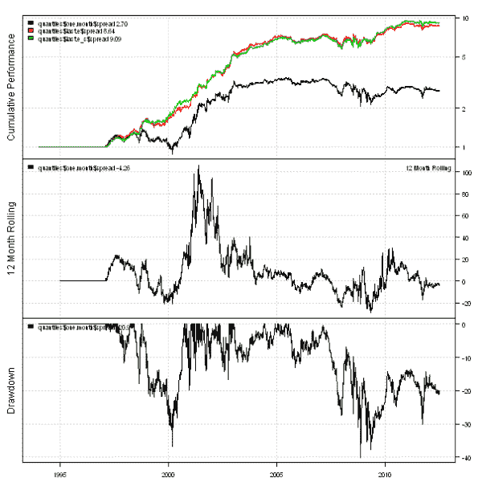
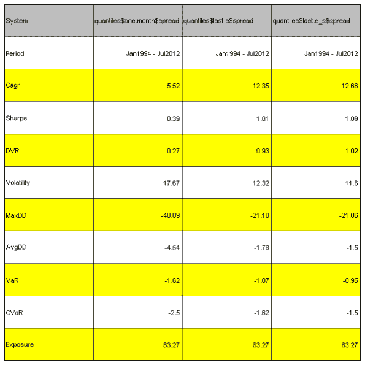
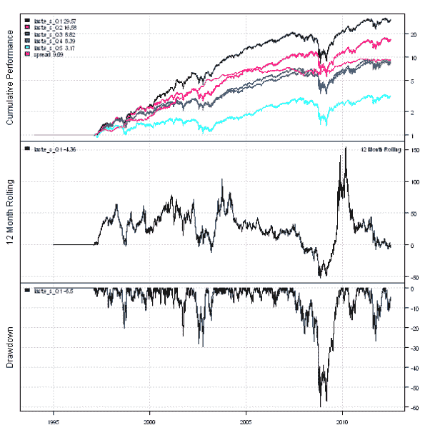

<!--yml
category: 未分类
date: 2024-05-18 14:39:26
-->

# Factor Attribution to improve performance of the 1-Month Reversal Strategy | Systematic Investor

> 来源：[https://systematicinvestor.wordpress.com/2012/07/17/factor-attribution-to-improve-performance-of-the-1-month-reversal-strategy/#0001-01-01](https://systematicinvestor.wordpress.com/2012/07/17/factor-attribution-to-improve-performance-of-the-1-month-reversal-strategy/#0001-01-01)

Today I want to show how to use [Factor Attribution](https://systematicinvestor.wordpress.com/2012/07/04/example-of-factor-attribution/) to boost performance of the [1-Month Reversal Strategy](https://systematicinvestor.wordpress.com/2012/07/13/1-month-reversal-strategy/). The [Short-Term Residual Reversal by D. Blitz, J. Huij, S. Lansdorp, M. Verbeek (2011)](http://papers.ssrn.com/sol3/papers.cfm?abstract_id=1911449) paper presents the idea and discusses the results as applied to US stock market since 1929\. To improve 1-Month Reversal Strategy performance authors investigate an alternative position ranking metric based on the residuals from the rolling Factor Attribution regression.

The base 1-Month Reversal Strategy forms portfolios each month by buying 20% of loosers and short selling 20% of winners from the S&P 500 index based on the prior 1-Month returns. The 1-Month **Residual** Reversal Strategy forms portfolios each month by buying 20% of loosers and short selling 20% of winners from the S&P 500 index based on the residuals from the rolling Factor Attribution regression. Following are the steps to form 1-Month **Residual** Reversal Strategy portfolio each month:

*   1\. for each company in the S&P 500 index, run a rolling Factor Attribution regression on the prior 36 months and compute residuals: e.1, e.2, …, e.t, …, e.T for t in 1:36
*   2\. alternative position ranking metric = e.T / standard deviation of (e)
*   3\. form portfolios by buying 20% of loosers and short selling 20% of winners from the S&P 500 index based on the alternative position ranking metric

Let’s start by loading historical prices for all companies in the S&P 500 and create SPY and Equal Weight benchmarks using the [Systematic Investor Toolbox](https://systematicinvestor.wordpress.com/systematic-investor-toolbox/):

```

###############################################################################
# Load Systematic Investor Toolbox (SIT)
# https://systematicinvestor.wordpress.com/systematic-investor-toolbox/
###############################################################################
setInternet2(TRUE)
con = gzcon(url('http://www.systematicportfolio.com/sit.gz', 'rb'))
    source(con)
close(con)

	#*****************************************************************
	# Load historical data
	#****************************************************************** 
	load.packages('quantmod')	
	tickers = sp500.components()$tickers

	data <- new.env()
	getSymbols(tickers, src = 'yahoo', from = '1970-01-01', env = data, auto.assign = T)
		# remove companies with less than 5 years of data
		rm.index = which( sapply(ls(data), function(x) nrow(data[[x]])) < 1000 )	
		rm(list=names(rm.index), envir=data)

		for(i in ls(data)) data[[i]] = adjustOHLC(data[[i]], use.Adjusted=T)		
	bt.prep(data, align='keep.all', dates='1994::')
		tickers = data$symbolnames

	data.spy <- new.env()
	getSymbols('SPY', src = 'yahoo', from = '1970-01-01', env = data.spy, auto.assign = T)
	bt.prep(data.spy, align='keep.all', dates='1994::')

	#*****************************************************************
	# Code Strategies
	#****************************************************************** 
	prices = data$prices
		n = ncol(prices)

	#*****************************************************************
	# Setup monthly periods
	#****************************************************************** 
	periodicity = 'months'

	period.ends = endpoints(data$prices, periodicity)
		period.ends = period.ends[period.ends > 0]

	prices = prices[period.ends, ]		

	#*****************************************************************
	# Create Benchmarks, omit results for the first 36 months - to be consistent with Factor Attribution
	#****************************************************************** 	
	models = list()

	# SPY
	data.spy$weight[] = NA
		data.spy$weight[] = 1
		data.spy$weight[1:period.ends[36],] = NA
	models$spy = bt.run(data.spy)

	# Equal Weight
	data$weight[] = NA
		data$weight[period.ends,] = ntop(prices, n)
		data$weight[1:period.ends[36],] = NA		
	models$equal.weight = bt.run(data)

```

Next let’s run Factor Attribution on each the stocks in the S&P 500 index to determine it’s alternative position ranking metric. I will save both e.T and e.T / standard deviation of (e) metrics.

```

# function to compute additional custom stats for factor.rolling.regression
factor.rolling.regression.custom.stats <- function(x,y,fit) {
	n = len(y)
	e = y - x %*% fit$coefficients
	se = sd(e)
	return(c(e[n], e[n]/se))
}

	#*****************************************************************
	# Load factors and align them with prices
	#****************************************************************** 	
	# load Fama/French factors
	factors = get.fama.french.data('F-F_Research_Data_Factors', periodicity = periodicity,download = T, clean = F)

	# align monthly dates
	map = match(format(index(factors$data), '%Y%m'), format(index(prices), '%Y%m'))
		dates = index(factors$data)
		dates[!is.na(map)] = index(prices)[na.omit(map)]
	index(factors$data) = as.Date(dates)

	# add factors and align
	data.fa <- new.env()
		for(i in tickers) data.fa[[i]] = data[[i]][period.ends, ]
		data.fa$factors = factors$data / 100
	bt.prep(data.fa, align='remove.na')

	index = match( index(data.fa$prices), index(data$prices) )
		prices = data$prices[index, ]

	#*****************************************************************
	# Compute Factor Attribution for each ticker
	#****************************************************************** 	

	temp = NA * prices
	factors	= list()
		factors$last.e = temp
		factors$last.e_s = temp

	for(i in tickers) {
		cat(i, '\n')

		# Facto Loadings Regression
		obj = factor.rolling.regression(data.fa, i, 36, silent=T,
			factor.rolling.regression.custom.stats)

		for(j in 1:len(factors))		
			factors[[j]][,i] = obj$fl$custom[,j]

	}

	# add base strategy
	factors$one.month = coredata(prices / mlag(prices))

```

Next let’s group stocks into Quantiles based on 1-Month Reversal factors and create reports.

```

	#*****************************************************************
	# Create Quantiles
	#****************************************************************** 
	quantiles = list()

	for(name in names(factors)) {
		cat(name, '\n')
		quantiles[[name]] = bt.make.quintiles(factors[[name]], data, index, start.t =  1+36, prefix=paste(name,'_',sep=''))
	}	

	#*****************************************************************
	# Create Report
	#****************************************************************** 					
	plotbt.custom.report.part1(quantiles$one.month$spread,quantiles$last.e$spread,quantiles$last.e_s$spread)

	plotbt.strategy.sidebyside(quantiles$one.month$spread,quantiles$last.e$spread,quantiles$last.e_s$spread)

	plotbt.custom.report.part1(quantiles$last.e_s)

```

[](https://systematicinvestor.wordpress.com/wp-content/uploads/2012/07/plot1-small2.png)

[](https://systematicinvestor.wordpress.com/wp-content/uploads/2012/07/plot2-small2.png)

[](https://systematicinvestor.wordpress.com/wp-content/uploads/2012/07/plot4-small.png)

The 1-Month **Residual** Reversal Strategy have done well over the last 10 years and handsomely outperformed the base 1-Month Reversal Strategy.

To view the complete source code for this example, please have a look at the [bt.fa.one.month.test() function in bt.test.r at github](https://github.com/systematicinvestor/SIT/blob/master/R/bt.test.r).