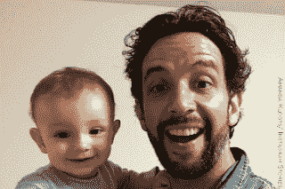

<!--yml
category: 未分类
date: 2024-05-12 19:57:49
-->

# Falkenblog: $1000 Covid Bet with Robin Hanson

> 来源：[http://falkenblog.blogspot.com/2020/11/1000-covid-bet-with-robin-hanson.html#0001-01-01](http://falkenblog.blogspot.com/2020/11/1000-covid-bet-with-robin-hanson.html#0001-01-01)

that he would take bets on the nascent COVID-19 pandemic, and he was generally 'long' the severity. His interest is non-partisan, as he is a seminal proponent of

for policy debates. The idea is rather simple: forecasts are more accurate when forecasters have to put money on them. Talk is cheap. Interestingly, the biggest obstacle to this idea is legal, as lawmakers discourage these markets by highlighting bizarre edge cases (as with crypto, these usually involve terrorists). More practically, regulators and their industry constituents want to make sure such markets do not encroach on their protected markets.

When covid arose in February I knew that historically bad flu seasons would generate extra 40k deaths in some years; high-profile viruses like avian flu tended to be limited (3k deaths in the US). Further, virulence is inversely correlated with contagiousness, as people really do not like dying, and so are very good at quarantining those infected by deadly diseases like SARS and Ebola. I knew that data could be manipulated, as with African AIDS deaths, but I thought death statistics in the USA would be relatively immune to this tactic. Thus, when he gave me a number of 250k deaths by the end of the year, I thought it impossible and offered 10-1 odds on $100 ('impossible' means 10% chance when applied to things I understand at this level; I'm a doctor, but not a

*real*

doctor). 

I just paid him $1,000\. I lost the bet fair and square because implicit in the bet was that we would use conventional metrics of covid deaths, such as those of the Center for Disease Control (CDC) or the World Health Organization (WHO). I have been following the CDC, and while one page [reports 244k](https://www.cdc.gov/nchs/nvss/vsrr/covid19/index.htm), it will pass 250k soon; another page on their site [reports 265k](https://covid.cdc.gov/covid-data-tracker/#cases_casesper100klast7days). Even if I take the minimum, the result is inevitable. In hindsight, my error was not anticipating that covid would become politicized.  Robin was right for the wrong reason (covid deaths are inflated, it is not comparable to the Spanish Flu), but that often happens in bets.

**The SARS Effect**

In January, China reported the first death from the new covid virus, and by mid-month, the WHO published a comprehensive of guidance documents on this new disease. In a prelude to the panic, the CDC, following the WHO's lead, was confident that a new pandemic was at hand. The WHO's initial January [report](https://www.who.int/csr/don/12-january-2020-novel-coronavirus-china/en/) specifically referenced the 2003 SARS, the highly lethal respiratory disease that formed the basis for many new Crisis Response Protocols developed by the health care bureaucracy. Covid was the pandemic that our experts had extensively planned for, which proved disastrous.

In the 2003 SARS pandemic many healthcare workers became infected, and hospital transmission was the primary accelerator of SARS infections, accounting for 72% of cases in Toronto and 55% of probable cases in Taiwan. This pattern is so common and terrifying that there is a special word for this: *nosocomial*, which means transmitted in a healthcare facility. While conventionally SARS refers specifically to the 2003 pandemic, it is also a generalized term (Severe Acute Respiratory Syndrom), and our current virus is considered in the same [clade](https://www.news-medical.net/health/Viral-Clades-of-SARS-CoV-2.aspx) as the 2003 SARS virus. It is the SARS-CoV-2 virus that causes COVID-19 disease (hereafter, covid). Over the past 17 years, health care institutions created hundreds of detailed guides about how to quarantine, report, and control the next SARS outbreak, with hospital protocols the first line of defense.

Reviews of the SARS experience noted the importance of a detailed protocol for dealing with such diseases. In Toronto, infected health care workers all reported that they had worn the recommended protective equipment, including gowns, gloves, specialized masks, and goggles, each time they entered the patient's room. However, the workers had not been fit-tested for their masks, and one nurse admitted his mask didn't fit well. It was also noted that some of the workers might not have followed the correct sequence in removing their protective equipment (i.e., gloves first, then mask and goggles). 

The emphasis on small details created a bureaucratic mindset that ignored common sense because the motivation was preventing not merely the next SARS, but the next worst-case-scenario SARS  (see *The Andromeda Strain* or the latest *Planet of the Apes* series). The focus was on health care workers at the expense of patients, which seems simply self-serving, but it makes sense if your vision of a pandemic comes from dystopic science-fiction movies. If all health care providers die first, everyone else is sure to die next because, without health experts, health experts expect society to revert to Medieval life expectancies. Thus the priority was not so much healing the sick but getting them out of circulation. When the objective is to prevent an existential threat to humanity, virtually any extreme measure with large present costs is justified.

At the beginning of the covid crisis, the CDC recommended health care workers don full Personal Protective Equipment (PPE) for each patient encounter, consisting of the following:

*   A disposable N95 respirator face mask that achieves a seal around the mouth and nose
*   Gloves
*   Eye protection
*   Disposable gown
*   Footwear

The priority was clearly on protecting health care workers, not saving infected patients. This implies reducing contact and making sure patients didn't breathe too much into hospital rooms. Here are some CDC covid protocol recommendations:

*   Intermittent rather than continuous patient monitoring to reduce contact
*   Rapid ventilation to minimize aerosol generation (Rapid Sequence Intubation)
*   Aggressively suppress patient cough through sedation strategies (fentanyl, ketamine, propofol).
*   Reduced suctioning
*   Reduced visitors, and then only with PPE

If a patient coded (goes into cardiac or respiratory arrest) in many hospitals, guidelines recommended that staff currently with that patient must leave the room and don full PPE before administering CPR. These are critical moments as the time to do this takes a couple of minutes, the difference between life and death. There were also

[do-not-resuscitate orders](https://www.forbes.com/sites/lisettevoytko/2020/04/01/overwhelmed-nyc-hospitals-reportedly-implementing-do-not-resuscitate-policies-for-coronavirus-patients/?sh=1f0ab4213146)

, though, like the orders to don full PPE, institutions denied ever having such protocols. Since no visitors are allowed in this protocol, this scandal was never witnessed by family members. These extreme protocols have been silently abandoned.

Early in the crisis, there was a focus on the number of ventilators as a hospital capacity metric. There were calls for transitioning defense contractors to ventilators' production, which are tangible cures for clueless politicians and journalists, similar to how Mao emphasized steel production. In fact, more people would be alive today if there was a shortage, and its aggressive and negligent application killed tens of thousands. Usually, 40% of patients with severe respiratory distress die while on ventilators, as these are emergency tactics for the very sick (classic selection bias). Yet in the March covid disaster in New York City, 85% of coronavirus patients placed on the machines died, including 97% of ventilated patients over 65 (see

[here](https://www.bloomberg.com/news/articles/2020-04-22/almost-9-in-10-covid-19-patients-on-ventilators-died-in-study)

). As many were placed on ventilators that otherwise would not have been, the implications for excess deaths are fairly direct.

The problems with intubation are known as VALI: Ventilator Association Lung Injury. For example, the absolute pressures used in order to ventilate lungs, and shearing forces associated with rapid changes in gas velocity can traumatize lung tissue. It increases the risk of pneumonia because the tube that allows patients to breathe can introduce bacteria into the lungs. Pressure and oxygen levels need to be individualized because too much or too little of either damage lungs, requiring frequent monitoring and adjustment. People were put on ventilators at a higher-than-normal rate and monitored infrequently. As their family members were absent, no one could call for a nurse when a patient was in obvious distress.

Drugging patients and putting them on ventilators reduced the risk they would infect health care workers. Additionally, there were reports that some covid patients had a

[rapid decline of oxygenation levels](https://www.sciencemag.org/news/2020/04/how-does-coronavirus-kill-clinicians-trace-ferocious-rampage-through-body-brain-toes)

, and so in anticipation of this, a ventilator first strategy was seen as proactive. A review of experiences in Italy stated that "invasive ventilation is associated with reduced aerosolization and is thus safer for staff and other patients," but also admitted that "it might also be associated with hypoxia, hemodynamic failure, and cardiac arrest during tracheal intubation."

Financial incentives aggravated the overuse of ventilators. In the United States, the

[government pays](https://www.usatoday.com/story/news/factcheck/2020/04/24/fact-check-medicare-hospitals-paid-more-covid-19-patients-coronavirus/3000638001/)

approximately $13,000 for a regular COVID-19 patient, but $39,000 for an intubated patient. A ventilator is a cash cow for medical facilities. Given the CDC's official recommendations, no one could second-guess them for being overly aggressive, especially when their aim was to prevent an existential threat. [Left-wing fact-checker Snopes

[rated](https://www.snopes.com/fact-check/medicare-hospitals-covid-patients/)

this payment factoid as 'mixed,' employing the casuistry that while correct as an approximation, actual payments are not exactly $13k or $39k in every case] 

**Over Counting**

When covid exploded in Italy the WHO had

[already implemented](https://swprs.org/open-letter-from-professor-sucharit-bhakdi-to-german-chancellor-dr-angela-merkel/)

an unprecedented policy to count all deaths 'with covid' as deaths 'from covid.' The policy was immediately adopted in the US as well, as Illinois' Public Health Director Ngozi Ezike stated, "even if you died of a clear alternative cause, but you had covid at the same time, it's still listed as a covid death." Early in the pandemic, when there was little data on how virulent this pandemic would be, the CDC emphasized how important it was to label anything plausibly related to covid as a COVID-19 death to "

[appropriately direct [the] public health response](https://www.cdc.gov/nchs/data/nvss/vsrg/vsrg03-508.pdf)

." This is a clear indication that they were interested in maximizing covid deaths from the outset. As Marx advised, the purpose of intellectuals is not merely to interpret history, but to change it.

As you die, your immune system shuts down, allowing many viruses to thrive as one nears death. These are opportunistic collateral infections, not the cause of death. Pneumonia was often referred to as 'old man's friend' because it was the immediate cause of death for most old people, whether the real reason was renal failure, cardiovascular disease, or cancer. Measuring for the appearance of a particular virus, regardless of these co-morbidities, is misleading, and why historically, no one has ever used the "died with" protocol for attributing the underlying cause of death (UCOD).

Further, a covid diagnosis is very lenient. The CDC not only allows a presumptive diagnosis but before any significant data on this new virus,

[confidently recommended](https://www.cdc.gov/nchs/data/nvss/vsrg/vsrg03-508.pdf)

applying covid to any death remotely plausible: "it is likely that it will be the UCOD, as it can lead to various life-threatening conditions, such as pneumonia ... in these cases, COVID–19 should be reported." Thus in April, when New York City breached 10k deaths, this included 3,700 who were

[presumed to have died](https://www.nytimes.com/2020/04/14/nyregion/new-york-coronavirus-deaths.html)

of covid but never tested.

The US authorized $150B for covid relief in March, including a 20% add-on to the standard rate for patients diagnosed with covid. If you have been to a hospital out-of-network recently, you learn how much extra you are charged without insurance, the 'standard rate' as defined by 'diagnosis-related groups.' These rates are benchmarks that allow insurers to show you how much you are saving with them. They are also high rates because they have low collection rates, and hospitals are obligated to service an ill person regardless of insurance. Many patients leave and are untraceable, so those who pay subsidize those who do not, a hidden redistributive tax within our health care. A covid diagnosis generates the standard rate, which is a premium rate, and adds a 20% bonus.

If you run a long-term care facility where many patients are at the end of their life, and final days usually entail expensive treatments, it would be financially prudent and entirely legal to diagnose as many decedents as covid as possible. Further, this petty cash grab would avoid media moral censure, as many eager to inflate the death count would consider this a cost worth paying.

While no testing is required for a covid diagnosis at death, the tests themselves are biased. A virus with a low load is often inactive, passive, non-threatening. This phenomenon is the basis for HIV antiretroviral therapy, in that when a person has a sufficiently low viral load, they not only do not get sick, they do not transmit the disease.

A critical threshold (Ct) for 'cycles' in PCR tests is an important cause of false positives. Each cycle doubles the amount of the virus fragments, so as 35 cycles is 10 more than 25 cycles, this implies it generates 1024 times (2^10) of the viral fragments in the final solution. A recent covid study found that 70% of samples with Ct values of 25 or below could be cultured, indicating an active infection, compared with less than 3% of the cases with Ct values above 35\. Yet, the CDC

[states](https://www.cdc.gov/coronavirus/2019-ncov/lab/faqs.html)

Ct values should not be used to determine a patient's viral load because the correlation between Ct values and viral load is imperfect. This objection would obviate just about every health metric if not all of statistics: is high blood pressure a useless signal because some people with high blood pressure live to 100? PCR provides an argument by authority--they reference peer-reviewed science--but if one does not simply defer to their credentials and understands the logic they present, it exposes their complete lack of credibility. Science as a method is rational and objective; science as an institution is as corrupt as the Medieval church.

|  |
| Nick Cordero  |

A good example of a spurious covid death is the tragic case of Broadway actor and dancer, Nick Cordero. He was promoted as an example of how covid threatens everyone, and the NYT

[reported](https://www.nytimes.com/2020/07/06/health/coronavirus-nick-cordero-underlying-conditions.html)

he had no underlying health conditions. Yet, at some point, he contracted pneumonia so severe he was admitted to the hospital in the peak of the New York City covid fiasco. I have had pneumonia twice, and in both cases, I was just given antibiotics, so he must have had a severe case. Once hospitalized, he was put on a ventilator, given dialysis, and put on a heart-lung bypass machine. His heart stopped for two minutes at one point, was put in a medically induced coma for six weeks, and his right leg was amputated due to excessive clotting. He was tested several times for covid, including initially, always negative, but eventually, he tested positive for covid before dying in July.

For the media to portray Cordero as having no underlying health conditions merely because this described him before hospitalization is not just misleading, but intentionally so. The litany of life-threatening complications before his first positive covid test made him one of the least healthy people on the planet. There is clearly a higher truth for the media in his story. It would be interesting to know to what degree the aggressive intubation protocols at his time of admittance factored in his death. It is quite likely he was rapidly intubated and neglected, per SARS protocols, a classic case of

[iatrogenesis](https://en.wikipedia.org/wiki/Iatrogenesis)

, when medical care harms the patient.

**Declines in Elective Surgery and Regular Doctor Visits**

To reduce infectious risk to providers and conserve critical resources, most states in the US enacted a temporary ban on elective surgery from March through May 2020\. Various discouragements have continued. Elective surgical cases fall somewhere between vital preventative measures (e.g., screening colonoscopy) and essential surgery (e.g., cataract removal). These surgeries plummeted 60% in April, but have subsequently rebounded, though are still well below last year. Similarly, outpatient visits fell by 50% initially and are still well below previous levels (see

[here](https://journals.plos.org/plosone/article?id=10.1371/journal.pone.0241331)

and

[here](https://www.healthaffairs.org/do/10.1377/hblog20201006.263687/full/)

). 

The effects of healthcare visits and elective surgery on mortality, let alone and quality of life, are speculative. Yet, many papers supported Obama's Affordable Care Act, noting that increased access to such care had significant effects.

[Estimates](https://www.nber.org/system/files/working_papers/w25568/w25568.pdf)

of how much more health care access people had due to Obamacare range from 1 to 5%, and the

[consequences range](https://www.cbpp.org/research/health/medicaid-expansion-has-saved-at-least-19000-lives-new-research-finds)

from 10k to 50k deaths avoided per year. Given an initial 50% reduction and a subsequent reduction of 10-20% over the rest of the year, a 100k increase in deaths would be a reasonable estimate given this literature.

Obamacare supporters generally also support the lockdown. They insist a small increase in access to healthcare saved tens of thousands via Obamacare, while this year's radically sharp decline in access to healthcare had no effect worth mentioning when discussing the lockdowns.

**Social isolation**

People are social, which is why one of the worst punishments in Roman times was exile. Solitary confinement cuts people off from the types of activity that bring meaning and purpose to their life, communal activities, and face-to-face social interactions. To suggest taking this away from people, especially the elderly, is not worth estimating in this pandemic is absurd to anyone who thinks life is about quality as well as quantity.

Yet even if we just focus on quantity, social isolation is a risk factor. Social isolation is associated with functional decline and death. For example, loneliness among heart failure patients nearly quadruples their risk of death, and it increases their risk of hospitalization by 68%. A

[meta-study](https://journals.sagepub.com/doi/abs/10.1177/1745691614568352)

on the effects of social isolation found significant mortality effects, where people in the 'loneliest quintiles had 30% higher all-cause mortality rates.

Suicide deaths are a relevant metric, but national data has a couple-year lag. We know that in 2018 there were 48,000 deaths from suicide and at least 1.4 million attempts, and in 2019, almost 71,000 people died from drug overdoses, many of which were suicide-related. There have been

[anecdotal reports](https://townhall.com/tipsheet/micaelaburrow/2020/07/28/redfield-says-more-abovebase-suicides-than-covid-deaths-n2573278)

that 

[suicides are up](https://fee.org/articles/suicide-claimed-more-lives-in-october-than-10-months-of-covid-19-in-japan-report-shows/?utm_source=ribbon)

, and it's concerning that the Social Justice Warriors are quick to lobby Twitter to

[censor](https://slate.com/technology/2020/11/whats-actually-happening-with-suicide-during-the-pandemic.html)

these reports as if any information or even discussion of the costs of the lockdown is dangerous. Our uber-rational elite sees no value in debating the costs and benefits of our extreme response, just like the state-run media in one-party states. 

**University Data: 0.0007% Case Fatality Rate**

While one can re-label a standard pneumonia death as covid, this is not possible for young people who rarely die of pneumonia. Further, given their excellent health, young people do not put themselves in situations to receive iatrogenic medical treatment or feel the effects of restricted access to health providers.

As mentioned, opportunistic infections are common in people near death, and there are strong incentives and easy ability to label a decedent as a covid death, regardless of its relevance. This makes the standard CDC data susceptible to massive inflation. An ideal estimation procedure would test a random sample of people, and then for those who test positive, check if they are alive in a couple of months. This removes many of the above-mentioned biases. Universities have done something close to this. As schools were cautious about the PR debacle if they were a covid-death hot-spot, universities were well equipped to test their students in order to keep them from spreading the virus. They would test those arriving, those with minor symptoms, and those without symptoms who were in contact with someone who tested positive. It is not perfectly random in that they will miss asymptomatic cases that were not in known contact with a covid positive person, but it's the most bias-resistant metric we have.