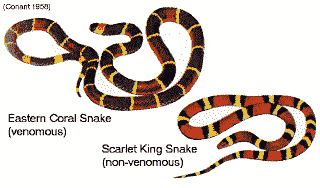

<!--yml
category: 未分类
date: 2024-05-12 21:25:39
-->

# Falkenblog: A Batesian Mimicry Explanation of Business Cycles

> 来源：[http://falkenblog.blogspot.com/2010/07/batesian-mimicry-explanation-of.html#0001-01-01](http://falkenblog.blogspot.com/2010/07/batesian-mimicry-explanation-of.html#0001-01-01)

I went to graduate school to become a macroeconomist and understand business cycles, but became convinced pretty quickly that this problem was not going to be solved anytime soon. The current theories today are pretty much the same is when I was in school 25 years ago. There are theories that recessions are caused by monetary shocks, interest rates being too low, insufficient consumption demand, sticky prices, technology shocks, changes in leisure preferences, cyclical investor optimism. None of these explanations are very convincing, which is why economists still have not coalesced around any one explanation. The debates of 50 years ago are pretty much the same as today, in substance if not in form.

Arnold Kling makes

[a good point](http://econlog.econlib.org/archives/2010/07/the_recalculati_2.html)

when he states that macroeconomic activity consists of sustainable patterns of specialization and trade, and if a recalculation occurs such that the current pattern is recognized as unsustainable, the system re-allocates by exiting those unsustainable businesses. But then, whence the massive recalculation? Do we always have something like Felix Salmon's

[copulas](http://falkenblog.blogspot.com/2009/02/dont-blame-quants-felix.html)

, unique math errors that pop up every 5 to 10 years?

For theories that rely on mercurial investment or animal spirits, the cognitive errors that underlie business booms and busts have yet to be identified. Aggregates like investment spending, consumer durables, aggregate average liabilities/assets, do not show that increases into some zone over an expansion are correlated with future declines; the aggregate data show only a contemporaneous pattern with GDP. Understanding why people always become too optimistic in expansions in modern 'representative agent' models is like trying to understand why a drunk drinks too much every day. You can't model such investment rationally, and if you model it irrationally you imply a simple market timing model for the stock market should generate abnormal profits, and

[no such rule exist](http://www.ivo-welch.info/academics/journalcopy/2008-rfs.pdf)

s.

My argument is that business cycles are best understood through the framework of

[Batesian mimicry](http://en.wikipedia.org/wiki/Batesian_mimicry)

, an endogenous mechanism for booms and busts thru a misallocation in the horizontal structure of production. In ecosystems, Batesian mimicry is typified by a situation where a harmless species (the

mimic

) evolves to imitate the warning signals of a harmful species (the

model

) directed at a common predator (the

dupe

). For example, venomous coral snakes have red, yellow, and black bands, while the non-venomous scarlet king snake has the same colors in a different order. Animals afraid of venomous snakes would do well to avoid 4 foot long snakes with red, yellow and black stripes, in the process avoiding the scarlet king snake (alternatively, one could remember the rule "Red on yellow, kill a fellow; red on black, friend of Jack").

The process has been observed in insects, reptiles, mammals, and plants, and sometimes occurs between species. By parasitizing the true warning signal of the protected species, the Batesian mimic gains the same advantage without having to go to the biological expense of maintaining a poison. The species being mimicked, on the other hand, is disadvantaged, along with the dupe who misses out on tasty mimic meals. If imposters appear in high numbers, positive experiences by the predator with the mimic may result in the model species losing the benefits of signaling its poison.

[Atsushi Yamauchi](http://www.springerlink.com/content/n55m25g487221315/)

has shown that when there are density effects on the model species, there is no stable equilibrium. Nonlinear dynamics make the system’s aggregate features unpredictable in specifics, but most importantly, it is not a stable equilibrium to have no mimics over long periods of time: the gains are large to the mimic because predators obey the model’s high-quality signal.

While it’s conceivable one could generate a formal economic model with these qualitative results, note that the ecological literature mainly looks at comparative statics for one species, noting what assumptions generate stable equilibria, and which do not. There is no attempt to generate a dynamic model of the mimic or model's success over time, presumably because the highly nonlinear, recursive system is so sensitive to initial conditions results would merely be qualitative, like the comparative statics.

In an expansion investors are constantly looking for better places to invest their capital, while entrepreneurs are always overconfident, hoping to get capital to fund their restless ambition. Sometimes, the investors (dupes) think a certain set of key characteristics are sufficient statistics of a quality investment because historically they were. Mimic entrepreneurs seize upon these key characteristics that will allow them to garner funds from the duped investors. The mimic entrepreneurs then have a classic option value, which however low in expected value to the investor, has a positive value to the entrepreneur. The mimicry itself may involve conscious fraud, or it may be more benign, such as naïve hope that they will learn what works once they get their funding, or sincere delusion that the characteristics are the essence of the seemingly promising activity. The mimicking entrepreneurs are a consequence of investing based on insufficient information that is thought sufficient, but they make things worse because they misallocate resources that eventually, painfully, must be reallocated.

Once the number of mimics is sufficiently high, their valueless enterprises become too conspicuous and they no longer pass off as legitimate investments. Failures caused by insufficient cash create a tipping point, notifying investors that some of their material assumptions were vastly incorrect. Areas that for decades were very productive, are found to contain exceptional levels of fraud, or operate with no conceivable expectation of a profit. Everyone outside the industry with excessive mimics marvels at how such people—investors, entrepreneurs, and their middlemen--could be so short-sighted, but the key is that the mimics and duped investors chose those business models that seemed most solid based on objective, identifiable characteristics that were, historically, correlated with success. An econometric analysis would have found these ventures a good bet, which is why investors did not thoroughly vet their business models. For example, banks stocks through 2007 were one of the

[best performing industries](http://mba.tuck.dartmouth.edu/pages/faculty/ken.french/data_library.html)

since industry data has been available in the US, and performed well in the 2001 recession. Another notable example: when I was head of economic risk capital allocations for KeyCorp in the 1990s, residential mortgages had the lowest risk allocation because of their historical minuscule loss rates; speaking with an economic risk capital allocator recently, they currently have the highest.

 Historical Applications

In the 1990’s tech firms in general and internet firms in specific were doing very well. The internet bubble was filled with a naïve lack of skepticism that allowed otherwise absurd business ventures to get funding. Using hindsight there were so many businesses with doomed business models, you wondered how they could have been taken seriously, but investors were looking primarily at a few key criteria—net presence, branding—and these did work well for several years until the March 2000 crash, especially using the criteria of their stock price. Consider that Enron was able to engage in negative cash flow activities for at least 5 years while their stock price kept climbing, highlighting that if you hit the key signals investors are naively prioritizing, they can be fooled, just not forever.

[AllAdvantage](http://en.wikipedia.org/wiki/Paid_to_surf)

was a website that paid members to surf the Net. It paid to acquire these users, and supposedly leveraged its members’ eyeballs into advertizing dollars. At the initial fundraiser internet investment banking guru Frank Quattrone (who helped fund Cisco) and President Clinton both paid tribute to AllAdvantage. Yet even then, an investigation into AllAdvantage had determined that the clicks came mostly from bots that were explicitly gaming the system. As Buffet says: first the innovators, then the imitators, and finally the idiots.

Similarly, the housing bubble of 2008 was based on the idea that the borrower’s credit was irrelevant because the underlying collateral, nationwide, had never fallen significantly in nominal terms. This was undoubtedly true. The economics profession, based on

[what got published](http://archives.hud.gov/news/1999/newsconf/biblio.html)

in top-tier journals, suggested that uneconomical racial discrimination in mortgage lending was rampant, lending criteria was excessively prudent (underwriting criteria explicitly do not note borrowers race, so presumably lenders were picking up correlated signals). Well-known economists Joe Stiglitz and Peter Orzag wrote a paper for Fannie Mae arguing the expected loss on its $2 trillion in mortgage guarantees of only $2 million dollars, 0.0001%. Moody’s did not consider it important

[to analyze the collateral within mortgage CDOs](http://falkenblog.blogspot.com/2008/04/lowenstein-on-moodys.html)

, as if the borrower or collateral characteristics were irrelevant. In short, lots of smart people thought housing was an area with extremely low risk.

Each major bust has its peculiar excesses centered on previously prudent and successful sectors. After the

[Panic of 1837](http://americanhistory.suite101.com/article.cfm/the_panic_of_1837)

, many American states defaulted quite to the surprise of European investors, who were mistakenly comforted by their strong performance in the

[Panic of 1819](http://en.wikipedia.org/wiki/Panic_of_1819)

(perhaps the first world-wide recession). The

[Panic of 1893](http://en.wikipedia.org/wiki/Panic_of_1893)

centered on railroads, which had for a half century experienced solid growth, and seemed tested by their performance in the short-lived

[Panic of 1873](http://en.wikipedia.org/wiki/Panic_of_1873)

.

Note by focusing on what seems the essence of a good investment is basically looking over the past generation, which implies that the crux of the last crisis is probably less risky going forward. For example, subsequent to the 1990 Commercial Real Estate debacle, defaults in this asset class were well below-average for the subsequent 15 years. In the aftermath of that 1990crisis, newly issued Commercial Real Estate Asset Backed securities did well because everyone was especially cognizant of the risk factors involved. A similar thing happened in railroads after the Penn Central railroad defaulted in the early 1970s. Fooled once by a specific sector perversion investors are not fooled again, making the key risk characteristic of the latest recession interesting only in its meta sense, its higher-level commonality to the mixed bag of other recession essentials.

Inherently Unpredictable

In 1929, Irving fisher’s famously opined “Stock prices have reached what looks like a permanently high plateau." In 1993, Stanford macroeconomist Robert Hall

[said](http://www.stanford.edu/~rehall/Macro%20Theory%20Recession%201993.pdf)

about the recession of 1990 that “established models are unhelpful in understanding this recession.” Econometricians James Stock and Mark Watson

[noted](http://www.richmondfed.org/publications/research/economic_quarterly/2003/summer/pdf/stockwatsonsummer03.pdf)

that the 1990 recession, which blindsided their new econometric forecasting model at that time, experienced a sharp fall in consumption, housing, and durable goods; whereas, in 2001, the updated model failed to note that the recession was centered on technology investment. Further, the signals change, as yield curves were not characteristically flat or inverted prior to the 1990 recession, and housing permits remained strong throughout the 2001 recession. Stock and Watson note “our conclusion—that every decline in economic activity declines in its own way—-is not new.” I think it's fair to say the latest recession has kept the string of unpredicted recessions perfect.

If mimicry is the essential driver of the misallocation of resources that inevitably must be corrected, it by definition occurs in places that do not have accurate quantitative signals; indeed, it preys upon areas where the essential data are beyond reproach (eg, mortgage underwriting did not matter to regulators, rating agencies, or investors prior to 2007). Safety creates risk in that eager overzealous entrepreneurs, once they figure out what sufficient statistics work on investors, quickly jump on these sectors with not merely excess capacity but business models that never stood a chance.

This model explains why business cycles are not forecastable, it’s inherent in the mimic's selection process. The recalculation

[Arnold Kling mentions](http://econlog.econlib.org/archives/2010/07/the_recalculati_2.html#more)

relates to an investing error of a particular expansion, which is always unique. Mimicry explains why the biggest winners in a business cycle are also the biggest losers: their productivity was pervaded by fraudulent and incompetent mimics. It explains why the biggest losers of the prior business cycle often do relatively well in the next recession: investors are wary of mimics, so mimics only thrive where they are not expected. It explains why recessions are concentrated in certain sectors, and why these sectors are different each recession.

Efforts to prevent the next recession face a large difficulty, in that the impetus by necessity will be in the area that invites the least concern because that is where mimics fester. Any risk analysis that can identify risky ventures necessarily identifies safe ones, and when these safe investment characteristics become known to the mimics, they will be exploited. Top down risk management, the focus of so much

[policy talk](http://online.wsj.com/article/SB10001424052748703977004575392883352226498.html?mod=WSJ_Finance_LEFTTopNews)

in Basel, Washington, and wonky journals is futile, because risk grows dangerously only where one does not suspect it (G-7 sovereign debt, anyone?).

This suggests focusing on robustness as opposed to prediction because the system works against rational expectations, especially those consensus ideas that come out of large bureaucracies. After all, what better sufficient statistic for a mimic to exploit than some well-known regulatory bullet point that supposedly ensures trivial risk? Recessions are not going away; they are endogenous because zero mimicry is not an equilibrium among insects, reptiles, or humans. Expect more unexpected recessions, just not real soon, and not in subprime housing.