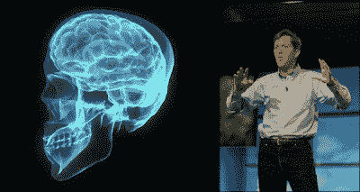

<!--yml
category: 未分类
date: 2024-05-12 21:10:36
-->

# Falkenblog: A Different 'No Free Lunch' Theorem

> 来源：[http://falkenblog.blogspot.com/2011/01/different-no-free-lunch-theorem.html#0001-01-01](http://falkenblog.blogspot.com/2011/01/different-no-free-lunch-theorem.html#0001-01-01)

Milton Friedman popularized the phrase 'there's no such thing as a free lunch' by using it as the title of a 1975 book, and it often appears in economics textbooks. It is a core idea in economics, but I was surprised to learn it comes up in AI.

My experience with neural nets is decidedly negative. They overfit and provide no intuition for modification. They are consistent estimators, that is, with enough observations they will find patterns, but financial data are notoriously correlated in such a way that we rarely have enough data to make these asymptotic properties relevant. That is, look at cross sectional equity returns. There are officially around 5000 stocks in the USA, so after a decade, you have about 12 million daily observations, which seems like a lot. Yet the really small 2000 stocks are still measured poorly in standard databases, as in the CRSP tapes a strong 'low price' effect still exists even after they supposedly rid the data of the delisting bias discovered by Shumway (delisted firms would often have 'N/A' for their final return, when in fact they would lose 40%). But then even with these 3000 stocks left, if you simply find something correlated with the internet bubble or the mortgage crisis, you will discover a high t-stat in explaining cross-sectional returns, and these patterns are

sui generis

, not fundamental characteristics of the data.

[Jeff Hawkins](http://www.youtube.com/watch?v=G6CVj5IQkzk)

is a successful computer programmer who is really interested in aping the brain to come up with more efficient algorithms. In his book

[On Intelligence](http://www.amazon.com/Intelligence-Jeff-Hawkins/dp/0805074562)

, he argues our neocortext is the essence of our intelligence. It is the wrinkly surface of mammalian brains that is about the size of a napkin folded up in your head. 1k square centimeters, 2-3mm thick, about 30 billion neurons. He calls this Heirarchical Temporal Memory because data is stored in heirarchies: we understand phonemes, words, phrases, ideas, each one a higher level understanding of the concepts below it.

We experience the world through a sequence of patterns, and when we recall them we do so to predict. It's an internal metric, not one based on behaviorism. Most patterns are spatial or temporal, in that a melody has has a a chord (set of frequencies), and the temporal relation of of those chords. When we comprehend a piece of music we are making predictions about what comes next, anticipating the next note. We recognize the song when our predictions are correct, and this generates an 'aha!' moment, as when you see the dalmation in the picture of black and white spots. Hawkins argues that intelligence is essentially this, the prediction of these patterns: when we predict something well our neocortex strengthens these neural connections, when it doesn't predict well the unsuccessful pattern disappears. The brain makes predictions down to what we perceive, and up to what we interpret. Intelligence is prediction.

It's an intriguing concept, and a rather stark contrast to two ideas from Alan Turing. The first, that the brain is just a big computer, with a bunch of AND-gates and OR-gates, just like logical circuits. Turing proved mathematically that with an infinitely long program, it can perform any definable set of operations in the universe. His second idea was that you could judge whether a computer is intelligence if you can't tell it's not human by asking it questions, and see if you could tell it was a computer.

As mentioned, Hawkins thinks intelligence is not emulating the behavior of humans, but rather, predicting well at every level, mainly for the many little consistencies we see in how the things in the world relate spatially and temporally. Secondly, there is the problem that Turing's program is very inefficient. There is a '

[no free lunch](http://en.wikipedia.org/wiki/No_free_lunch_in_search_and_optimization)

' theorem in optimization programs: no learning algorithm can be better than all other learning algorithms for all problems. To be best for one problem you have to tune it to the problem at hand. A Turing machine makes no assumptions, but you pay a cost because it is not necessarily organized hierarchically or temporally, which turns out to be a good way of describing our world.

A general algorithm must be tweaked to incorporate the specific problem at hand. This mainly concerns the selection of inputs (not too many), and their transformation (sigmoidal transformation, putting raw data into stationary time series, etc.), but also the functional form. This 'outside the box' framing problem uses up a lot of degrees of freedom, but doesn't really show up anywhere because once done, any algorithm ignores them in their standard errors, as if this was the first and only way of apprehending the data. Specific algorithms contain a lot of specialized intuition or common sense, which is why really smart people are often clueless at modeling the real world.

Hawkins' book is a good read, and he has several interesting videos on YouTube. I like the idea of the no free lunch, and adding structure in the way he mentions. Yet, I still think his ideas are too unstructured. He has had access to a lot of funding and has been working in this dimension for almost 10 years. He seemed to think his track was on the cusp (couple years) of finding some really better artificial intelligence algorithm back in 2005 or so. I haven't see those. His signature achievement, the creation of the

[Graffiti software](http://en.wikipedia.org/wiki/Graffiti_(Palm_OS))

to recognize letters in things like the Palm Pilot, seems like your typical useful, highly specialized algorithm. I suppose some neural net modified in this 'temporal hierarchical' structure is better than one with merely layers of hidden nodes, but that still leave a lot undefined in the step where you choose what to look and what functional forms it should constrain itself to. Robot maids, machines with general intelligence, are still science fiction. Instead, we have great machines for applying specific logic, which invariably is specialized in such a way to make any big optimization idea rather uninteresting. The 'No Free Lunch' theorem Hawkins mentions seems to counter his big idea.