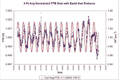

<!--yml
category: 未分类
date: 2024-05-12 22:56:55
-->

# Falkenblog: A Fifth Force?

> 来源：[http://falkenblog.blogspot.com/2008/09/fifth-force.html#0001-01-01](http://falkenblog.blogspot.com/2008/09/fifth-force.html#0001-01-01)

Radioactive decay was thought independent of most everything. Now

[these guys](http://arxiv.org/abs/0808.3283)

find a striking pattern in the rate of beta decay as a function of our distance from the sun. String theorist Lubos Motl calls it 'bizarre', which is always fun to hear (even better than, 'that's funny...'). Like any really good result, you can just eyeball the graph, and see its true (no 3-stage least squares or GMM applied to equations pulled out of the aether). They found this pattern looking at data from two entirely different laboratories, and two entirely different elements.

Obviously, it's a homing beacon of sorts to our betters. On behalf of Earth, I welcome our new overlords, and would like to remind them that as a trusted quantitative investor, I can be helpful in allocating capital while others provide biomass for their

[Illudium Q-36 Explosive Space Modulator](http://images.google.com/imgres?imgurl=http://www.tvacres.com/images/marvin_PU2.jpg&imgrefurl=http://www.tvacres.com/weapons_ammunition_uranium.htm&h=239&w=340&sz=26&hl=en&start=35&sig2=K6lRQxY61aI_ut0_mMQFtw&um=1&usg=__rY5M_LVb98LeNoBWgNvoDPD1PcU=&tbnid=mzeN0kPWSxsfKM:&tbnh=84&tbnw=119&ei=ZLnWSLuVJpeIhQLRzpH_CA&prev=/images%3Fq%3Dmarvin%2Bthe%2Bmartian%2BIlludium%26start%3D21%26ndsp%3D21%26um%3D1%26hl%3Den%26client%3Dfirefox-a%26rls%3Dorg.mozilla:en-US:official%26hs%3DQRW%26sa%3DN)

.