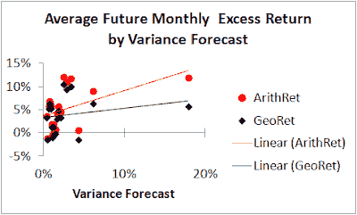

<!--yml
category: 未分类
date: 2024-05-12 20:35:25
-->

# Falkenblog: A Market Timing Rule that Works

> 来源：[http://falkenblog.blogspot.com/2012/02/market-timing-rule-that-works.html#0001-01-01](http://falkenblog.blogspot.com/2012/02/market-timing-rule-that-works.html#0001-01-01)

One of the most interesting things about finance is that while the past seems predictable, in practice it is very difficult to outperform passive indices using simple rules.

[Ivo Welch and Amit Goyal](http://research.ivo-welch.info/journalcopy/2008-rfs.pdf)

showed that a bunch of signals, such as the dividend-earnings ratio, may work with hindsight, but in real-time do not generate an ability to better one's equity returns over the business cycle. The best intuition for this bias is that if we take a set of data generated by a simple time series and plot the stock price vs. future return for that stock, there would be a strong negative correlation between price and future return for our sample, though in real time we know the mere stock price does not predict stock returns. This paradoxical result is why many are certain the markets are irrational or at least susceptible to myriad improvements via if-then logic, because they have never tried the rules they are certain exist (and why E-Trade and Ameritrade market as if giving rubes a lot of information about trends and ratios leads fairly straightforwardly to better returns--as opposed to merely more brokerage commissions).

Nonetheless, many give the advice that one should allocate more of their wealth, proportionally, to cash as one gets older, a basic rule would be your age in years as a percent should be your bond allocation (eg, 29% for a 29 year old). While this advice is common, most academics find such recommendations misleading, as

[Robert C. Merton and Paul A. Samuelson](http://zonecours.hec.ca/documents/H2006-1-640175.Texte6-30-253-00-E05-Live-cycleFinance...(2).pdf)

have written numerous articles over the years arguing these are based on a misunderstanding about long-term data that just happened to work out well over the past 120 years in the USA.

I'm not addressing that argument, that one should allocate differently based on one's investment horizon or level of human capital, rather, I'm focusing on the implication from the predictability of volatility. Consider the simple 10 day moving average implicit in the following variance forecast

EMAvar(t+1)=(1-λ)*ret(t)^2+λ*EMAvar(t)

With a λ=0.9, that's about a 10-day exponential decay moving average. Now, with daily observations from the market return data from Ken French's

[website](http://mba.tuck.dartmouth.edu/pages/faculty/ken.french/data_library.html)

(which has daily returns back to 1963), we get highly significant predictability. This fact underlies the usefulness of

[GARCH](http://en.wikipedia.org/wiki/Autoregressive_conditional_heteroskedasticity)

modeling of financial time series, and why Robert Engle won a Nobel prize for it. Volatility is eminently predictable:

In contrast, returns are not highly correlated with the volatility forecast (here data were bucketed into 20 groups sorted by the variance forecast):

There's a weak correlation with arithmetic return for volatility forecast, and extremely weak for the geometric return. The simple implication is that you might be able increase your Sharpe by avoiding the really highly volatile times that offer no corresponding return premium. The key, as highlighted in Welch and Goyal, is whether this is one of those patterns that disappears in real time, in that 'high' and 'low' in the above graph is only revealed after seeing what happens; a useful rule looks at 'point in time' data that is not forward-looking, and this is were most rules fail.

Consider the following rule:

*   Invest 100% in equities if Ema(Variance)<[1.5*2 year rolling average of the Ema(variance)]
*   Invest 100% in T-bills otherwise
*   Only change allocation if you haven't changed it over the past month

Note the criteria is solely backward looking, just noting that if the variance estimate is too high. The final point just keeps it from doing some quick changes that would be impractical for a large portfolio, and in practice didn't change the results much. This generates the following results:

Data from 1965-2011

So, the Timing Rule generates a significant increase in the Sharpe ratio, from 0.25 to 0.43\. With 33% of the volatility removed, it is comparable to 'minimum variance portfolios'. That is, those approaches also can also reduce your volatility relative to passive strategies by 30-40%, without sacrificing total return (usually increasing it a couple percent). The max drawdown moves from 55% to 47%, which isn't a lot, but the timing strategy missed a comparable loss in 2009, so more importantly the frequency of these 50%ish drawdowns was cut from 2 to 1\.

This strategy generated a 68% average 'long' position over the time period, and so I compared it to a static 68%/32% equity/bond portfolio. Here one sees that as having really no change on the Sharpe, though it reduces the portfolio volatility by quite a bit.

Volatility timing reduces your portfolio volatility by one-third without sacrificing total return, unlike a static blended portfolio where the excess return is reduced *pari passu*.

Some might say: 'this is great, but what if everyone did this?' Well, if everyone priced in conditional market volatility (what was called 'risk' back in the 1960s), there would be a dynamic risk premium as standard theory presumes. That is, theoretically,

Asset Demand=k*E(ret)/variance

Here k is some constant, and this is a standard result (see

[here](http://www.people.hbs.edu/rmerton/onestimatingtheexpectedreturn.pdf)

). Asset demand should be inversely proportional to expected return variance, unless expected returns move in concert. Expected returns do not move in concert with variance, but until they do you would be well served by following the

[normative](http://en.wikipedia.org/wiki/Normative)

implications of

[Modern Portfolio Theory](http://en.wikipedia.org/wiki/Modern_portfolio_theory)

, which may not explain how the world works, but does generate some useful tools for approaching your investment portfolio.

The take-away is this: purge your portfolios of the most volatile components, across time and assets, and you will slightly increase your return and lower your volatility significantly. It works precisely because it doesn't offer you something so attractive that, even if everyone believed it worked, most people would not use it. In Sharpe space, it's a much larger improvement than from switching from active to passive mutual funds (itself a good idea).

An implication of the above is that with the VIX at 18 compared to its two year average of 23, now is the time to get back into equities.