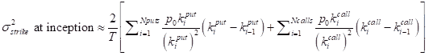
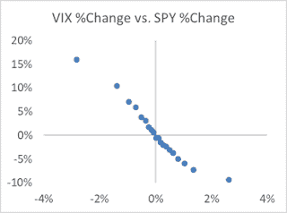

<!--yml
category: 未分类
date: 2024-05-12 19:58:41
-->

# Falkenblog: A Simple Equity Volatility Estimator

> 来源：[http://falkenblog.blogspot.com/2020/02/simple-vol-estimators.html#0001-01-01](http://falkenblog.blogspot.com/2020/02/simple-vol-estimators.html#0001-01-01)

While short-term asset returns are unpredictable, volatility is highly predictable theoretically and practically. The VIX index is a forward-looking estimate of volatility based on index option prices. Though introduced in 1992 it has been calculated back to 1986, because when released they wanted people to understand how it behaved.

Given the conditional volatility varies significantly over time it is very useful to generate a VIX proxy for cases where one does not have VIX prices. This includes pre-1986 US, countries that do not have VIX indices, and when trying to estimate the end-of-day VIX. This latter problem is subtle but important because historical closing VIX prices are taken from the 4:15 ET in the US while the market closes at 4:00, and so using VIX prices for daily strategies can generate a subtle bias when used in daily trading strategies.

First, we must understand the VIX because there's some subtlety here. It is really not a volatility estimate, but a variance estimate presented as volatility. VIX is calculated as the square root of the par SP500 variance swap with a 30-day term, multiplied by 100 and annualized (ie, 19.34 means 19.34% annualized). That is, it would be the strike volatility in a 30-day variance swap at inception:

On September 22, 2003, the CBOE changed the VIX calculation in two ways. First, they began to use SP500 rather than SP100 option prices. This lowered the volatility to about 97% of its old vol level because the SP500 is more diversified and less volatile. Second, instead of just taking the average volatilities of nearby puts and calls, they used explicit call and put prices in a more rigorous way. This is because a variance swap's replicating portfolio consists of the following weights for out-of-the-money puts and calls. 

The VIX futures started trading in 2004, and options on these futures started in 2008\. Liquid markets make index prices more efficient because nothing motivates like the profit motive (eg, regardless of your preferences, more money will help you achieve them). The net result is that one should use data since 2004 when analyzing the VIX even though there is data back to 1986 (which, is still useful for some applications).

One can see that the old VIX index was significantly more biased upwards than after these changes. This implies abnormal volatility trading strategies prior to 2004 if you assumed the VIX was a true par variance swap price.  Now, there should be a slight positive bias in the VIX due to the variance premium, where shorting variance generates a positive return over time. Personally, I think this variance premium is really a consequence of the equity premium, in that short variance strategies have very strong correlations with being long the market. That is, the variance premium is not an independent priced risk factor, just a consequence of the equity premium given its high beta. 

|  |  |  |  |  |
|  |  |  |  |  |
|  |  |  |  |  |
|  |  |  |  |  |
|  |  |  |  |  |
|  |  |  |  |  |
|  |  |  |  |  |

As a liquid market price, the VIX is a good benchmark for any equity volatility model. The most common academic way to estimate volatility is some variant of a Garch(1,1) model, which is like an ARMA model of variance:

The problem is that you need to estimate the parameters {

*w*

, α, β} using a maximum likelihood function, which is non-trivial in spreadsheets. Further, there is little intuition as to what these parameters should be. We know that α plus β should be less than 1, and that the unconditional variance is w/(1-α-β). That still leaves the model highly sensitive to slight deviations, in that if you misestimate them you often get absurd extrapolations.

For daily data, a simple exponentially weighted moving average (EWMA) version of Garch(1,1) works pretty well, with

*w*

=0, α=0.05, and  β=0.95\. This generates a decent R

²

 with the day and month-ahead variance.

**EWMA Vol Estimator on Daily Data**

Alas, this has two problems. First, there is a predictable bias in the EWMA because it ignores mean reversion in volatility. Garch models address this via the intercept term, but as mentioned it is tricky to estimate and creates non-intuitive and highly sensitive parameters. We can see this bias by sorting the data by VIX into deciles, and take the average EWMA, where the relative difference in the VIX and the EWMA increases the lower the EWMA. As this bias is fairly linear, we can correct for this via the function 

**US data sorted into VIX deciles**

**2004-2019**

|  | VIX | EWMA | EWMA* |
| Low | 11.1 | 8.1 | 10.6 |
| 2 | 12.7 | 10.2 | 13.2 |
| 3 | 14.0 | 11.4 | 14.7 |
| 4 | 15.6 | 12.4 | 15.8 |
| 5 | 17.1 | 13.4 | 16.9 |
| 6 | 18.7 | 15.0 | 18.7 |
| 7 | 20.7 | 17.3 | 21.2 |
| 8 | 23.0 | 19.1 | 23.1 |
| 9 | 25.9 | 21.3 | 25.3 |
| High | 40.3 | 39.5 | 39.7 |

Secondly, there's the correlation between returns and VIX movements that are asymmetric: positive index returns decrease implied volatility while negative movements increase implied volatility. Further, the strength of the relationship is asymmetric, in that down moves are twice as strong as up moves.  Here are the contemporaneous changes in the VIX and SPY using daily returns since 2003\. I sorted by SPX return into 20 buckets and took the average SPX and VIX percent changes.

An EWMA would generate a symmetric U-pattern between asset returns and volatility as 0.01² = (-0.01)²,  a huge mismatch with real daily VIX changes.

There are a couple of good reasons for this asymmetric volatility response to price changes. As recessions imply systematic economic problems, there's always a chance that negative news is not just a disappointment, but reveals a flaw in your deepest assumptions (e.g., did you know you don't need 20% down to buy a house anymore?). This does not happen in commodities because for many of these markets higher prices are correlated with bad news, such as oil shocks or inflation increases. Another problem is that many large-cap companies are built primarily of exponential growth assumptions. Companies like Tesla and Amazon need sustained abnormal growth rates to justify their valuations, so any decline could mean an inflection point back to normal growth, lowering their value by 90%. Again, this has no relevance for commodities.

One can capture this by the following function

For example, if the return was +1%, yesterday's vol is multiplied by 0.975, while if it was down 1%, the adjustment factor is 1.05\. While the empirical relation of returns on volatility is not just asymmetric but non-linear (the absolute returns have a diminishing marginal impact), putting in a squared term creates problems as they extrapolate poorly, and so this piecewise linear approximation is applied to make the model more robust.

The first term captures the volatility-return correlation, the second mean reversion. The term 0.2 adjusts the speed to which our volatility estimate moves towards its long-run target given its current level. I'd like to give this a cool name with Latin roots but given two adjustments it would become German-sized, so I'm just going to call this transformed estimate of the EWMA '

**EricVol**

' for simplicity and clarity. After this transformation, the bias to our vol estimate is diminished:

**Vol Estimators sorted by VIX**

|  |  |  |  |
|  |  |  |  |
|  |  |  |  |
|  |  |  |  |
|  |  |  |  |
|  |  |  |  |
|  |  |  |  |
|  |  |  |  |
|  |  |  |  |
|  |  |  |  |
|  |  |  |  |

As most volatility trading strategies are linear functions of variance, and the VIX itself is really the square root of its true essence, we predict returns squared and square our vol estimates in these equations.