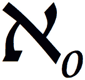

<!--yml
category: 未分类
date: 2024-05-12 23:03:59
-->

# Falkenblog: A Test of Technical Trading Rules

> 来源：[http://falkenblog.blogspot.com/2008/08/test-of-technical-trading-rules.html#0001-01-01](http://falkenblog.blogspot.com/2008/08/test-of-technical-trading-rules.html#0001-01-01)

Some guys in Australia

[tested](http://papers.ssrn.com/sol3/papers.cfm?abstract_id=1181367)

a bunch of technical trading rules, and found they didn't work. The problem is they test 5000 trading rules, which is a lot.

As there are an infinite number of ways of doing something wrong (not profitable), the ratio of good to bad technical rules should be near zero regardless. That is, consider the concept of infinity, where the

[Aleph number](http://en.wikipedia.org/wiki/Aleph_number)

of natural numbers is null, and the number of real numbers is something higher than that (say, Aleph 3). The ratio of Aleph null to Aleph 3 is 0\. So even if there are an infinite number of good trading rules, the number of bad trading rules is infinitely greater, the ratio is zero. Thus, this test is biased towards rejection.

With 5000 trading rules, I imagine only say 20 worked, and so 20/5000 is not statistically significant. I don't know exactly how to account for this, but it highlights the importance of theory, because without a theory, your search space will either find null or positive results depending on how you construct the sample.