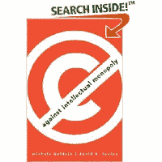

<!--yml
category: 未分类
date: 2024-05-12 22:59:45
-->

# Falkenblog: Against Intellectual Monopoly

> 来源：[http://falkenblog.blogspot.com/2008/09/against-intellectual-monopoly.html#0001-01-01](http://falkenblog.blogspot.com/2008/09/against-intellectual-monopoly.html#0001-01-01)

A neat book on

[Against Intellectual Monopoly](http://www.amazon.com/Against-Intellectual-Monopoly-Michele-Boldrin/dp/0521879280/ref=si3_rdr_bb_product)

by Michele Boldrin and David Levine, makes an interesting case on James Watt, inventor of the steam engine. Watt, basically, created the idea of a separate condenser for the standard Newcomen engine. This is good. But he got a 30 year patent in 1775, and steam engine productivity stalled for the next 30 years. This is because any improvements in the steam engine would necessarily involve a separate condenser, and thus, violate the patent. Fuel efficiency for steam engines was unchanged during the period of this patent, then increased 5-fold in the next 25 years.

In classic histories, Watt is a heroic inventor ushering in the Industrial Revolution. In this telling, he was merely one of many inventors trying to improve on the existing Newcomen engine, and once he was one step ahead of the pack, he remained ahead by exploiting the legal system.

This kind of history is fun to read, because often one's understanding of ancient events or people is superficial, and learning thing were quite different is fun. As someone who has spent a lot of time and money for my right to use 'mean-variance optimization' among other common tools, I know how costly it can be to defend oneself against an assertion something is proprietary, because everything is related, and so potentially derivative. If you are rich and petty get a good lawyer, and you can make people suffer, or win big: eg, a current case against Nintendo asks for half the profits from the Wii based on a patent violation, and clearly a 5% chance of half their Wii profits is worth a mere

[$25 million investment in litigation](http://www.baltimoresun.com/technology/bal-bz.wii21aug21,0,6454747.story)

.

Most intellectual property law is inefficient, because it diminishes competition more than it spurs innovation. But not all is, and thus the opening for the hucksters who hide their monopolistic intentions, or just plain bad faith; behind an idea, that sometimes, in some places, has a good effect. So often something that is good in moderation in that if some is necessary and optimal, is taken to excess.

This is a very well written book, with neat ideas like how the idea of property rights is different than intellectual property, in that my right to use my property, is much different than a patent or some such contrivance, which are rights of prohibition of others. He is describing modern day con-men, shakedown artists appealing to an analogy that does not hold. There are men who try to ruin others lives on the pretext of property rights, to garner monopoly rents. If you are unaware of these situations, consider yourself naive or lucky.

Boldrin did hard core theory when I was acquainted with him at Northwestern. It's great to see him write such a good, non-technical book.