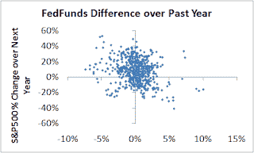
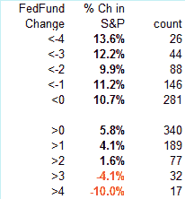

<!--yml
category: 未分类
date: 2024-05-12 23:23:49
-->

# Falkenblog: Aggregate Market Predictor

> 来源：[http://falkenblog.blogspot.com/2008/04/aggregate-market-predictor.html#0001-01-01](http://falkenblog.blogspot.com/2008/04/aggregate-market-predictor.html#0001-01-01)

The best single predictor of the future stock market return is the year-over-year change in the Fed funds rate. When it falls, the market tends to rise and vice versa. This is using data back to the beginning of the managed Fed Funds rate back in 1954, and looks at the past 12 month change in the Fed Funds v. the future 12 month change in the S&P500\. Look at the graph below.

In table form, it looks like this. There's a whopping 5% difference in future stock market return when there is a negative, as opposed to a positive Fed Funds rate change over the prior years, looking a year ahead. It's not a big enough edge to quit your job, but for something as noisy as the aggregate market, it's pretty good.

