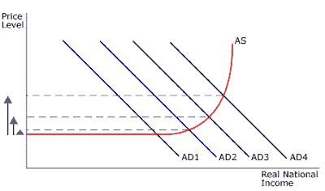

<!--yml
category: 未分类
date: 2024-05-12 20:42:17
-->

# Falkenblog: Aggregate Supply and Demand Nonsense

> 来源：[http://falkenblog.blogspot.com/2011/10/aggregate-supply-and-demand-nonsense.html#0001-01-01](http://falkenblog.blogspot.com/2011/10/aggregate-supply-and-demand-nonsense.html#0001-01-01)

One characteristic of Keynesian thinking is to think the problem currently is with inadequate Aggregate Demand, as if this is some simple analytical construct that is just as meaningful as the demand for apples. This is nonsense. Aggregate Demand and Aggregate Supply are incoherent constructs that require heroic assumptions. You might as well talk about the current law of motion on the Hegelian Dialectic, which for decades was discussed as if it were real. Things exist before people know they exist (eg, nations, atoms), and things also don't exist even when many are certain they do (eg, anthropomorphic God, aether, phlogiston). About what one can not speak, one should remain silent, and you can't talk about something that is as logically vacuous as aggregate supply and demand.

In partial equilibrium, a good exists and its price represents its output relative to innumerable other consumer wants. This is why the demand curve slopes downward, because the more it costs, the more you have to forgo of other stuff. Demand curves are driven by consumer utility (which decreases as one consumes more of a specific good), and income (which shifts it about). For supply curves, the correlate to utility curves are cost curves. One generally produces where marginal cost equals price, and so marginal cost is increasing (if it were decreasing, you could increase supply and lower costs for a 'given' price). Thus, you only raise your output if the price rises.

You can assume demand and supply move separately, as when seasonal harvests of perishable goods arise in supply, or demand for cranberries increases before Thanksgiving. The logic of supply and demand curves in markets is firmly based on utility and cost functions, and is a very useful way to think about things.

Now consider Aggregate Demand. Here the 'price' on the vertical axis is not a relative price, but rather an absolute price level, which by itself is meaningless. If there was only one good in any economy people cared about, what would its 'price' even mean? So, right off the bat, something's fishy. Supposedly, in normal times the AD curve slopes down, we think, because other things equal a higher price level increases the demand for money, which drives up interest rates, which reduces investment and spending. But how does one increase the price level and leave 'other things equal?' One can imagine doing this in partial equilibrium, but it's a strange thing to contemplate over all goods. Further, at interest rate levels like today, it's not as if lowering interest rates is having any effect on investment (the liquidity trap, which is occurs always in real time for Keynesians, who always say this is why government spending is necessary now).

Then there's the 'Pigou's wealth effect', which affects wealth by changing people's real balances, because presumably their cash levels are constant but magically prices move, affecting real wealth, CashValue/Price. However, offsetting that is the 'Fisher real balance effect', where one's debts change in real value. These debt effects are generally thought of as more important, and why most macroeconomists believe a little inflation would be good right now, and perhaps always: it reduces the legacy debt in real terms.

Lastly there are Mundell-Fleming effects, which operate though capital inflows caused by changes in real rates from changing the price level. Supposedly lower interest rates lead to capital account deficit, which a trade surplus, which implies higher GDP. The data on this are mixed, but generally international trade is the tail, not the dog, for large countries like the USA.

Now consider aggregate supply, which classically is horizontal, and then in the Keynesian world vertical. It supposedly becomes positively sloped because 'prices' refers to outputs, not inputs. Why prices supposedly effect finished goods rather than wages or intermediate goods is strictly

*ad hoc*

.

This is why general equilibrium models, like those of Edward Prescott and Finn Kydland, whose Nobel Prize winning research emphasized shocks to utility or production functions, because one has to put in some

ad hoc

structure to get these aggregate demand and supply curves to work in the Keynesian paradigm. Now, I don't think Prescott/Kydland models work either, but most policy debates aren't predicated on these models (I don't know anyone to really believe our problems are currently a technology shock, or preferences for more leisure).

The result of this flawed paradigm is to continually assert that simply spending more on X increases aggregate demand via their spending, because one becomes inured to extrapolating partial equilibrium analysis into general equilibrium results. Consider this AFL-CIO

[press release](http://blog.aflcio.org/2010/04/15/study-union-construction-jobs-help-economy/)

, which conflates more spending on union jobs with greater prosperity. If only everyone worked for a government protected industry with market power, presumably, we could all work 9-4 with negotiated, predictable wage increases.

So, like discussions in Marxist economics, which often involves very learned, earnest, and prolix researchers, it's best just not to go there, because it's gibberish. Don't say Aggregate Demand, say, subsidies to investment of some kind, or more government spending, because that's more meaningful, and then ask, should we be subsidizing these investments, or having more government spending? The indirect effects are so speculative you might as well ignore them, and just ask if the direct effects are worthwhile.