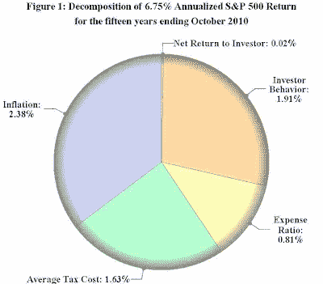

<!--yml
category: 未分类
date: 2024-05-12 21:08:20
-->

# Falkenblog: Alternative Investment Return Puzzles Proliferate

> 来源：[http://falkenblog.blogspot.com/2011/02/alternative-investment-return-puzzles.html#0001-01-01](http://falkenblog.blogspot.com/2011/02/alternative-investment-return-puzzles.html#0001-01-01)

When I was writing my

[dissertation](http://www.efalken.com/papers/EF%20Dissertation.pdf)

in 1993 on the negative return to highly volatile stocks, this result was considered so implausible, my finance faculty were too embarrassed to give it a recommendation. It wasn't poorly done, as part of it made a Journal of Finance

[publication](http://www.afajof.org/journal/jstabstract.asp?ref=11588)

, but no one wants to recommend someone promoting a flat earth theory. As job offers in academia are primarily from word of mouth, that mean no fly-outs, but I was eager to apply this result in the private sector, so it didn't bother me. In any case, what I didn't know then that I believe now, is that the risk premium is zero in general because people are better described as

[envious rather than greedy](http://falkenblog.blogspot.com/2010/03/why-envy-dominates-greed.html)

, and this simple adjustment explains my finding. Without this assumption, you have to assume a very schizophrenic market, risk-loving within equities, but not between equities and bonds, and such ad hoc assertions pre-behavioral finance were considered lame (eg,

[Frazzini and Pederson](http://falkenblog.blogspot.com/2010/12/frazzini-and-pedersen-simulate-beta_15.html)

assume people allocate only 50% of their liquid wealth to stocks, but then are leverage constrained in their investment choices within equities--as if they couldn't simply allocated 60% of their wealth to equities due to some rule of thumb).

Yet, we see again and again that asset classes, when you really account for their various biases, are no better than the risk-free rate. Case in point: CTAs, or Commodity Trading Advisor accounts.

[Bhardwaj, Gorton and Rouwenhors (2008)](http://www.efalken.com/papers/morepapers/CTAs.pdf)

t published a study on CTA returns:

> Investors face significant barriers in evaluating the performance of hedge funds and commodity trading advisors (CTAs). The only available performance data comes from voluntary reporting to private companies. Funds have incentives to strategically report to these companies, causing these data sets to be severely biased. And, because hedge funds use nonlinear, state-dependent, leveraged strategies, it has proven difficult to determine whether they add value relative to benchmarks. We focus on commodity trading advisors, a subset of hedge funds, and show that during the period 1994-2007 CTA excess returns to investors (i.e., net of fees) averaged 85 basis points per annum over US T-bills, which is insignificantly different from zero.

They focus on CTAs because they are relatively easier to handle than the diverse set of hedge fund strategies, but they are probably representative of hedge funds in general. CTAs manage about $200B in 2007, so it is not an insignificant sum. At the end, the authors try to address the question of why so many people invest in an investment class so much riskier than money markets without anything to show for it, and they are left with a puzzle: "the poor performance track record of CTAs raises the question of why the asset class has continued to grow – apparently despite a long history of poor performance."

Their answer is basically that hope dominates reality, in large part because the information presented is so biased. Further, regulations actually exacerbate this problem because they prohibit funds from advertising performance directly, because supposedly this would be soliciting unsophisticated investors; in practice this allows CTAs as a class to hide their lame aggregate performance more effectively.

Private equity is another asset class with difficult-to-know aggregate performance data.

[Robinson and Sensoy (2011)](http://www.efalken.com/papers/morepapers/PE1984-2010.pdf)

find that private equity investments do slightly better than the S&P looking at data from 1984-2010\. But just as in the broad equity market, the returns to private equity are low following high fundraising years, so that the return to the average dollar invested is actually lower than for the S&P500, and this lowers the average dollar return by more than a third, putting them back into money market returns.

[Maymin and Fisher (2011)](http://www.efalken.com/papers/morepapers/InvestorsChaseReturns.pdf)

find the average investor in an asset class lags the average performance of the asset class itself by an average of 1.95 percent per year over the past fifteen years, based on net investor cash flows of 25,000 mutual funds, leaving them with next to zero after taxes and inflation. Below is a pie chart from their paper:

The theory that risk is not rewarded explains more of the data, and avoids the bizarre risk-loving/risk-hating theory that is preferred by academics. This clearly makes most investments much less attractive, which combined with its unorthodox assumption (envy over greed), makes it a very minority view. But it's still right.