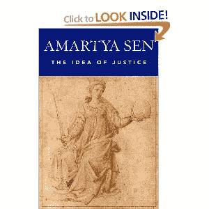

<!--yml
category: 未分类
date: 2024-05-12 20:49:19
-->

# Falkenblog: Amartya Sen's Justice

> 来源：[http://falkenblog.blogspot.com/2011/07/amartya-sens-justice.html#0001-01-01](http://falkenblog.blogspot.com/2011/07/amartya-sens-justice.html#0001-01-01)

I was reading

[The Idea of Justice](http://www.amazon.com/Idea-Justice-Professor-Amartya-Sen/dp/0674060474/ref=sr_1_1?s=books&ie=UTF8&qid=1311211323&sr=1-1)

by Nobel Laureate Amartya Sen, now in paperback, and he starts out with the following example.

Take three kids and a flute. Anne says the flute should be given to her because she is the only one who knows how to play it. Bob says the flute should be handed to him as he is so poor he has no toys to play with. Carla says the flute is hers because she made it.

Sen argues that who gets the flute depends on your philosophy of justice. Bob, the poorest, will have the support of the economic egalitarian. The libertarian would opt for Carla. The utilitarian will argue for Anne because she will get the maximum pleasure, as she can actually play the instrument. Sen states there are no institutional arrangements that can help us resolve this dispute in a universally accepted just manner.

This supposedly shows that there is no single theory of justice, rather one should look at enhancing the redistribution of life-saving goods and removing 'injustice'.

I thought his initial thought example rather curious. Instead of asking how to allocate the flute between the three children, why not ask first under which rules would the flute have come into existence? If Carla knew she would not get the flute, she would not have made it. Therefore, just add a time dimension to the puzzle, and there's no puzzle at all: only a libertarian form of justice is consistent with the flute existing.

I was rather surprised that Sen didn't address this, as if goods and technologies exist independent of our allocation rules, which we then choose between. It's a bit like

[John Stuart Mill](http://www.sparknotes.com/philosophy/mill/section2.rhtml)

, who reasoned that the laws of production are exogenous, but the laws of distribution are created and enacted by human choice. That's excusable for Mill, who wrote before the

[marginal revolution](http://en.wikipedia.org/wiki/Marginalism#The_Marginal_Revolution)

(around 1871) and the manifest failure of socialism, but for an accomplished social welfare theorist like Sen to make such an error highlights that experts are working within a paradigm, and a flawed assumption (ie, wealth is given) makes all the resulting argument lame.