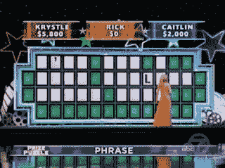

<!--yml
category: 未分类
date: 2024-05-12 21:16:29
-->

# Falkenblog: Amazing Guess, Great Models, Similarly Inspired

> 来源：[http://falkenblog.blogspot.com/2010/11/amazing-guess-great-models-similarly.html#0001-01-01](http://falkenblog.blogspot.com/2010/11/amazing-guess-great-models-similarly.html#0001-01-01)

In the most

[stunning solution](http://voices.washingtonpost.com/blog-post/2010/11/wheel_of_fortune_contest_pulls.html)

of a "Wheel of Fortune" puzzle ever, a Manhattan editor Caitlin Burke nailed a staggeringly long answer with just one letter for a clue. The show has you spin a wheel that generates prizes for each letter guessed, and usually you wait until the phrase is mostly done, such as "Risky Stocks are Crappy Passive In-estments". But when she was staring at the highly ambiguous 27-letter phrase "-'-- --- - ---- ---L--- ----- ----", she risked her chance at winning by guessing: "I've Got a Good Feeling About This". She won a Caribbean vacation worth about $6,500 with that guess. She finished the game with a total of $53,618.

This seemed like some kind of joke, or the game was rigged, but it seems legitimate. Learning about how she did it is interesting. First, she played the game at home a lot with her family, and was relatively good at it. This is also evidenced by her total winnings, which show she did not merely get lucky. Second, she identified the "-'--" as "I've", because that is the most common three letter contraction that starts a sentence. Lastly, her ringtone for her boyfriend is "I've got a Feeling" by the Black Eyed Peas, so a close phrase was in her short term memory. Put that all together, and her guess seems reasonable, without that information, it seems like magic.

I find that many theories are like that. If you look at the history and derivation of many models--Black-Scholes, special relativity, the law of gravitation--you'll find similar properties. What seems like magic is a pretty straightforward synthesis of some well-known information, applied by someone who is smart but not superhuman.