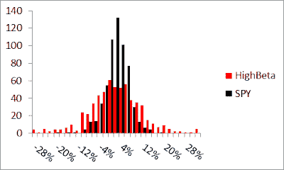
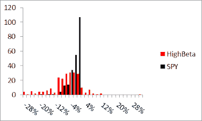

<!--yml
category: 未分类
date: 2024-05-12 20:34:00
-->

# Falkenblog: Are High Beta Assets Really Low Risk?

> 来源：[http://falkenblog.blogspot.com/2012/03/are-high-beta-assets-really-low-risk.html#0001-01-01](http://falkenblog.blogspot.com/2012/03/are-high-beta-assets-really-low-risk.html#0001-01-01)

At Friday's conference,

[Sam Wildeman](http://www.mitsloaninvestment.com/Sam-Wilderman.html)

of GMO articulated his diagnosis of the low volatility anomaly: high beta stocks are low risk. He seems like a good guy, merely confused, so as a public service I'll try to explain why this makes about as much sense as the qwerty keyboard.

His basic idea comes from the finding that high beta stocks tend to have higher betas in bull markets (good!) and lower betas in bear markets (also good!). In that sense, they are less risky than a simple high beta asset. True enough. A 1.5 beta portfolio probably has less risk than the SPY levered 1.5 times due to this effect. But the higher beta portfolio is still considerable riskier than average by any definition.

Here's a histogram of monthly returns from 1962-2011

Here's the same thing in months where the S&P500 Index return was negative

So, the lower tail is proportionately larger for high beta stocks for both the total sample, and the truncated sample when the S&P500 falls. I don't think the 'long put' idea is really at work. Now, it is true that prospective betas are closer to 1.0 than measured historically, and this has been well-known for decades. The initial two-pass sorts in

[Fama and MacBeth in 1973](http://en.wikipedia.org/wiki/Fama%E2%80%93MacBeth_regression)

was created to correct for the fact that high beta stocks, in general, are over-estimated, and low beta stocks are underestimated. This is also accounted for in beta estimates that incorporate a bayesian prior, as is the default assumption for Bloomberg betas.

If it could be shown that high beta stocks are really low risk stocks, that would be a neat trick. I don't see any evidence for that.