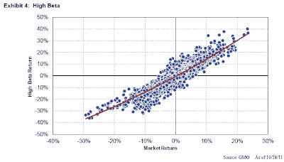

<!--yml
category: 未分类
date: 2024-05-12 20:39:24
-->

# Falkenblog: Are High Beta Stocks Like Call Options?

> 来源：[http://falkenblog.blogspot.com/2011/11/are-high-beta-stocks-like-call-options.html#0001-01-01](http://falkenblog.blogspot.com/2011/11/are-high-beta-stocks-like-call-options.html#0001-01-01)

Dave Cowan and Sam Wildeman at GMO have a new paper,

[Re-thinking Risk](https://www.gmo.com/America/CMSAttachmentDownload.aspx?target=JUBRxi51IIBEIq6GNuTKrwDEmPY4UP89T11HQe%2bUJtaoPnrxQd%2b4bpGewst3vdOaQJVJ8XY4qD%2b12UXC0xaylXB7gabljhAHNugpRoO%2fMH9S5LTUfl6%2fcZf0CK%2bbQ1hv46Sthj5jlJU%3d)

(check

[here](http://www.gmo.com/America/)

or

[here](http://ibankcoin.com/streetsleuth/2011/11/19/rethinking-risk-what-the-beta-puzzle-tells-us-about-investing-gmo/)

if that doesn't work), that makes the argument that the poor performance of high beta stocks makes perfect sense. Their idea is that high beta stocks actually are leverage with a put option, because unlike a levered fund where you can lose 2 times your investment (200%), a beta=2 portfolio can only lose 100%. In their words:

> The point here is that the form of leverage offered by high beta is different in an important way from explicit borrowing. Investors should prefer this kind of leverage, and, in an efficiently priced market, they will accept a lower return for it. As we will show, the performance of high beta is not a product of excessive demand, but rather a reasonable and rational consequence of the fact that it provides a convex payoff to the market.

Their analysis highlight the fact that 'risk' has two meanings. One is the risk people intuit, the other the technical metric in financial theory that generates a return premium. The risk that generates a risk premium is solely a function of expected covariance with some risk factor. Convexity just means the average expected risk in the future is nonlinear, but there's still a simple linear function of this expected covariance that should relate to the expected return. Convex payouts in options may seem less risky, and indeed are often sold via the pitch that they have 'limited downside.' If losing 100% is risk reduction for you, your broker probably has you on speed dial.

The key insight in Black-Scholes-Merton wasn't the basic formulation, which was well-known at that time among practitioners like

[Edward Thorpe](http://www.edwardothorp.com/sitebuildercontent/sitebuilderfiles/Interview_with_The_Journal_of_Investment_Consulting_2011.pdf)

, it was rather that one should use the 'risk free rate' to discount future payoffs. This was surprising, and though it was proved later much more simply by Cox and Rubinstein in their

[binomial pricing model](http://en.wikipedia.org/wiki/Binomial_options_pricing_model)

, they figured it out first and deserve their accolades.

Convexity generates option value only because of its effect on expected values, not because of a 'risk premium' in the technical sense. That is, the 'option premium' above the 'intrinsic value' is purely a risk neutral expected value. The convexity in payoffs should show up in the expected returns, which should show in average returns over a large enough sample. As the authors note, high beta stocks under perform historically in the US and internationally, so it is implausible to say this is simple a 'peso problem' of having a small sample.

If a high beta stock is really like a portfolio with leverage plus a put option, the expected return is still a function of its

*expected*

beta. This is shown rather nicely by Joshua Coval and Tyler Shumway in their paper '

[Expected Option Returns](http://www.people.hbs.edu/jcoval/Papers/OptionReturns.pdf)

.'

Nevertheless, while it is true that Beta=2 equities can lose only 100% unlike being levered 2 times where you can lose 200%, in practice this convexity is quite small. Above is their empirical estimation of the convexity in high beta equities. While there is a little convexity, it is quite small, not significantly different than zero (ie, it's pretty linear). It's implausible to think this minor amount of curvature is practically important.

The authors then point out that betas for high-beta equities have lower betas in down markets than in up moves. True enough, but this highlights having a good conditional beta forecast that recognizes this. By now everyone should know that in highly volatile times like 2008, stocks tend to decline and correlations increase, compressing the cross-section of beta (lowering high betas and increasing low betas). In practice, you want a bayesian adjustment or shrinkage parameter to your beta estimation that recognizes this (more shrinkage in bull or declining volatility estimation periods).

In sum, I think the authors are confusing the intuitive risk with priced risk. The low return to high beta stocks is still a puzzle to standard theory because these stock returns include the convex payout, and this should show up in the average returns of stocks that implicitly include them. Not only is the convexity slight, high beta equities have lower than average returns historically.