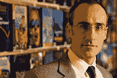

<!--yml
category: 未分类
date: 2024-05-12 21:30:30
-->

# Falkenblog: Arthur Brooks on Happiness

> 来源：[http://falkenblog.blogspot.com/2010/06/arthur-brooks-on-happiness.html#0001-01-01](http://falkenblog.blogspot.com/2010/06/arthur-brooks-on-happiness.html#0001-01-01)

[Arthur Brooks](http://www.arthurbrooks.net/)

, president of the AEI, has a new book out,

[The Battle](http://www.amazon.com/Battle-between-Enterprise-Government-Americas/dp/0465019382)

, and he makes an interesting claim. He states that the key factor in one's happiness--not experiential happiness, but 'remembered happiness' that is more correlated with 'life satisfaction', see

[Kahneman](http://falkenblog.blogspot.com/2010/03/kahneman-on-two-happinesses.html)

on the difference--is 'perceived earned success'. This is the willingness and ability to create value in your life or the life of others. He states that if you ask someone if they feel like they are creating such value, they are happy, regardless of how much they make. Giving people money, via welfare or inheritance, does not make people happy, because this if anything discourages the effort needed to find and develop such a niche.

In

[Finding Alpha](http://www.efalken.com/video/index.html)

, I noted that alpha isn't in an asset, but an individual's edge. Like Minnesota hedge fund manager Andy Redleaf's thesis in

[Panic](http://mnfmi.org/2010/05/14/book-review-panic-by-andrew-redleaf-and-richard-vigilante/)

that above-average returns are a function of 'good ideas', not risk, and good ideas aren't just relevant to picking stocks, but all sorts of things that can make you more successful. Finding alpha is about finding your comparative advantage in your work. As

[David Ricardo](http://en.wikipedia.org/wiki/Comparative_advantage)

noted about comparative advantage, it exists regardless of one's absolute advantage, it's what one is relatively best at, basically, one's most productive activity. When you find it, you are literally being all you can be.

Invariably, one finds one is good at what they like and vice versa, because you can only get good at something via a lot of effort, and if the task is perceived as onerous or boring you won't put in enough effort; if you are good at it, you'll find you like the appreciation you receive from others that is greater than in any other activity. Thus, finding your alpha is like Brook's 'perceived earned success'. If you find what you would do for nothing and get so good people pay you for it, you will probably be happy.

One important refinement of this idea is that there's a difference between current and permanent value: Pets.com vs. Google, the works of John Kenneth Galbraith vs. Ludwig von Mises. They might, at one time, have generated the same appreciation, but one faded, the other proved highly prescient. One's sense of whether one is creating permanent value, irrespective of current rewards, is important as well, because its rather ghastly to think one's lifework will be seen like past experts in quack homeopathy, irrelevant if not a joke.

A recent

[study](http://www.overcomingbias.com/2010/05/why-schools-test-often.html)

found that as children get older, they move from egalitarians to meritocrats. This makes sense because kids learn that people are differently skilled, and one wants the best person acting as quarterback, lead violin, or head writer, because that helps them be more successful in their goals as wide receiver, lead flute, or lead actor; to reward people the same is to be counterproductive and unjust. Free markets are fair in the sense that they most closely allocate rewards according to this ideal, and Brooks finds that those who think the market is generally fair believe in markets, and those who think the market is a rigged game, believe in greater government control. It comes down to the belief as to whether a market is fairer than feasible alternatives, better at rewarding value, implementing justice.

If you are dead weight in an organization, one whose absense causes not merely indifference, but greater productivity and joy, one senses it through all sorts of little cues. It is much better to be underpaid than overpaid (though not too much). I remember the film '

[About Schmidt](http://en.wikipedia.org/wiki/About_Schmidt)

', where right after a retirement dinner with all the insincere goodbyes, Schmidt (Jack Nicholson) stops by his old office and notes his replacement is too busy to speak with him, and his old files are set out for garbage collectors. Clearly no on misses him a whit, and it causes great existential despair. One can whine, like Willy Loman in

[Death of a Salesman](http://www.bellmore-merrick.k12.ny.us/death.html)

, about people not appreciating us and how unfair that is, but only we have the ability to make the changes in our lives that get us into niches where we are best appreciated.

Most likely your destiny is not to be famous or rich, but rather, a dependable, valued, programmer for a company that makes paper. Or perhaps your best talent will never be exploited because of a large opportunity cost. Further, the work sphere of your life complements but does replace the personal side, where friends and family appreciate very different skills. The key is doing the best with what you can, the self-awareness and motivation to develop one's strengths so that your hard work generates a maximum payoff going forward. As Muhammad Ali once said, "You can be the best garbage man or you can be the best model--it doesnt matter as long as you're the best." 'The best' is mathematically improbable, 'really good' generates the same result. If you are really good at your job your day is filled with sincere gratitude by colleagues and customers, and hopefully you can also have a family that appreciates you as well (but for vary different reasons).

In the end Marcus Aurelius notes that popularity counts for nothing, "we're all forgotten. The abyss of endless time that swallows it all. The emptiness of those applauding hands." So, live for creating value in the lives of those around you, value that is appreciated and will be missed because it is real. If you create real value, things that with the passage of time retain their admiration, as Brooks suggests, that will probably make you happy, which isn't nothing.