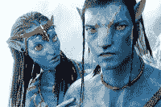

<!--yml
category: 未分类
date: 2024-05-12 21:40:50
-->

# Falkenblog: Avatar Silly Fun

> 来源：[http://falkenblog.blogspot.com/2009/12/avatar-silly-fun.html#0001-01-01](http://falkenblog.blogspot.com/2009/12/avatar-silly-fun.html#0001-01-01)

I took my boys to Avatar and found it visually dazzling, though the story totally cliche. It's the standard trope about the superior virtues of a primitive, indigeounous culture. The funny thing is that everyone knows primitive indigenous white cultures, such as those in Appalachia (rural America), are backward: illiterate, racist, sexist, and homophobic. The have high rates of crime, drug use, and incest. Their religiosity is not admirable, it merely highlights their devotion to dogma. However, given the current enlightened tribalism white trash has no analogue among brown, black, yellow and now blue hominids. I guess the marginal effect of education on rational self-interest is high only for Europeans; everyone else simply knows that 'playing nice' is an optimal strategy in dynamic interactions.

The most important fact to remember when species from different ecosystems meet is that one usually has 100x the brainpower of the other. When one comes light years to visit the other, and you can put your money on the visitors, and remember, they are not only smart, but hungry. This is why I'm not too excited by the thought of aliens coming back, because I don't think they are going

[to serve mankind](http://en.wikipedia.org/wiki/To_Serve_Man_(The_Twilight_Zone))

in a way we would like.

Most importantly, I was wondering whether it counts as creepy if you lust for females of another species merely because they look and act kind of human. Sure, she's a pretty blue girl, but horses are pretty, and if they could talk, I still wouldn't fark one, even if "I" were a horse. I guess ever since Captain Kirk started making out with alien babes everyone figures a hot chick with a tail and racing stripes is just a hot chick. I'm all for being color blind, but if your neighbors are really blue, deep blue, don't tell me you'll treat them just like everyone else.

Interestingly, there's a

[fun theory](http://www.starchildproject.com/)

out there (see

[Chariots of the Gods](http://en.wikipedia.org/wiki/Chariots_of_the_Gods%3F)

), that aliens with really big heads came around, bred with the locals and build megaliths, then left or where killed, suggesting that Ghengis Khan is not the greatest progenitor of the planet, but rather the Captain Kirk from

[Planet X](http://xfacts.com/x.htm)

. This also explains why all cultures assume the Gods come from the heavens. You can see evidence of their big heads in

[South American](http://www.crystalinks.com/incanskulls.html)

to Russia, and their buildings from Macchu Picchu to Giza.