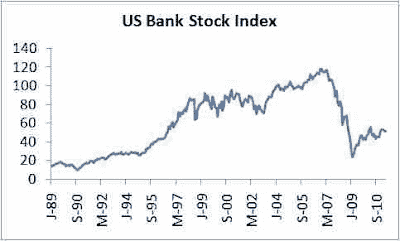

<!--yml
category: 未分类
date: 2024-05-12 20:55:07
-->

# Falkenblog: Bank Stocks Still Stagnant

> 来源：[http://falkenblog.blogspot.com/2011/05/bank-stocks-still-stagnant.html#0001-01-01](http://falkenblog.blogspot.com/2011/05/bank-stocks-still-stagnant.html#0001-01-01)

Above is the

[KBW bank index](http://www.google.com/finance?client=ob&q=INDEXDJX:BKX)

(extrapolated back to 1990 via another bank index). When I was working for a bank in the 1990, I remember we always had lots of unrecognized gains in our book of assets acquired from the S&L crisis. It seemed like a bottomless cookie jar that bailed us out whenever we needed it. As there were lots of banks, and bank assets, sold well below their value, it seeded the best decade of bank stock returns ever. But after the latest crisis, bank stocks have stagnated well below their prior peaks.

I think this time, we have a reverse cookie jar. Banks had a lot of mortgage assets, and not only have those prices fallen, but the rules have changed, so that the time to foreclosure has more than doubled. Thus, banks still have lots of unrecognized losses, and like Japan in the 1990s, hope to slowly write them off. I'm guessing. One thing I learned about banking is that unless you have some first hand knowledge that CFOs have, you don't really know.