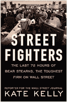

<!--yml
category: 未分类
date: 2024-05-12 22:01:33
-->

# Falkenblog: Bear Books

> 来源：[http://falkenblog.blogspot.com/2009/05/bear-books.html#0001-01-01](http://falkenblog.blogspot.com/2009/05/bear-books.html#0001-01-01)

When Bear Stearns failed in May 2008, it basically went from trading at $60 on Thursday, $30 on Friday, and then they announced a $2 takeover price on Sunday. It was adjusted to $5 by Monday, and finally to $10 the following week. Quite the fall from $178 in January 2007\.

What happened? Three books have been released that cover this debacle.

[Street Fighters](http://www.amazon.com/Street-Fighters-Hours-Stearns-Toughest/dp/1591842735/ref=sr_1_1?ie=UTF8&s=books&qid=1242596803&sr=1-1)

by Wall Street Journal reporter Kate Kelly,

[Bear Trap](http://www.amazon.com/Bear-Trap-Fall-Bear-Stearns-Panic/dp/1883283639/ref=sr_1_2?ie=UTF8&s=books&qid=1242596803&sr=1-2)

by Bear Managing Director Bill Bamber, and

[House of Cards](http://www.amazon.com/House-Cards-Hubris-Wretched-Excess/dp/0385528264/ref=sr_1_3?ie=UTF8&s=books&qid=1242596803&sr=1-3)

by William Cohan. Street Fighters is the easiest read, in that you could knock it off on a long flight, and reads with the simplicity of the newspaper articles from which it was derived. Bamber's insider account is interesting, but I get the sense that I'm missing out of both the bigger picture or what the main agents--the CEO's, the Fed--are doing. My neighbor used to work for AIG, and I can attest that he was as surprised as anyone by what happened and was buying stock the whole way down. If you aren't in the right place, your insider account is often rather barren. Cohan's book is probably the most definitive. So, I would say if you are really interested in this and have a lot of time, read Cohan's book. If you want to knock it off relatively quickly, read Kelly's.

These books highlight that banks really are different than other companies. The actual value of Bear is never really addressed. That is, are the assets worth more than the liabilities? This would get into details about the nature of the mortgages and other assets on Bears books. No one really goes into much detail here. As this was the key question, I was rather surprised that Bear did not have a standard template for explaining why they thought their mortgage assets--with a book value of $46B--were really worth that much. In the final hours, outside firms really had no way to value these assets with much confidence. Bear should have been able to slice a book sixteen different ways, by the vintage, FICO, LTV, and other dimensions of the collateral, look at how various securities are in the waterfall of the tranches. They should have had clear reference securities for benchmarking their valuation. For this reason, I don't really feel sorry for Bear. This was a major managerial failure.

In the summer of 2007, two of their hedge funds collapsed, going from being up a few percent, to being wiped out in merely a month. They had write downs throughout 2007 related to mortgage securities, and people were wondering if that was just the beginning. The week prior to Bear's demise, Renaissance, the huge hedge fund, pulled its money from its prime brokerage at Bear, and a large hedge fund can't do this without everyone knowing about it. Then, on Wednesday Goldman decided it did not accept Bear as a counterparty on some derivatives, and this was mentioned in an interview by Marc Faber on CNBC with CEO Alan Schwartz. While Goldman reversed their position the following day, this decision exacerbated the run as most hedge funds were pulling their money out of their Bear prime brokerage accounts. Why Goldman and Renaissance did this is really the big question that none of the books address, and given the importance of this event in the destruction of Bear, I imagine that is a story that will never be told because of legal liability. That is, if you say too much, a lawyer could argue the actions were damaging and contained bad faith bargaining, In any case once the run started the whole solvency question was rather moot, because if everyone is concerned that others are not rolling their debt over, they won't roll over Bear's debt, create a self-fulfilling prophesy. If Bear has 50 counterparties, but each thinks they other's are pulling their money out, then Bear will go bankrupt irrespective of its solvency. This is the nature of a bank run. Once it starts, it is very hard to stop. FDIC insurance stops most retail runs, but for banks dependent on short term financing, runs remain [see

[this paper](http://papers.ssrn.com/sol3/papers.cfm?abstract_id=1401882)

by Gary Gorton, an economist who consulted for AIG on their derivatives exposure, and thus is very well informed, thinks the run by hedge funds really defined our current credit crisis.]

The thing about short term money is that one's credit quality has to be beyond question. Moving to BBB in your debt rating is basically a death sentence for such a firm, and a BBB rated company has only a 0.15% probability of default, so as a practical matter it is very difficult to say whether a company should be rated A (0.07% annualized default rate) or BBB. So, it's very tricky, which is why there is all this concern about trust, and keeping out of the gossip pages. You want bankers who are squeaky clean, and the pot-smoking rumors about 72 year-old ex-CEO Jimmy Cayne surely didn't help, though personally I don't see the relevance.

An interesting note in this debacle was the absence of the Risk Managers. They aren't mentioned at all various scenes because they really didn't matter. In that way, they are like Merton and Scholes in the LTCM failure--irrelevant. Those making the key decisions, making the key arguments, were the simple business managers: Alan Schwartz, a broker by training, head of Fixed Income Warren Spector, the Treasurer Bob Upton, and CFO Sam Molinaro. Indeed, Kelly writes "managers in places like risk management and operations were considered less important to the firm's core franchise and therefore largely excluded from important decisions." Risk Management lumped with operations. Ouch.

An interesting point is to what degree the hedge funds really drove this. If all the hedge funds were pulling their prime brokerage accounts, this could have driven the bankruptcy by itself. As hedge funds are greedy little companies like any other, the implications of their actions would clearly suggest that hedging their risk, or profiting from their predicament, would be a good trade. Thus, selling Bear stock and buying default protection on Bear, would drive down Bear's credit rating, exacerbating their problem, making more money for the hedge funds all the way down. For a big hedge fund like Renaissance, they must have know the implications of their actions, and it clearly suggested shorting Bear as a strategy. Some funds, like Citadel, seemed ready to step in and buy Bear, but as there were rumors of a bear run by hedge funds this was basically never considered by Bear, and only JPMorgan, custodian for Bear's assets, had the wherewithal to quickly review Bear's assets in time to generate a buyout bid.