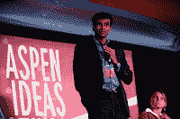

<!--yml
category: 未分类
date: 2024-05-12 20:50:31
-->

# Falkenblog: Behavioralists Think Everyone Else is Biased

> 来源：[http://falkenblog.blogspot.com/2011/07/behavioralists-think-everyone-else-is.html#0001-01-01](http://falkenblog.blogspot.com/2011/07/behavioralists-think-everyone-else-is.html#0001-01-01)

Sendhil Mullainathan of Harvard won a MacAurthur genius grant in 2009, which makes him a celebrity among the New Yorker crowd who like to think they are on the cutting edge. He is also the Assistant Director for Research of the Consumer Financial Protection Bureau. He is a 'behavioral economist', a field supposedly generating what David Brooks calls

[golden age of behavioral research](http://www.nytimes.com/2011/07/08/opinion/08brooks.html?_r=2&src=me&ref=general)

. I read Kahneman, Tversky and Slovic's

[Judgement under Uncertainty](http://www.amazon.com/Judgment-under-Uncertainty-Heuristics-Biases/dp/0521284147)

in the 80's (published 1982), which mainly discussed a series of papers

[published in the 1970s](Thirty%20years%20of%20research%20on%20race%20differences%20in%20cognitive%20ability.)

, and found it fascinating, but now it's now 30 year old stuff and pretty boring. There's a couple hundred academically based

[confirmed biases](http://en.wikipedia.org/wiki/List_of_cognitive_biases)

which are all kinda true, but not very profound. For instance, people tend to eat more in groups than when they eat alone. That's interesting, and has some implications, but they are pretty parochial. I suspect Freud had a similar popularity cycle, publishing around 1899, peaking in the 1950's, and now scientifically irrelevant although always useful for a rhetorical flourish ('penis envy', 'Oedipus complex').

In his Aspen Institute

[speech](http://www.youtube.com/watch?v=1NZMNqwfBO4)

, Mullainathan recounts some familiar anecdotes, such as that default choices are very influential, that being distracted makes you less attentive. These are useful to be sure but hardly something to generalize upon. There aren't a lot of insights generated from the default choice bias, other than, for simple things like organ donation and 401ks, make those the default choice. These have been the staple examples since the 1990s, and they remain the primary regulatory examples.

Take something like irradiating eggs, something almost all scientific people agree is good (kills bacteria, no residual radiation). Why not make them the default eggs? They never would argue for that, because it's contrary to the Luddite-leftists who hate technology but love government. In practice behavioral insights are applied mainly to increase the scope and scale of government, which presumably is staffed by unbiased administrators. Consider than Al Gore cozied up to ethanol when he was trying to be President but now agrees it was counterproductive, and like the sugar cane quotas created a permanent policy that cost merely tens of billions in waste. Such are the results of presumably high-minded objectives, all twisted by the absence of competition. Thus, Mullinaith can only go to the 401k and organ donor example, but can't extrapolate to food irradiation or something else as simple (eg, don't encourage low down payment mortgages). Simple rational thinking doesn't generate better policy. He can prove me wrong with actually generating regulations that have positive benefit/cost ratios, but I'm not optimistic.

Sendhil also thinks that a major problem of the poor is that they inadequately sign up for welfare because the forms are so complicated. If you simplify forms you will have more people on welfare and more fraud, which isn't necessarily good for families in the long run. So, Sendhil likes to play to standard liberal pieties about how government can help and inequality is the result of evil and prejudice (he's big on the stereotype bias, another publication bias result gone viral). Yet he forgets the most profound behavioral bias in this literature that is delightfully recursive:

> We think we are better than average at not being biased in thinking that we're better than average.

This is true especially for people who have studied this subject at college. Thus, the behavioralists neatly infer from the literature that everyone else is biased. Now, surely these are smart, educated people, and they are less biased on simple scientific questions that your average housewife doesn't know, but there are lots of big issues relating to politics and business strategy that don't have a monotonic relation between learning and the ability to discern the good. Just look at politics or education, areas subject to a lot of study over the past 50 years, which are hardly more efficient than before all this knowledge arrived.