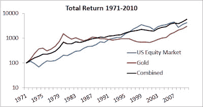

<!--yml
category: 未分类
date: 2024-05-12 20:47:12
-->

# Falkenblog: Benefits of Diversification

> 来源：[http://falkenblog.blogspot.com/2011/08/benefits-of-diversification.html#0001-01-01](http://falkenblog.blogspot.com/2011/08/benefits-of-diversification.html#0001-01-01)

In 1971, the US dollar was removed from the gold standard for good. Since then, the price of gold has risen, though basically in spurts. The equity market has also been subject to major cycles. Looking at the raw price of gold and comparing this to the total US equity market return, you see both end up around the same place: 7.9% for Equities, 7.0% for gold, through 2010\. But combined 50-50, and reweighting each year, one would generate an 8.4% return via the lower volatility (geometric average is greater due to its lower volatility).