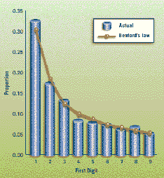

<!--yml
category: 未分类
date: 2024-05-12 23:09:50
-->

# Falkenblog: Benford's Law

> 来源：[http://falkenblog.blogspot.com/2008/07/benfords-law.html#0001-01-01](http://falkenblog.blogspot.com/2008/07/benfords-law.html#0001-01-01)

[Benford's law](http://www.aicpa.org/pubs/jofa/may1999/nigrini.htm)

states that the frequescey of the first digit in a set of numbers obeys a power law, so that for base 10 the odds of getting a "1" in the first digit is about 30%, a 2 about 18%, and decreasing to about 5% for a 9\. This has to do with numbers generally having logarithmic distributions (for normally distributed variables, like IQ, you don't see Benford's law).

Anyway, I was reading about how you can apply Benford's law to accounting fraud, because fools who make up numbers will put in equal distributions of numbers starting with 9 vs. those starting with 1\. But then I thought, most fraud pertains to a classification issue, such as classifying an expense as an investment, or accelerating income--the numbers are real, just relabeled. Further, someone might take a big number and back into it, but usually by adjusting a handful of numbers. If you are targeting the number X, and you have Y, all you need is one number (X-Y). You can't use Benford's law, which applies to frequencies, to disprove a handful of fudged numbers.

I see there are lots of conferences and books on this, because it's a neat finding, but I can't imagine is has significant practical value.