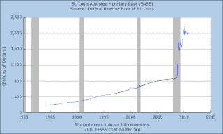

<!--yml
category: 未分类
date: 2024-05-12 21:17:27
-->

# Falkenblog: Bernanke Panics

> 来源：[http://falkenblog.blogspot.com/2010/11/bernanke-panics.html#0001-01-01](http://falkenblog.blogspot.com/2010/11/bernanke-panics.html#0001-01-01)

[Here's big Ben](http://www.federalreserve.gov/BOARDDOCS/SPEECHES/2002/20021108/default.htm)

at a conference to Honor Milton Friedman in 2002:

> For practical central bankers, among which I now count myself, Friedman and Schwartz's analysis leaves many lessons. What I take from their work is the idea that monetary forces, particularly if unleashed in a destabilizing direction, can be extremely powerful. The best thing that central bankers can do for the world is to avoid such crises by providing the economy with, in Milton Friedman's words, a "stable monetary background"--for example as reflected in low and stable inflation.

And here's his

[latest great idea](http://www.bloomberg.com/news/2010-11-01/fed-likely-to-announce-500-billion-of-purchases-survey-shows.html)

:

> The Federal Reserve will probably begin a new round of unconventional monetary easing this week by announcing a plan to buy at least $500 billion of long-term securities, according to economists surveyed by Bloomberg News.

Not only is this destabilizing, increasing the monetary base even more than it has been, but the Fed is now trying to fine tune the yield curve. Bernanke's praise of Friedman's work, which promoted stable monetary growth rates, remind me of Marx (Groucho, not Karl): "those are my principles. If you don't like them, I have others." Here's the monetary base, the only monetary aggregate the Fed has direct control over. We are in uncharted waters.

