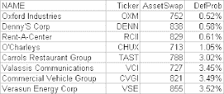

<!--yml
category: 未分类
date: 2024-05-12 23:24:44
-->

# Falkenblog: Best Buys in High Yield

> 来源：[http://falkenblog.blogspot.com/2008/04/best-buys-in-high-yield.html#0001-01-01](http://falkenblog.blogspot.com/2008/04/best-buys-in-high-yield.html#0001-01-01)

Above are some credits trading well above what is implied by their actual default probabilities. If happy days are here again, these are good buys. But know that since 1950, if you look at the 20 days closest to the 3.6% jump we had yesterday, the future 12 month return on the index was only slightly greater than its average over the period. In other word's, one datapoint, a big day, doesn't say so much.