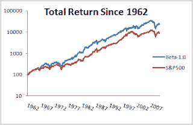
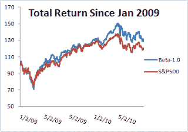

<!--yml
category: 未分类
date: 2024-05-12 21:21:04
-->

# Falkenblog: Beta 1.0: A New Low Cost Indexing Strategy

> 来源：[http://falkenblog.blogspot.com/2010/09/beta-10-new-low-cost-indexing-strategy.html#0001-01-01](http://falkenblog.blogspot.com/2010/09/beta-10-new-low-cost-indexing-strategy.html#0001-01-01)

In

[have argued](http://www.efalken.com/RiskReturn.html)

that people pay for hope--lottery tickets, Black Swans--and this shows up as lower returns for highly volatile assets of all forms. In practice it's worse than raw data show, because highly volatile assets tend to have higher transaction costs because they are often less liquid, having a higher bid-ask spread and move more when you try to position into them.

Thus, it seems obvious a Sharpe maximizing investor should target low volatility portfolios, and indeed many such indices are funds are being created. The Dutch asset manager

[Robeco](http://www.robeco.com/eng/lp/global/index.html)

employs economist

[Pim van Vliet](http://papers.ssrn.com/sol3/cf_dev/AbsByAuth.cfm?per_id=296465)

who has written on the perverse low-volatility results, and they have two low volatility funds, the

[Global Conservative Equity](https://www.robeco.com/com/eng/institutional_investors/product_information.jsp?pdstchn=instcom&pfndid=2581&plang=english)

and

[European Conservative Equity](https://www.robeco.com/com/eng/professionals/products/product_information.jsp?pdstchn=profcom&pfndid=3250&plang=english)

funds. I think such strategies dominate their benchmarks because they avoid the high-flyers that have very poor returns, and they lower risk: win-win in return-volatility space. Institutional equity managers should flock to these, because they should be sophisticated enough to see that the Sharpe ratio is the best metric for a broadly diversified equity portfolio.

Yet, I understand that many investors are more concerned with 'underperformance', such as any deviation from a benchmark such as the S&P500\. Around the year 2000 I was trying to pitch a low volatility strategy, and running a small fund with my own money as a sideline to my day job as a quant and risk manager. I remember many saying to me that it all seemed fine, but it would have underperformed over the prior year, and no one wants to put money into a strategy that underpeformed recently. I thought it was irrational, but given the way money flows into funds--via relative performance--it was rational given their constraints. Alas, it did very well over the next two years. The key is, when you play the averages, using decades of data, you can't really market time as well; not everything has momentum.

I used to be concerned that my result would be arbitraged away but now I realize that like many people with a good new idea, my problem is not people stealing it, rather, shoving it down their throats. The idea that 'the CAPM' does not work, is pretty well established. Even the fact that higher volatility stocks underperform is now pretty universally acknowledged. The implication is therefore obvious (though I

[had to spend a lot of money to be able to say this](http://www.efalken.com/papers/legaldocs.html)

): low volatility equity portfolios are a dominant equity investing strategy.

Back in 1993 when I was trying to sell the Northwestern faculty on my finding that lower volatility stocks had higher returns than high volatility stocks, they figured I just made an error, and hoped I would disappear. My finding couldn't be true because rational investors should not allow it, 'the market' should have a dominant Sharpe ratio, and I did not identify it via generalized method of moments or Banach spaces. Just control for price, or size, and sort, and there it was.

One key stumbling block to my potential advisers was this finding would imply many funds were being irrational. Indeed, as Sharpe maximizers, they are. Buying hope is very common, which is why you keep getting stupid spam: lots of idiots answer these adds on the chance that some Duke in Nigeria does need only a $2000 processing fee to unlock $10MM USD.

[Bloomberg Magazine's issues](http://falkenblog.blogspot.com/2009/10/bloomberg-magazine-shows-market-bias.html)

on top analysts, and end of year reports of top funds, consistently highlight 'top' achievers, those with the biggest gains over the prior year. Returns are never 'risk adjusted' in any way. Someone who merely outperformed the S&P500 by 2% a year, but never made the top 10% in any year, would probably lose his job the first year he underperformed, because he would never have one of those years that generates those dubious awards given out by industry to itself (e.g.,

Risk Magazine

's Risk Manager of the Year--which historically has included people from Enron and WorldComm).

I argue that the fact people are better described as envious as opposed to greedy, this leads to benchmarking, and leads to an elimination of the risk premium. Add to this that there's a 'hope premium' in highly volatile assets, and high volatility stocks are basically suboptimal within a long-only portfolio.

Yet if you want to maximize an Information Ratio, as opposed to a Sharpe ratio, a strategy of targeting stocks 'in the middle' gives you a little lift in return, while minimizing benchmark risk. The

[Beta 1.0 strategy](http://falkenblog.blogspot.com/2010/09/low-volatility-and-beta-10-portfolios.html)

takes the 100 stocks within the S&P500 with betas nearest 1.0\. Thus, by construction it has a beta near that of the S&P500 index. The average returns over the past 50 years is as follows:

**US Returns Since 1962**

|   | Beta1.0 | S&P500 |
| Avg Ann.Arith Return | 12.9% | 10.5% |
| Avg. Ann.Geo. Return | 11.4% | 9.4% |
| Ann StDev | 17.4% | 15.1% |
| Beta | 1.04 |   |

The average return over the past 2 years has been as follows:

**US Returns Since 2009**

|   | Beta1.0 | S&P500 |
| Avg Ann.Arith Return | 18.21% | 13.1% |
| Avg. Ann.Geo. Return | 15.7% | 10.8% |
| Ann StDev | 27.6% | 24.4% |
| Beta | 1.07 |   |

This is a new strategy that I think is quite attractive. As most portfolio managers both cling to their benchmarks, yet underperform by a couple percent, this strategy would do so in a much lower-cost, straightforward way, and historically has generated a 2% premium.