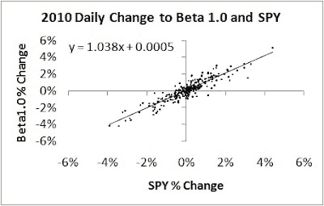
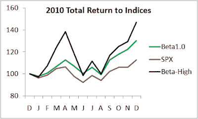
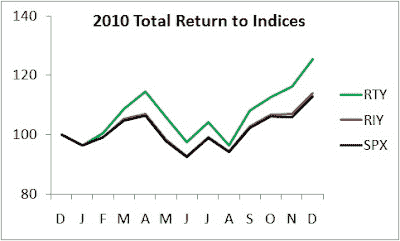

<!--yml
category: 未分类
date: 2024-05-12 21:11:13
-->

# Falkenblog: Beta1.0 2010 Results

> 来源：[http://falkenblog.blogspot.com/2011/01/beta10-2010-results.html#0001-01-01](http://falkenblog.blogspot.com/2011/01/beta10-2010-results.html#0001-01-01)

I have a website

[betaarbitrage.com](http://www.betaarbitrage.com/)

, which I update monthly, and has the daily and monthly historical returns for minimum variance portfolios (MVPs), and targeted beta portfolios. MVPs are described

[here](http://falkenblog.blogspot.com/2010/12/low-volatility-investing-fun-facts.html)

. Targeted beta portfolios are my little project, and I describe them

[here](http://falkenblog.blogspot.com/2010/09/beta-10-new-low-cost-indexing-strategy.html)

. The basic idea for these is, instead of investing in 'high' and 'low' beta stocks, target a direct beta of say 1.0, or 1.5\. This avoids the variability in the beta deciles, which as any good investor knows, goes up during expansions, and compresses as correlations rise during bear markets.

The basic idea for the Beta1.0 portfolio, is to outperform the S&P500 while minimizing benchmark risk. By using only stocks with market caps above $500MM, and then choosing 100 stocks with historical betas closest to 1.0, the prospective beta is near one. That is, you grap this middle section. This gives you the benefit sf trivial benchmark risk, but by avoiding the super high beta stocks that are part sf the index, you add a couple percent to you return:

Now, I have been doing this historically for a while, choosing portfolio constituents once every 6 months, and applying them forward. Data at betaarbitrage.com are free and available for download without any pesky login stuff. If you look at the actual beta of this in 2010 using daily data, you see a near 1.0 beta, pretty much as expected:

How did it do last year? Fabulously! Check it out:

The beta1.0 portfolio was up 30%, vs 14% for the S&P500\. How did this happen? Mainly because the beta1.0 portfolio drew from all stocks over $500MM, and so reaped the benefit of the small cap boom in 2010\.

Here the RTY is theh Russell 2000, or the largest stocks outside the top 1000 stocks. It trounced the S&P500 and Russell 1000 last year (25% for RTY vs. 13ish% for SPY and RIY), primarily because of the rise in the second half of the year. Using data since 1962, the beta1.0 portfolio outperforms about about 2% annually, slightly higher volatility (~3% annualized), and a beta around 1.0 (hence the name).

I actually have a patent pending on the Beta1.0 idea ... being on the wrong end of the law, I thought I might try using it to my advantage.