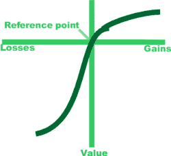

<!--yml
category: 未分类
date: 2024-05-12 23:19:46
-->

# Falkenblog: Betting with House Money

> 来源：[http://falkenblog.blogspot.com/2008/05/betting-with-house-money.html#0001-01-01](http://falkenblog.blogspot.com/2008/05/betting-with-house-money.html#0001-01-01)

Many people are more risk loving when playing with 'house money' than when they have lost money. That is, if you go to Vegas, and win $1000, you are more willing to bet with that $1000 (the house's money), than when you initially came, or if you lost money. This is often explained via Prospect Theory, but the theory is really quite a kluge, and was meant to describe the following behaviors:

1\. Very risk-averse behavior in gains involving moderate probabilities (concave for right-hand side)

2\. Risk-loving towards small losses (convex for left-hand side)

3\. Risk averse toward large losses (steeper for far left-hand side)

These facts are consistent with the graph of one's utility function at the upper right, where the y-axis is the reference point. But to make

[prospect theory](http://en.wikipedia.org/wiki/Prospect_theory)

apply to this 'house money' phenomenon, you need

[Cumulative Prospect Theory](http://prospect-theory.behaviouralfinance.net/)

, because regular Prospect Theory says you should be risk averse with house money. In Cumulative Prospect Theory, if you have house money (ie, are up), you are in the convex portion of your utility function (convex utility=risk loving). Given the plasticity, and parochial nature of how Prospect Theory is applied (Cumulative here, regular there), I'm rather unimpressed with the power of this theory. I'm shocked at how many smart people think that this type of reasoning is going to generate lots of really useful insights, because it doesn't predict anything, and is always applied piecemeal.

Assume you are playing black jack. You are up $1000\. Now you bet more aggressively. Why? Well, to say 'it's because you are now risk loving', isn't a theory, is a description of what we know to be true. Rather, someone who gambles, and wins, thinks they have alpha. Now, if they aren't counting cards, or are playing slots or roulette where no alpha is conceivable, this alpha is delusional. But I still think many people

think

they have alpha in these circumstances, thinking they have invoked a 'lucky streak', or have somehow drawn favor with the gods of chance. Or, they might be counting cards, and thus truly have a 2% edge. The key is being up, having house money, increases their initial estimate of having alpha, and so, when you have alpha, you

should

bet more aggressively.

Consider this in terms of a trader. You give him some capital and he applies his strategy. After 6 months, he is up big on the year. He wants to bet more. His boss wants him to bet more. Why? Because they both are more reassured he has alpha, and you give people with alpha more money. People winning big against the house have a higher probability of having alpha than someone just starting out, or, someone who has lost money. Luck and alpha are always at work, but, making money should always increase the probability its alpha, not merely luck. Not to a probability of 1, of course, but higher than the unconditional odds. And this is true at every time dimension, leading to the phenomenon of betting more when you are playing with 'house money'.

But back to dissing Prospect Theory.

[Huang, Barberis and Santos](http://papers.ssrn.com/sol3/papers.cfm?abstract_id=169790)

(2002), argue that Prospect Theory is applicable to the changing expected return in stocks, in that after a market rise, people are less risk averse, while after a fall, they are more risk averse. If after a market rise, people are less risk averse, they should accept, and in equilibrium will receive less. This is a theory of endogenous cyclicality. Seems reasonable. But then figure an outstanding puzzle in momentum in cross-sectional asset pricing: stocks that have risen over the past year tend to rise more than average the next year, and this momentum is also true for underperformers. If 1 year is the relevant horizon for investors in the market in aggregate, why is it contradicted when applied to individual stocks? Further, if after a good run-up in stocks, such as in 1999, people are less risk averse and supposedly tolerate lower expected returns as a result, why do they expect returns on stocks to be higher after run-ups (

[Sharpe and Amromin](http://www.federalreserve.gov/Pubs/feds/2008/200817/200817pap.pdf)

)? In this model, they should expect a lower return. It’s like whack-a-mole--fix a problem here, create a new one there. No one applies Prospect Theory consistently, just to little issues here and there. That's not theorizing, that's describing.