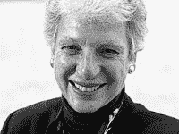
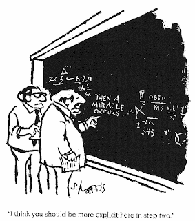

<!--yml
category: 未分类
date: 2024-05-12 21:59:55
-->

# Falkenblog: Beware Ideas Too Big, Too Little

> 来源：[http://falkenblog.blogspot.com/2009/06/beware-ideas-too-big-too-little.html#0001-01-01](http://falkenblog.blogspot.com/2009/06/beware-ideas-too-big-too-little.html#0001-01-01)

Bennington College President Liz Coleman gave a

[talk at TED](http://www.ted.org/talks/liz_coleman_s_call_to_reinvent_liberal_arts_education.html)

about reinventing liberal arts education, as she sees it as too specialized. She states 'we know more and more about less and less', and indeed if she had a better grasp of the narrow field of history she would know this is a cliche among elderly educators, as it is a comforting idea to mandarins who find themselves helpless with the new technologies ("it says 'press any key', where's the '

any

' key?"). She notes values outside technical competence are viewed with increasing suspicion:

> Questions such as What kind of a world are we making? What kind of a world, should we be making? What kind of a world, can we be making? Are treated with more and more skepticism and moved off the table.

Yeah, it would be good to know the answers to those big questions but there really isn't a good way to approach them. Any answer would perforce be a minority view based on a lot of unshared assumptions, and hardly amenable to empirical or logical analysis in any systematic way. Further, as an economist who actually believes in the invisible hand, I think the world will take care of itself better if we merely focus on our individual long-run self-interest.

After talking about the kind of world we want for a couple years, most students have to get a job programming computers or selling copier equipment, and their big-picture liberal verities will appear a lot less useful than knowing how to code in C++, understand standard errors, or have familiarity with the classical literature of the 19th century.

Economists, meanwhile, are increasingly seduced by the other end of the spectrum, ideas that are 100% true yet irrelevant. Alex Tabarrok is writing an economics textbook that puts individual incentives at the center, which I think is fantabulous, but there should be a focus on price theory, not trivia. For instance, he had a contest for the text's epigram, and the

[winner was](http://www.marginalrevolution.com/marginalrevolution/2009/05/textbook-competiton-results.html)

> Economics is the study of how to get the most out of life.

The website for their new textbooks

[notes](http://worthpublishers.com/CowenTabarrokMacro/)

"Incentives matter. I want to show my students their impact in

every aspect in their lives

" The idea that practical examples are essential for learning economics has been stretched too far towards what is true and unimportant. His co-author is Tyler Cowen, who wrote a book in the

[Freakonomics genre](http://falkenblog.blogspot.com/2008/04/why-freakonomics-craze.html?showComment=1208016840000)

, suggesting a focus on the fun and flippant (they would say 'edgy and insightful'). As Ariel Rubinstein

[noted in a withering critique](http://falkenblog.blogspot.com/2008/04/why-freakonomics-craze.html?showComment=1208016840000)

of Levitt and Freakonomics:

> Freakonomics expresses the aspiration to expand economics to encompass any question that requires the use of common sense.... What have we learned about Levitt [reading Freakonomics]? He is a smart guy... What is the connection to economics? None.

Freakonomics made popular the idea that the traditional areas of economic focus are not central, rather any fun little anecdote about self-interested behavior counts as an equal-weighted brick in the economic foundation. These economists revel in their ability to 'explain' why sumo wrestlers throw matches, why teachers cheat on standardized tests, and why people buy gym memberships they don't use (answer: self interest), and indeed these ideas are simple enough to understand that they make for popular reading, but academics should always be wary of popularity. While economists are not like dentists when it comes to fixing problems they face, there are some insights that endure and have application to markets, such as most International Trade, Intermediate Microeconomics, or introductory finance. Sure, Macro is a clusterpuck, but we know what causes hyperinflation! Growth theory is not settled, but lots of persistently popular ideas about long-term economic growth can be shown wrong, excluding a lot of bad intuition. It's not physics, but it's not as bad as sociology either.

Stephen Levitt notes his book is mainly about generating questions, not answers. Questions are essential, but they are really quite easy, and infinite. My kids asks me questions every day, most of which I can't answer (Who's the strongest man in the world?

I don't know.

Can ninjas beat jedi warriors?

Never.

Will sharks eat us if we go swimming?

Generally not in Minnesota. Or a pool.

) It's good to know we don't know much and there's lots of interesting things to know, but ever since Socrates emphasized the wisdom of knowing what one does not know, people think it's really deep to articulate they know they know nothing. Knocking off little areas that document self-interested behavior in quirky areas suggests we have lots of different ways of acting selfish, but it does not generalize as any cursory look at Levitt's

oeuvre

demonstrates.

Coleman ends her speech with a flourish that must have seemed pure genius when she wrote it at 2 AM because it's so over the top:

> If the question where to start seems overwhelming, you are at the beginning, not the end, of this adventure. Being overwhelmed is the first step if you are serious about trying to get at things that really matter, at a scale that makes a difference. So what do you do, if you feel overwhelmed? You have two things, you have a mind, and you have other people. Start with those, and change the world [standing ovation]

That insight reminds me of a proof I learned in grad school (see above). She emphasizes how important this is, because she reminds us earlier that 'Obama can not do it alone'. I'm sure that statement put her on the paleo-conservative wing of her lunch table (say it ain't so!). Coming from an authority figure, such an exhortation to change the world via one's mind and other people may sound profound to a 20 year old, but it comes off as adolescent blather to a middle-aged dad like myself.

School should give one exposure to ideas big and small, but moderation in all things. Ideas too small to be generalizable, too big to be soluble, can't be central to the canon because we only have so much time, and so mastery of some specialized, systematized field of knowledge, is ultimately our best strategy. One can't teach common sense, which is why you can't major in it after all these years, and while you can teach trivia it is obvious that would be pointless. But we can teach engineering, math, or programming. It isn't trivia, but it isn't a life strategy either. It is in the middle. The useful things we can know are both abstract and parochial, and a simple way to accomplish this is to master a small field. By knowing a single area really well can one understand what ignorance really means. If you aren't an expert on anything, you do not really understand what ignorance is, how superficial knowledge is misleading, and how expert consensus is both the height of best practices yet highly fallible.

Its fun and easy to talk about important big ideas, because in this area usually anyone's opinion is as valid as any other, and you can find a witty or profound supporting quote by great historical thinkers for almost any proposition (eg, 'early bird gets the worm' vs. 'second mouse gets the cheese'). It is also fun to talk about trivia like perception biases among speed daters, because these are new facts that are interesting if limited. But the reason a lot of little ideas, or a single big idea, tends to bore people is they have experience with these ideas going absolutely nowhere. An idea should not be judged solely by its importance or its truth, but the triumvirate of importance, truth, and novelty. The bigger the idea, the less we can be sure it's true, and less likely it is novel; the smaller the idea the less important. So, leave the big ideas and trivia to barbecues and late-night bong sessions, and learn some statistics. It won't guarantee wisdom, but it's a better base.