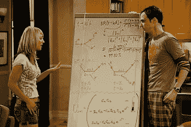

<!--yml
category: 未分类
date: 2024-05-12 22:38:08
-->

# Falkenblog: Big Bang Theory Whiteboards

> 来源：[http://falkenblog.blogspot.com/2008/12/big-bang-theory-whiteboards.html#0001-01-01](http://falkenblog.blogspot.com/2008/12/big-bang-theory-whiteboards.html#0001-01-01)

Professor

[David Saltzberg](http://personnel.physics.ucla.edu/directory/faculty/index.php?f_name=saltzberg)

, an astrophysicist at UCLA, vets the science on "

[Big Bang](http://online.wsj.com/article/SB122904206389400209.html)

", including making sure all the equations on the whiteboards are real and correct.