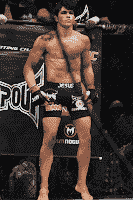

<!--yml
category: 未分类
date: 2024-05-12 20:05:20
-->

# Falkenblog: Bring on Silva vs. Hendricks

> 来源：[http://falkenblog.blogspot.com/2013/06/bring-on-silva-vs-hendricks.html#0001-01-01](http://falkenblog.blogspot.com/2013/06/bring-on-silva-vs-hendricks.html#0001-01-01)

I'm a big 

[Johny Hendricks](http://en.wikipedia.org/wiki/Johny_Hendricks)

 (left) fan, but I think right now among 170 pounders, Erick Silva is the man, Hendricks next, then GSP. Just 

[watch him](http://www.fightvideomma.com/2013/06/erick-silva-vs-jason-high-fight-video.html)

 sneak this triangle choke onto his opponent from last weekend's UFC in Brazil. I couldn't believe Silva didn't fall off because he was so high, but Silva obviously has great leg control.  Standing, Silva moves like a cat, and I can't wait until he meets Hendricks after Hendricks beats GSP.