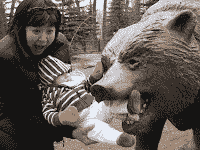
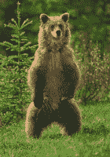

<!--yml
category: 未分类
date: 2024-05-12 21:24:45
-->

# Falkenblog: Brown Bears and Grizzlies

> 来源：[http://falkenblog.blogspot.com/2010/08/brown-bears-and-grizzlies.html#0001-01-01](http://falkenblog.blogspot.com/2010/08/brown-bears-and-grizzlies.html#0001-01-01)

I would often go to Yellowstone park as a child, and my dad always prepared our campsites for bears by putting our food in a bag strung between trees so a bear could not get it. I also remember listening to various park rangers tell us what to do in the case of a bear contact. For black and brown bears, you want to stand still, look the bear in the eye, and make yourself look large. For grizzlies and polar bears, you want to play dead in a little ball with your hands around your head.

Now, my fevered 11-year mind quickly focused on the scenario where, facing a large, brownish bear I should either raise up like the Karate Kid or shrink into a human McNugget, depending on what type of bear it was. My response function was not robust to reasonable estimation error as bear ethnicities are probably indistinguishable when I'm pooping my pants in fear (brown right, grizzly left). Many things are like this, as when doctors say that margarine or butter, is worse for you; too much, or too little, self esteem is bad for teen-agers; the early bird gets the worm, the second mouse gets the cheese. It seems all great advice can be boiled down to one essential truth: Always--or is it never?--do X.

Thus I'm rather amused by the skewness avenue for fixing our empirical asset pricing mess (ie, what's the risk that begets higher expected returns?), as suggested by

[Campbell Harvey](http://faculty.fuqua.duke.edu/~charvey/Research/Published_Papers/P56_Conditional_skewness_in.pdf)

. The idea that people really like right skewed assets, like lottery tickets, options, and really volatile stocks, nicely explains why these assets have low returns: they give us so much pleasure when they hit a

[ten-bagger](http://en.wikipedia.org/wiki/Ten_bagger)

, we are willing to forgive the fact that they are eating a hole in our net wealth. Could be true. But as assets with really high right skewness have high volatility, then the question would always be, is this one of those high skewness-high volatility assets that people like because of its skewness, or don't like because of its volatility? Skewness are volatility are positively correlated. I guess analysts should love it because it explains everything without obviously saying so.

I really doubt the skewness story because it isn't robust. If people got an extra premium for buying assets with the 'bad' skew, a leftward skew as in bonds, then bonds should have pretty good return premiums, and they don't. Risky currencies,which have a leftward skew, do not have a demonstrable premium above assets without this skew. Utility stocks have historically had leftward skew because their returns are capped via regulation, yet they have not outperformed the market since data has been kept.