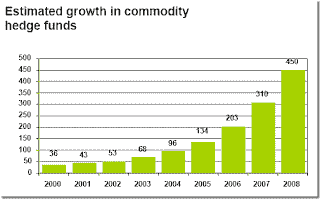

<!--yml
category: 未分类
date: 2024-05-12 23:16:04
-->

# Falkenblog: Bull Market or Genius?

> 来源：[http://falkenblog.blogspot.com/2008/06/bull-market-or-genius.html#0001-01-01](http://falkenblog.blogspot.com/2008/06/bull-market-or-genius.html#0001-01-01)

The recent run up of commodity prices such as wheat, corn, and oil, have made many people very wealthy. Just being long these assets has generated large returns. As one might expect, there has been an explosion in funds that specialize in commodities.

Now, given the huge expansion of commodity funds, one could reasonably assume that the average commodity fund performance has been pretty good. And given that commodity prices have risen steadily over the past 4 years, these funds must have been net long commodities, on average. Over the past 60 months, if we assumed oil should rise at the risk free rate, we experienced a 1 in 5000 event as prices have risen over 3 fold. So clearly, many fund managers in this space have merely been long, and rewarded considerably. Smart or lucky? I'm sure a little of both, but mostly the latter.

Of course, this goes not just for hedge funds, but oil and gas companies. I used to work with this guy Ryan Gilbertson (don't know him well, but he is as described in the article, quite the cowboy), who is now CFO of Northern Oil & Gas. As he told

[Bloomberg](http://www.bloomberg.com/apps/news?pid=20601170&refer=home&sid=ayj1uo_gdNI4)

:

> Gilbertson says he knows more about interest-only mortgage bonds than he does about oil. But he says Northern will succeed because he and Reger weren't in business during the busts of earlier decades, so they aren't gun-shy today.
> When EOG hit oil, they leased as many mineral rights in Mountrail County as they could, even as prices rose.
> 
> ``The fear of these busts has clouded the judgment of so many players,'' Gilbertson says. ``We just grabbed everything with both hands.''

So basically, he's saying they are successful (risen 300% in past year and a half), because they have just been more aggressive out of ignorance. This reminds me of a paper by DeLong, Shfleiffer, Summers, and Waldeman (Noise Trader risk in financial markets,1990), where less informed investors earn the highest (and lowest) rates of return on their total portfolios because they irrationally believe they have a more favorable risk-return opportunity and hence invest in securities with a higher return. In effect, their ignorance effectively diminishes their risk aversion, and in the long run allows a lucky few of them to reap the financial rewards that would accrue to the less risk averse (one could call it the ‘Forrest Gump’ effect). As opposed to speculation weeding out the irrational traders and making only the best opinions matter, the irrational can dominate the class of winners.

It's interesting model in this context. Those funds and companies, that threw risk controls out the window over the past 5 years have done the best. I think it's like the internet bubble, or any bubble. The question you have to ask is, is this 1998 (big up year ahead), or 1999 (the opposite)?