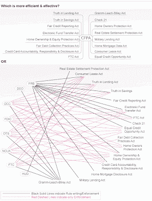

<!--yml
category: 未分类
date: 2024-05-12 20:50:50
-->

# Falkenblog: CFPA Still Fighting

> 来源：[http://falkenblog.blogspot.com/2011/07/cfpa-still-fighting.html#0001-01-01](http://falkenblog.blogspot.com/2011/07/cfpa-still-fighting.html#0001-01-01)

While the Consumer Finance Protection Act seems like a no-brainer--who isn't for consumer protection?--the mission was recently

[bullet pointed](http://www.huffingtonpost.com/2011/07/05/financial-reform-wall-street-gop-warren_n_890090.html)

as follows:

> _ Created the consumer protection agency to oversee mortgages, credit cards and other financial products.
> 
> _Established a body of regulators to scan the economy for threats to the financial system.
> 
> _Required banks to hold back money for protection against losses.
> 
> _Curbed the trading of derivatives, speculative investments partly blamed for the 2008 financial crisis.
> 
> _Gave the Federal Reserve powers to oversee huge companies whose failures could jeopardize the entire financial system.

There's nothing particularly wrong with these objectives, but they are already covered by existing agencies. I'm all for replacing old objectives with new ones, but no one is proposing shutting down the old agencies, just adding this new one. Thus, the picture below is misleading, because it is merely adding another set of lines the the spaghetti graph at the bottom. I have found merely one 'dotted line' reporting function to be a disaster within large organizations, and with our financial regulation just about every law has multiple agencies enforcing it, leading to everyone and no one being in charge.

Spending $200MM (what Republicans want) or $329MM (what Obama wants) on this elephant highlights that US interests rates are way too low, because if we are still spending money on boondoggles as if The Multiplier will make it all pay off, we deserve to have our credit card canceled.

