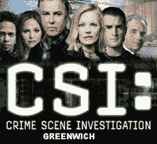

<!--yml
category: 未分类
date: 2024-05-12 22:46:50
-->

# Falkenblog: CSI: Greenwich

> 来源：[http://falkenblog.blogspot.com/2008/11/csi-greenwich.html#0001-01-01](http://falkenblog.blogspot.com/2008/11/csi-greenwich.html#0001-01-01)

Andy Lo's testimony (pdf

[here](http://oversight.house.gov/documents/20081113101922.pdf)

, video

[here](http://oversight.house.gov/story.asp?ID=2274)

) in front of Congress included this little recommendation.

> The most pressing regulatory change with respect to the financial system is to provide the public with information regarding those institutions that have “blown up”, i.e., failed in one sense or another. This could be accomplished by establishing an independent investigatory agency or department patterned after the National Transportation Safety Board, e.g., a “Capital Markets Safety Board”, in which a dedicated and experienced team of forensic accountants, lawyers, and financial engineers sift through the wreckage of every failed financial institution and produces a publicly available report documenting the details of each failure and providing recommendations for avoiding such fates in the future.

That would be a very fun job--I would love see Lehman or Bear's balance sheet when they failed. Too many times all we have after big disasters are journalist accounts, and they bring their own bias to these stories, as inevitably to get good info they need an insider, and every insider has an agenda. Most investors don't like revisiting their failures, and of course legal risk inhibits discussing events too much, so there's a real bias for the story to die at the very superficial level of some local paper accounts.

Add in the occasional sordid murder subplots (eg,

[Kissel murders](http://www.nydailynews.com/news/ny_crime/2008/03/22/2008-03-22_two_charged_in_andrew_kissel_murder.html)

,

[Seth Tobias](http://www.nytimes.com/2007/12/04/business/04tobias.html)

), and who knows, forensic accounting could be sexy.