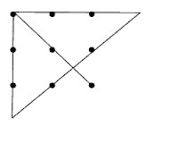

<!--yml
category: 未分类
date: 2024-05-12 22:05:53
-->

# Falkenblog: Can't Teach Creativity

> 来源：[http://falkenblog.blogspot.com/2009/04/cant-teach-creativity.html#0001-01-01](http://falkenblog.blogspot.com/2009/04/cant-teach-creativity.html#0001-01-01)

In a new book on education (

[Why Don't Students Like School?](http://www.amazon.com/Why-Dont-Students-Like-School/dp/0470279303/ref=sr_1_1?ie=UTF8&s=books&qid=1240943955&sr=1-1)

) by Daniel Willlingham, sounds like a lot of common sense. The reviewer

[notes](http://online.wsj.com/article/SB124079001063757515.html)

:

> Another question: "What is the secret to getting students to think like real scientists, mathematicians, and historians?" According to Mr. Willingham, this goal is too ambitious: Students are ready to understand knowledge but not create it. For most, that is enough. Attempting a great leap forward is likely to fail.

I've always noted that academic creativity exercises were cliches, where we students would sit around, learning new levels of disrespect for our educators. The corny lessons were almost patronizing--like those

[Successories](http://www.ben-brophy.com/?p=436)

posters--and our minds would wander appropriately.

Most people are not creative about abstract academic issues like math, science, or philosophy, and there is nothing wrong with that.

Often they are still very funny, decent, valuable people. Academic creativity is a rarity among academics, for God's sake. But when a curriculum trains kids with the idea they have to train the next Albert Einstein, they waste time. As educators, they are too stupid to realize this, but Albert was hardly a product of some dopey excercise where one connects lines outside the box (thus giving the great insight to think outside the box).

My two boys, ages 9 and 7, go to

[Kumon](http://www.kumon.com/?gclid=CKD17uyalJoCFRAMDQod6T6fMQ)

, a chain that teaches English and Math. They mainly drill, overlearning basics, and then are introduced to the next level. They are first tested, and then start workbooks slightly below their level so they hit the ground running. It's a workbook, where my 7 year old will add the number 3 to a bunch of numbers for 10 pages (eg), but only 20 minutes or less a day. When they master a workbook, they move to the next level, but if not, they repeat that lesson. At $100 per month, they learn more math at Kumon than at their school, which costs 10 times as much and has them for a longer time. [Another key to Kumon is tracking, so each kid is at a level determined by his measured ability, which creates the wrong kind of diversity].

Teachers love to pooh-pooh drills and systems, because they discourage creativity, and seem to make them less important. It's just the

[serenity prayer](http://www.cptryon.org/prayer/special/serenity.html)

in practice: affect what you can. What is most boring is listening to pointless lectures, lectures you know won't help you, and kids can sense when the teacher's 'big idea' lesson plan is merely nonsense. Teacher would love to teach the higher level skills that define genius because they want credit for the next genius, but the sad fact is that while good teachers are very helpful, it is almost always impossible to explain an Einstein, Feynman, or Crick by pointing to some deep insight from an 8th grade teacher. These are exceptional people, and teaching the basics is what they needed most.