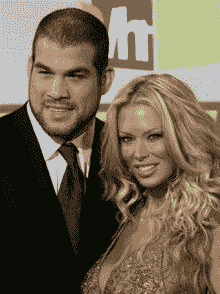

<!--yml
category: 未分类
date: 2024-05-12 23:18:12
-->

# Falkenblog: Career Advice From Jenna Jameson

> 来源：[http://falkenblog.blogspot.com/2008/05/career-advice-from-jenna-jameson.html#0001-01-01](http://falkenblog.blogspot.com/2008/05/career-advice-from-jenna-jameson.html#0001-01-01)

I saw

[UFC 84](http://www.canada.com/vancouversun/news/story.html?id=1088e3a7-0626-462f-bc8b-77bdf1e43a3e)

, which was quite good. A lot of people, like John McCain, call it human cock fighting, but it's actually less dangerous than boxing, because a hurt boxer gets more punches to the head, where a hurt fighter is pounced upon and usually submits to a choke quickly. The combination of jujitsu--with emphasizes joint locks--wrestling, and boxing, make it the most awesome sport. It takes more than just talent, because joint locks are really tricky. Brock Lesnar found this out when he was pummeling Frank Mir, who nimbly

[grabbed](http://www.youtube.com/watch?v=ZNsZ_qfHDSA)

his ankle in a jujitsu hold and finished Lesnar.

BJ Penn, the headliner in this event, is truly amazing, simply a natural genius at this sport. I had a suspicion his opponent, Sean Sherk, was in for trouble when he asserted that because Penn is from a wealthy family, he is soft. Comfort without struggle—and the sense of insecurity that motivates it—leads to disproportionate amount of self destructive decadence, and presents a unique challenge to wealthy people raising children. But that's a stereotype, and just as we should override group average information when assessing an individual we know a lot about, BJ Penn has issues, but I don't think his affluence is really operative right now. To think the poor kid will beat the rich kid because 'he wants it more' is simply not true.

The card also had the last fight for Tito Ortiz in the UFC, because Tito has been continually carping about the UFC for underpaying its fighters, publicly feuding with the President of the UFC Dana White in a way that makes all bosses crazy.

[Tito Ortiz](http://www.titoortiz.com/)

was the champion from 2000-03, but that was a long time ago. He's now, probably, the 10th ranked fighter and moving down. Unfortunately, his girlfriend, Jenna Jameson, is giving him career advice. Tito basically argues that as he helped create the UFC brand, and it now generates hundreds of millions in revenue a year, he wants a piece. At the press conference after the fight, Jameson was heard yelling that Ortiz should be at the top table because he's a champion. It's all kind of sad, because Ortiz lost, and he is no longer champion, and having your girlfriend yelling like that just makes for an embarrassing situation for everyone

[Jameson](http://en.wikipedia.org/wiki/Jenna_Jameson)

is one of the more successful adult film stars today, as her website ClubJenna.com grosses $30 million per year, and she clearly figured out that as talent she could get a lot more as a part-owner than merely an employee. But she's a headliner, and used that

[Q-rating](http://sanjose.bizjournals.com/sanjose/stories/2001/09/03/focus2.html)

to brand her company. Ortiz

was

a headliner. He can't break out on his own, because no one is going to pay $40 to see the 10th ranked fighter moving down. As the head of the competing IFL stated, if he thinks the UFC doesn't pay him enough, he should understand that no other league will be able to pay him anything close. Further, say the UFC is worth $1B, should Ortiz have a piece of that? Well, no. Sure he helped build the brand, but he had a contract, and was an employee. Perhaps he should have negotiated some options, but you can't argue for them ex post. So, while I'm sure Jameson is qualified to give advice on all sorts of things, her flawed analogy between his status as 'talent' and hers, is just wrong. Bad analogies are at the bottom of every bad business decision.

But mixed martial arts is changing. Upon graduating college,

[Johny Hendricks and Jake Rosholt](http://sports.yahoo.com/mma/news?slug=ki-rosholt031208&prov=yhoo&type=lgns)

recently decided to join professional mixed martial arts, rather than international wrestling, and they were 2 and 3 time national champs, respectively. That's a big datapoint, when the best college wrestlers are dreaming of the UFC rather than the Olympics. Thus, at first you had people like Matt Hughes, Don Frye, and Randy Couture, who were merely very good college wrestlers, but the next generation will be the cream of the collegiate wrestling. This is a sport on the upswing.