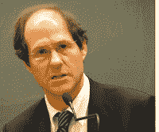

<!--yml
category: 未分类
date: 2024-05-12 21:32:23
-->

# Falkenblog: Cass Susstein For Mandating Voluntary Blogger Action

> 来源：[http://falkenblog.blogspot.com/2010/05/cass-susstein-for-mandating-voluntary.html#0001-01-01](http://falkenblog.blogspot.com/2010/05/cass-susstein-for-mandating-voluntary.html#0001-01-01)

Cass Susstein wrote Nudge, a book about 'libertarian paternalism'. This sounds like an oxymoron, but he would always try to highlight its character with the example of changing the default choice for 401k investments so that people save more.

Yesterday, however,

[he highlighted](http://deathby1000papercuts.com/2010/05/obama-czar-cass-sunstein-internet-mandates-spread-the-link-love/)

his strong paternalistic side, discussing his new idea that all websites provide 'the other side' of arguments:

> If we could get voluntary arrangements in that direction, it would be great and if we can’t get voluntary arrangements maybe Congress should hold hearings about mandates.”

Alas, most bloggers aren't super political, and when you move beyond Left and Right, the other side isn't obvious. I mean, I disagree with 'market irrationality' man Robert Shiller on a lot of issues, but also 'market rationality' proponents like John Cochrane or Eugene Fama. I'm a strong critic of Financial Theory, but find most other critics of this theory to be 'more wrong', and probably have less in common with your average finance critic than with the ruling elite of modern financial theory.

I think Susstein is showing the absurd slippery slope of his libertarian paternalism, and he's doing the sliding. I disagree with everyone on something, agree with no one on everything, and often share similar conclusions with people for very different reasons, so the weighting of my disagreement would be vital in figuring out my opposite link. Who weights the issues of agreement/disagreement? If this incredibly naive, unworkable idea was sufficiently vetted to merit mention with NPR, I would love to know what his other ideas are.

On the other hand ... I guess the Al Gore would then have to admit the Climate Debate is not over! Indeed, a lot of issues Susstein finds have no legitimate other side would now be on the table! I'm thinking everything from racial profiling to all the Politically Correct taboos, such as the assertion the Holocaust never happened, HIV does not cause AIDS, etc. He would be '

[hoist with his own petard](http://en.wikipedia.org/wiki/Petard)

', as the Bard would say.

Actually, if The Man starts giving me orders, I think it would be quite fun because I imagine the poor chaps in the "Office of Website 'Opposite Link' Definitions" would be in way over their heads, and that would mean fewer regulators actually doing real harm implementing regulations they could enforce.