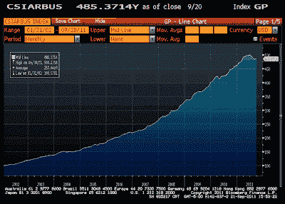

<!--yml
category: 未分类
date: 2024-05-12 20:45:03
-->

# Falkenblog: Credit Suisse Arb Index Fishy

> 来源：[http://falkenblog.blogspot.com/2011/09/credit-suisse-arb-index-fishy.html#0001-01-01](http://falkenblog.blogspot.com/2011/09/credit-suisse-arb-index-fishy.html#0001-01-01)

Credit Suisse has an 'Arbitrage US Index' (CSIARBUS Index), that presumably reflects the return on 10 stat arb strategies. The total return since inception in Jan 2002 is above. It's a Sharpe of about 2.4, Madoff-like. If it's real, everyone should put most of their money in such strategies asap.

I'm rather skeptical of such indices. Where's the infamous

[August 2007 draw down](http://web.mit.edu/alo/www/Papers/august07.pdf)

? The index was first made available on Bloomberg in February 2011, and just this August this index had its worst draw-down ever. I have a feeling it is filled with innumerable back-fill biases, a typical naive backtest quants present all the time, oblivious to their selection biases. I looked on the internet for some kind of description, and found nothing.

The world doesn't need more institutions presenting implausible returns. It sure doesn't help their credibility.