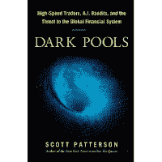

<!--yml
category: 未分类
date: 2024-05-12 20:27:23
-->

# Falkenblog: Dark Pools: Good Book, Bad Title

> 来源：[http://falkenblog.blogspot.com/2012/06/dark-pools-good-book-bad-title.html#0001-01-01](http://falkenblog.blogspot.com/2012/06/dark-pools-good-book-bad-title.html#0001-01-01)

Scott Patterson's new book

[Dark Pools: High-Speed Traders, A.I. Bandits, and the Threat to the Global Financial System](http://www.amazon.com/Dark-Pools-High-Speed-Traders-Financial/dp/0307887170)

suggests a Rolling Stone type expose of vampire squids sucking the vital fluids out of widows and orphans. In contrast, most of the book was about the development of electronic exchanges from 1990 through 2007, especially focused on the firms Archapelego and Island. It reminds me of Justin Fox's

[Myth of the Rational Market](http://falkenblog.blogspot.com/2009/06/justin-fox-book-like-market.html)

which suggested a rather slanted and damning hatchet job but then did nothing of the sort. I suppose the marginal business book buyer is on the way to an Occupy rally.

 I work on tactics related to these tactics and technologies, so found it very enjoyable. The real hero of this book, rightly, is Joshua Levine, who started Island. He pioneered paying for flow, where one pays those making markets, and charges those crossing the spread. He was on the bleeding edge in cloud computing, creating more robust infrastructure with a fraction of the budget than his big-time competitors. I know people who dealt with him, and they highlight how thoughtful he was about sharing information back in the day on order strategies, technical stuff that others might guard in a paranoid fashion. Levine thought if his customers could make more money, they would trade more, and this would breed even more liquidity. In other words, a classic business mensch.

 There are lots of numbers thrown around, but it's good to remember that  electrons move about 1 foot per nanosecond, so there's a basic limit to how fast these things can get.  It is true that humans generally take  a couple hundred milliseconds to process information and push a button, so clearly computers that can turn around info in a couple milliseconds beat humans in any whack-a-mole game.  But all that pico-stuff is pretty silly.  Consider the S&P minis futures contracts trades 400k times a day, so every 60 milliseconds (thousandth of a second) represents the highest frequency relevant for any contract. Stocks like IBM trade about once a second. Thus, all that super speed below a millisecond is not for trading so much as 'lining the book', market makers playing games in the queue to provide liquidity.  Your average trader should think about this as much as they think about what's going on

[underground at Disney World.   ](http://www.hiddenmickeys.org/WDW/MagicKingdom/Secrets/General/Underground.html)

There's a theme that originally the innovators wanted to cut out the middlemen, but then discovered there were new middlemen. Meet the new boss, as The Who would say. The bottom line is that spreads on big stocks like MSFT and ORCL used to be ¼ in the good old days before ECNs, which allowed lots of traders to make a fortune via their monopoly access to customer flow and the various barriers to competitors. That these specialists are now unemployed should be considered classic creative destruction.  I knew several of them; they were lucky while it lasted, and it lasted too long.

 The book is a bit light on actual tactics, making some strategies sound a lot more effective than they are. For example, Patterson describes a strategy he calls "0+", that supposedly makes money with zero risk. In fact, this strategy does have risk, because it presumes that you can always exit your position before the queue behind disappears.   Often a level gets 'taken out' by an order and so the queue behind you is gone within any possible time to place new order and get out at scratch (pre-fees, I should add). Indeed, the trader plying this strategy is presented later pathetically fishing for 10 minute stock predictors like thousands of other punters, highlighting this was no money pump.

A lot of the conspiracy talk around algorithms presumes a market price reflects 'true value', like the mass of something, and that algorithms are keeping others from it. Market prices approximate value, but a price is really an aggregate compromise, one that almost everyone disagrees with.  If you want to buy

**more**

,

**now**

, you will pay a higher price because you need to convince more people to take the other side. Jehova shouldn't care because 'true value' is unaffected by such concerns, but the market does, and so comparing prices to some assumed point estimate of 'true value' just leads to meaningless disquisitions.  If you want to think about such issues just remember all those theologians who wrote about the 'just price' for about one thousand years and whose work is now totally ignored for good reason, to give you a sense of your futility.  

The bottom line is that those buyers and sellers with big orders have always moved markets from their 'last price', and in the old days this was all done via a coalition of partners over a phone, but now algorithms sniff out these orders by noting a higher-than-usual buy crossing rate, or sense a really big iceberg limit order, and so basically have expropriated the front-running revenue from the traditional recipient of this value. A large order will move prices so it's going to be exploited, and this is better done competitively via electronic markets than by a specialist with monopoly access to the flow.

 There's some funny other stuff in there, like how regulator are pretty irrelevant to all the innovations. Indeed, the regulators appear more interested in protecting the

*status quo*

, as George Stigler noted 50 years prior in his work on the

[industry capture of regulators](http://techliberation.com/2010/12/19/regulatory-capture-what-the-experts-have-found/)

. Mary Schapiro gets

[her standard uncritical mention](http://falkenblog.blogspot.com/2010/11/book-review-all-devils-are-here.html)

, as she is always presented as the righteous regulator who would have prevented the 2008 crisis if it weren't for Lawrence Summers and his cabal. Her big idea after the flash crash was 'circuit breakers', aka limit price moves. This doesn't help much, as decades of experience with these in futures has shown, though it does 'work' if you merely want to prevent prices from moving more than 5% a day (why not solve the Greek budget deficit by not reporting it?).

The Flash Crash of May 6 2010 included an order to buy 75000 contracts when your average price level had only 5000 contracts there, so it pushed the 'market price' into uncharted territory. Its understandable these things happen, it's a new technology, lots of users, and lots of new emergent properties, most coming down to problems related to idiots placing large 'market orders' that wipe out several 'levels' of prices. I bet the exchanges will figure out a governor in spite of what the SEC does, but such issues are really irrelevant to what caused the crisis of 2008 or the 'Global Financial System.'

Part of a popular work on technical issues seems to involve building up the major players as geniuses, going over their rocket science background. In this case it's like pointing out how every professional football player was an outstanding high school athlete--financial innovators tend to have done well in math and science, so that whole physicist turned financier story isn't rare or intellectually sexy. I suppose that's how to get your hooks into the masses, because people like to read about geniuses.

In spite of the scary title, it's simply a good story of how innovators destroy the old guard. If you are worried about high frequency traders you almost surely trade too much, and would be better focused on asset markets built on things that are truly unsustainable.  High frequency traders are very sensitive to cash flow (note Trading Machines shut down pretty quickly after not finding a niche), so they aren't building palaces based on unrealistic expectations like, say, California or or NYU journalism majors.